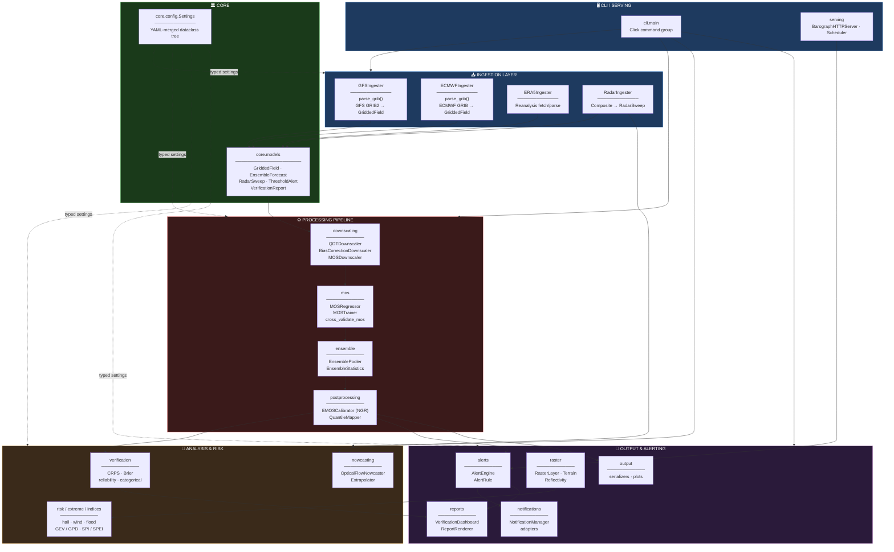
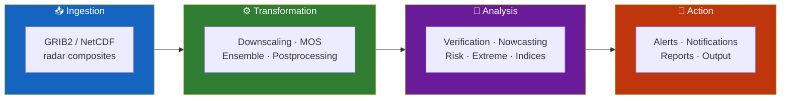
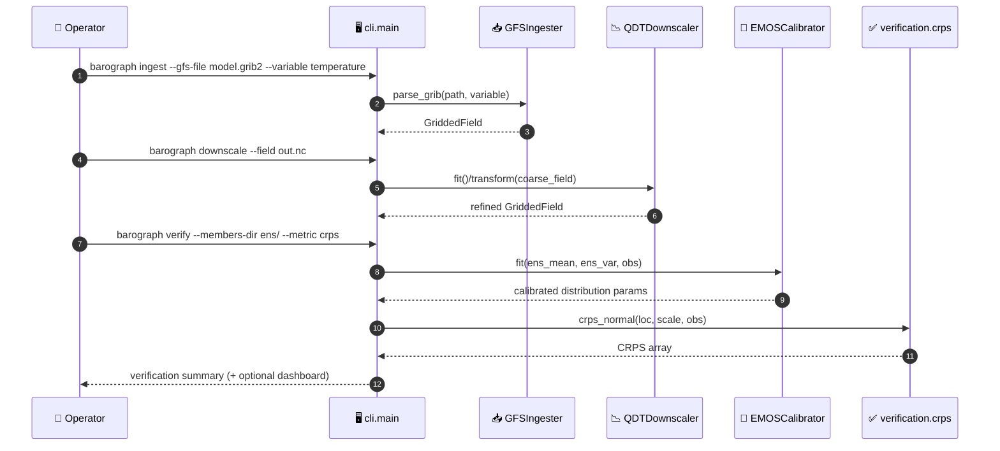
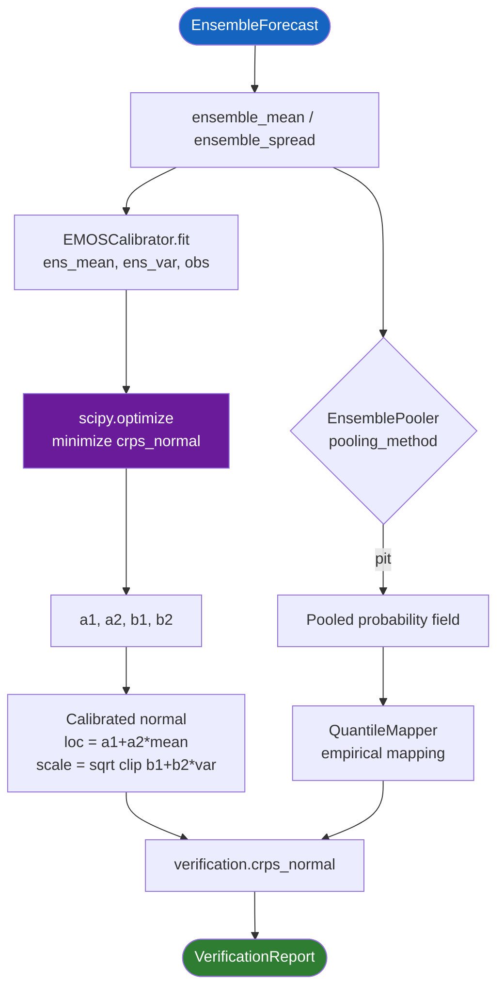
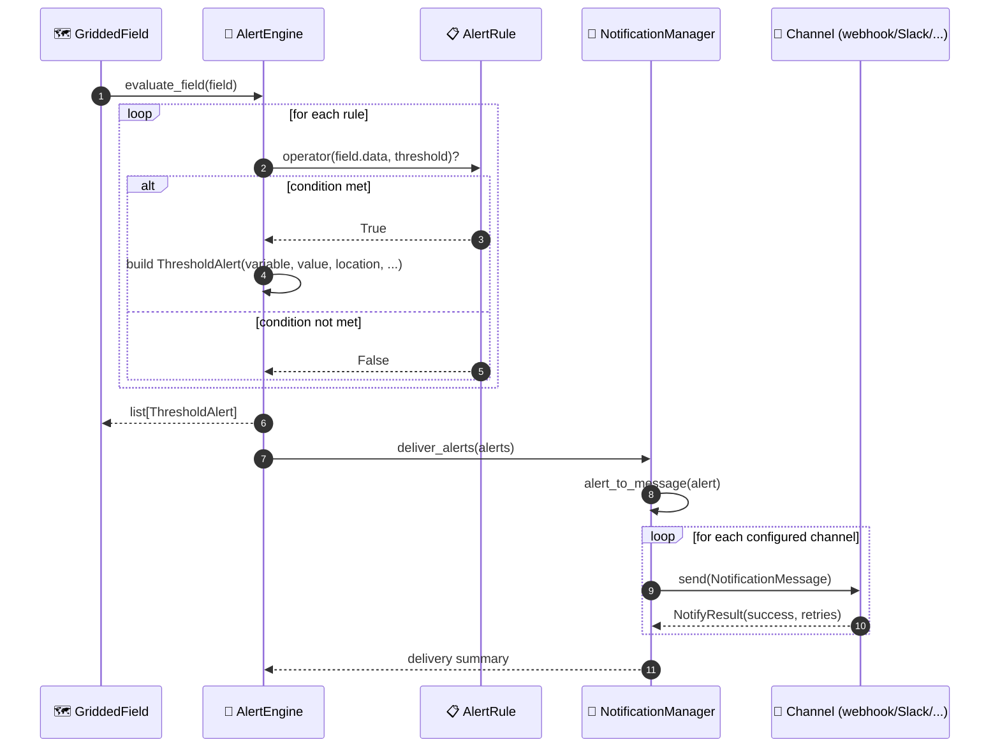
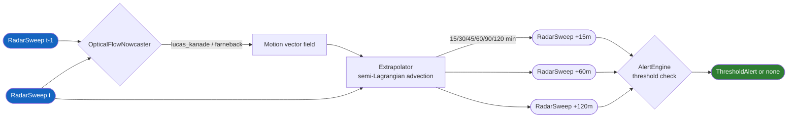
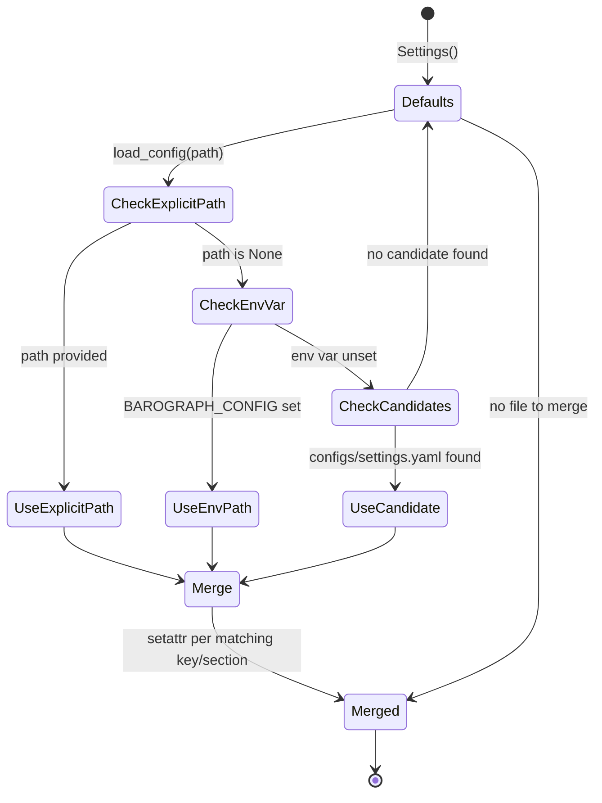
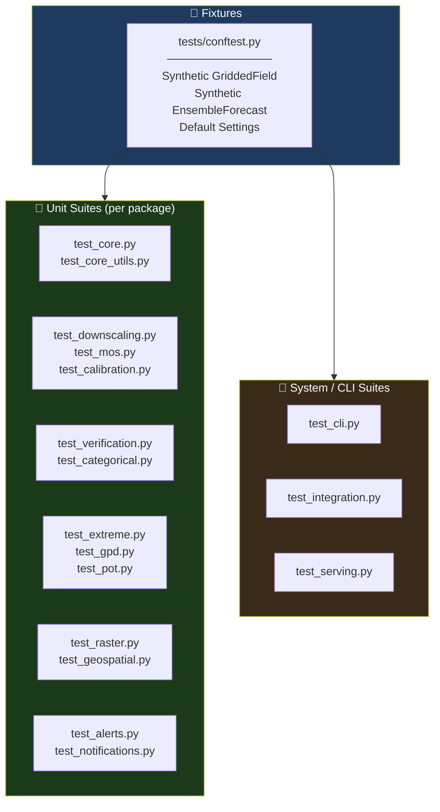

<div align="center">

**🌐 Choose Language / Selecione o Idioma / Elija el Idioma**

[](README.md)&nbsp;&nbsp;&nbsp;[](README_PT.md)&nbsp;&nbsp;&nbsp;[](README_ES.md)

</div>

---

<div align="center">

```
██████╗  █████╗ ██████╗  ██████╗  ██████╗ ██████╗  █████╗ ██████╗ ██╗  ██╗
██╔══██╗██╔══██╗██╔══██╗██╔═══██╗██╔════╝ ██╔══██╗██╔══██╗██╔══██╗██║  ██║
██████╔╝███████║██████╔╝██║   ██║██║  ███╗██████╔╝███████║██████╔╝███████║
██╔══██╗██╔══██║██╔══██╗██║   ██║██║   ██║██╔══██╗██╔══██║██╔═══╝ ██╔══██║
██████╔╝██║  ██║██║  ██║╚██████╔╝╚██████╔╝██║  ██║██║  ██║██║     ██║  ██║
╚═════╝ ╚═╝  ╚═╝╚═╝  ╚═╝ ╚═════╝  ╚═════╝ ╚═╝  ╚═╝╚═╝  ╚═╝╚═╝     ╚═╝  ╚═╝
        Weather Forecast Modeling, Post-Processing & Verification Toolkit
```

---

[](https://www.python.org/)
[](https://numpy.org/)
[](https://xarray.dev/)
[](https://scipy.org/)
[](https://scikit-learn.org/)
[](https://click.palletsprojects.com/)
[](https://pytest.org/)
[]()

<br/>

> **A file-based, dependency-driven toolkit for ingesting NWP model output,**
> statistically downscaling it, calibrating ensembles, verifying skill and issuing alerts.

<br/>


</div>

---

## 📑 Table of Contents

<details>
<summary>▶️ <strong>Click to expand / collapse this section</strong></summary>

<table>
<tr>
<td valign="top" width="50%">

**🏗️ System**
- [Overview](#-overview)
- [System Architecture](#-system-architecture)
- [Technology Stack](#-technology-stack)
- [Design Patterns](#-design-patterns-applied)
- [Project Structure](#-project-structure)

**📦 Modules**
- [Core — Models, Config, Coordinates](#-core--domain-models-config--coordinates)
- [Ingestion — GFS, ECMWF, ERA5, Radar](#-ingestion--gfs-ecmwf-era5-radar)
- [Downscaling — QDT, Bias Correction, MOS](#-downscaling--qdt-bias-correction-mos)
- [MOS — Regressor, Trainer, Evaluation](#-mos--model-output-statistics)
- [Ensemble — Pooling & Statistics](#-ensemble--pooling--statistics)
- [Postprocessing — EMOS & Quantile Mapping](#-postprocessing--emos--quantile-mapping)
- [Verification — CRPS, Brier, Categorical](#-verification--crps-brier-categorical)
- [Nowcasting — Optical Flow](#-nowcasting--optical-flow-extrapolation)
- [Alerts — Rules & Engine](#-alerts--rule-engine)
- [Raster — Layers, Algebra, Terrain](#-raster--layers-algebra-terrain-reflectivity)
- [Extreme, Indices, Risk & Time Series](#-extreme-indices-risk--time-series)
- [Serving, Notifications, Reports, CLI](#-serving-notifications-reports--cli)

</td>
<td valign="top" width="50%">

**💼 Business**
- [Business Rules](#-business-rules)
- [Functional Requirements](#-functional-requirements)
- [Non-Functional Requirements](#-non-functional-requirements)

**📐 Design**
- [Data Model](#-data-model)
- [System Flows](#-system-flows)
- [Ingest → Downscale → Verify Flow](#ingest--downscale--verify-flow)
- [Ensemble Calibration Flow](#ensemble-calibration-flow)
- [Alert Evaluation Flow](#alert-evaluation-flow)
- [Nowcasting Flow](#nowcasting-flow)
- [Configuration Resolution State](#configuration-resolution-state)

**🔐 Security & Ops**
- [Security](#-security)
- [Installation & Execution](#-installation--execution)
- [Automated Tests](#-automated-tests)
- [Metrics & Monitoring](#-metrics--monitoring)
- [Known Limitations](#-known-limitations)

</td>
</tr>
</table>

---

</details>

## 🌟 Overview

<details>
<summary>▶️ <strong>Click to expand / collapse this section</strong></summary>

**Barograph** is a Python toolkit that carries a numerical weather forecast from a raw GRIB2/NetCDF model file through to a verified, alert-worthy product. It is organized as 25 focused packages under `barograph/`, each owning one stage of the pipeline: ingestion, statistical downscaling, Model Output Statistics (MOS), ensemble processing, post-processing calibration, verification, radar nowcasting, alerting, raster analysis and output.

The project deliberately avoids a database or a persistent server as its backbone. Instead, `barograph.core.models` defines a small set of dataclasses (`GriddedField`, `EnsembleForecast`, `PointForecast`, `RadarSweep`, `ThresholdAlert`, `VerificationReport`) that flow between stages in memory, and `barograph.utils.storage` persists them to NetCDF, Zarr or NPY when a stage boundary needs a file on disk. Configuration is a dataclass tree (`barograph.core.config.Settings`) merged from an optional YAML file, so every subsystem — ingestion URLs, MOS algorithm, ensemble pooling method, alert cooldowns — has a typed default that a deployment can override without code changes.

A single Click-based CLI (`barograph.cli.main`) exposes the whole pipeline as composable subcommands (`ingest`, `downscale`, `verify`, `nowcast`, `check-alerts`, `raster`, `qc`, `derived`, `extreme`, `spi`, `spei`, `risk`, `notify`, `export`, `config-show`), so the toolkit can be driven from shell scripts, cron, or a scheduler without importing Python.

### 🎯 System Objectives

| Objective | Description |
|-----------|-------------|
| 📥 **Model ingestion** | Parse GFS, ECMWF, ERA5 GRIB2/NetCDF and radar composites into `GriddedField` objects |
| 📉 **Statistical downscaling** | Refine coarse-grid forecasts with Quantile Delta Transform or bias correction |
| 🌡️ **Model Output Statistics** | Train per-station regressors (linear, gradient boosting) that map model fields to station-scale forecasts |
| 🎲 **Ensemble calibration** | Pool ensemble members and calibrate spread/location with EMOS (NGR) and quantile mapping |
| ✅ **Verification** | Score forecasts with CRPS, Brier score + decomposition, reliability diagrams and categorical (POD/FAR/CSI/ETS) metrics |
| 🌩️ **Radar nowcasting** | Extrapolate reflectivity fields with Lucas-Kanade / Farneback / block-matching optical flow |
| 🚨 **Threshold alerting** | Evaluate `AlertRule` objects against gridded fields and dispatch through pluggable notification channels |
| 🗺️ **Raster analysis** | CRS-aware grid algebra, masking, terrain derivatives (slope/aspect/hillshade) and Z-R reflectivity conversion |
| 📊 **Reporting** | Render verification dashboards and alert/field summaries in Markdown/JSON/HTML |
| 🧪 **Quality control** | Flag gross-range, spike, persistence, duplicate and gap issues in observation series before they reach a model |

---

</details>

## 🏗️ System Architecture

<details>
<summary>▶️ <strong>Click to expand / collapse this section</strong></summary>

### Module Diagram



### Architecture Layers



---

</details>

## 🛠️ Technology Stack

<details>
<summary>▶️ <strong>Click to expand / collapse this section</strong></summary>

<table>
<thead>
<tr>
<th>Layer</th>
<th>Technology</th>
<th>Version</th>
<th>Purpose</th>
</tr>
</thead>
<tbody>
<tr>
<td rowspan="2"><strong>🧠 Language</strong></td>
<td>Python</td>
<td>&gt;= 3.10</td>
<td>Application language (<code>requires-python</code> in <code>pyproject.toml</code>)</td>
</tr>
<tr>
<td>mypy target</td>
<td>3.12</td>
<td>Type-checking baseline (<code>[tool.mypy] python_version</code>)</td>
</tr>
<tr>
<td rowspan="5"><strong>🔢 Scientific Core</strong></td>
<td>NumPy</td>
<td>&gt;= 1.24</td>
<td>Array operations across every module</td>
</tr>
<tr>
<td>pandas</td>
<td>&gt;= 2.0</td>
<td>Tabular time series and station data</td>
</tr>
<tr>
<td>xarray</td>
<td>&gt;= 2023.1</td>
<td>Labeled multi-dimensional arrays, NetCDF/Zarr I/O</td>
</tr>
<tr>
<td>SciPy</td>
<td>&gt;= 1.11</td>
<td><code>scipy.optimize</code> (EMOS fitting), <code>scipy.stats</code> (CRPS/normal), <code>scipy.interpolate</code>, <code>scipy.ndimage</code> |</td>
</tr>
<tr>
<td>scikit-learn</td>
<td>&gt;= 1.3</td>
<td>Linear / ridge / random-forest / gradient-boosting regressors for MOS and ML pipelines</td>
</tr>
<tr>
<td rowspan="4"><strong>📦 Data Formats</strong></td>
<td>netCDF4</td>
<td>&gt;= 1.6</td>
<td>NetCDF read/write backend for <code>xarray</code></td>
</tr>
<tr>
<td>zarr</td>
<td>&gt;= 2.15</td>
<td>Chunked, compressed array storage for ensembles</td>
</tr>
<tr>
<td>cfgrib</td>
<td>&gt;= 0.9</td>
<td>GRIB2 decoding via ecCodes bindings</td>
</tr>
<tr>
<td>eccodes</td>
<td>&gt;= 1.6</td>
<td>Low-level GRIB message codec (ECMWF)</td>
</tr>
<tr>
<td rowspan="2"><strong>⚙️ Parallelism</strong></td>
<td>dask[complete]</td>
<td>&gt;= 2023.7</td>
<td>Chunked/lazy computation over large gridded arrays</td>
</tr>
<tr>
<td><code>n_workers</code> setting</td>
<td>—</td>
<td><code>Settings.n_workers</code>, default 4</td>
</tr>
<tr>
<td rowspan="2"><strong>🖥️ CLI / Config</strong></td>
<td>Click</td>
<td>&gt;= 8.1</td>
<td>Command group in <code>barograph.cli.main</code>, 19 subcommands</td>
</tr>
<tr>
<td>PyYAML / toml</td>
<td>&gt;= 6.0 / &gt;= 0.10</td>
<td><code>load_config()</code> merges YAML settings into <code>Settings</code></td>
</tr>
<tr>
<td rowspan="2"><strong>🖼️ Imaging</strong></td>
<td>OpenCV (opencv-python)</td>
<td>&gt;= 4.8</td>
<td>Lucas-Kanade / Farneback optical flow for nowcasting</td>
</tr>
<tr>
<td>loguru</td>
<td>&gt;= 0.7</td>
<td>Structured logging via <code>utils.logging.setup_logging</code></td>
</tr>
<tr>
<td rowspan="3"><strong>🧪 Quality</strong></td>
<td>pytest / pytest-cov / pytest-xdist</td>
<td>&gt;= 7.4 / 4.1 / 3.3</td>
<td>Test runner, coverage, parallel execution (<code>dev</code> extra)</td>
</tr>
<tr>
<td>mypy</td>
<td>&gt;= 1.5</td>
<td>Static typing (<code>[tool.mypy]</code>, third-party stub overrides)</td>
</tr>
<tr>
<td>ruff</td>
<td>&gt;= 0.0.280</td>
<td>Linting, rule set <code>E,F,I,N,W,UP</code>, line length 100</td>
</tr>
<tr>
<td rowspan="1"><strong>📚 Docs</strong></td>
<td>Sphinx + sphinx-rtd-theme</td>
<td>&gt;= 7.2 / 2.0</td>
<td><code>docs</code> extra, built via <code>hatch run docs:build</code></td>
</tr>
<tr>
<td rowspan="1"><strong>📦 Build</strong></td>
<td>hatchling</td>
<td>—</td>
<td><code>[build-system]</code> backend, entry point <code>barograph = barograph.cli.main:cli</code></td>
</tr>
</tbody>
</table>

---

</details>

## 🎨 Design Patterns Applied

<details>
<summary>▶️ <strong>Click to expand / collapse this section</strong></summary>

| Pattern | Where | Rationale |
|---------|-------|-----------|
| 🧱 **Abstract Base Class / Template Method** | `downscaling.base.BaseDownscaler`, subclassed by `QDTDownscaler`, `BiasCorrectionDownscaler`, `MOSDownscaler` | Every downscaler exposes the same `fit`/`transform` contract while owning its own statistical method |
| 🏭 **Factory Function** | `model.regressor._make_estimator(kind, **kwargs)` | Builds a scikit-learn estimator from a string key (`"linear"`, `"ridge"`, `"random_forest"`) without leaking sklearn imports across the codebase |
| 🎯 **Strategy** | `EMOSCalibrator(distribution=...)`, `QuantileMapper(method=...)`, `Extrapolator` optical-flow method selection | The calibration/extrapolation algorithm is chosen by a config string and swapped without touching call sites |
| 🧾 **Dataclass Value Objects** | `core.models` (`GriddedField`, `EnsembleForecast`, ...), `core.config` (`Settings` and its sub-configs) | Immutable-by-convention, typed records instead of dicts moving through the pipeline |
| 🚦 **Guard Clause / Fail Fast** | `GriddedField.__post_init__`, `EnsembleForecast.__post_init__`, `ingestion._grib.require_cfgrib()` | Invalid shapes or missing optional dependencies raise immediately instead of failing downstream |
| 🔌 **Adapter** | `notifications.adapters.alert_to_message`, `notifications.adapters.deliver_alerts` | Converts a `ThresholdAlert` domain object into the `NotificationMessage` shape each channel expects |
| 🧮 **Pipeline / Composite** | `model.regressor.RegressionPipeline` (`FeatureSelector` + `RegressionModel`) | Chains feature selection and estimation behind one `fit`/`predict` call |
| 👂 **Observer-like Callback Registry** | `alerts.engine.AlertEngine` notification channel list, `serving.scheduler.Scheduler` job list | Multiple independent handlers react to the same evaluated event without tight coupling |
| 🗃️ **Repository-lite** | `utils.storage` (`save_gridded_field`, `load_gridded_field`, `save_ensemble`, `to_zarr`) | Centralizes every disk read/write so formats can change without touching pipeline code |
| ⏳ **Memoization / Decorator** | `utils.cache.memoize(ttl_hours=...)`, `utils.cache.TTLCache` | Wraps expensive network/parsing calls with a time-bound cache transparently |

---

</details>

## 📁 Project Structure

<details>
<summary>▶️ <strong>Click to expand / collapse this section</strong></summary>

```
barograph/
│
├── 📄 pyproject.toml                 # hatchling build, dependencies, ruff/mypy/pytest config
├── 📄 README.md                      # 🇺🇸 English (primary)
├── 📄 README_PT.md                   # 🇧🇷 Português
├── 📄 README_ES.md                   # 🇪🇸 Español
│
├── 📂 configs/                       # 📄 settings.yaml, alert_rules.yaml (runtime configuration)
├── 📂 data/                          # 📂 gen/ 📂 ingested/ 📂 radar/ — sample/working data directories
├── 📂 docs/                          # Sphinx sources — 📂 _static/ 📂 _templates/ 📂 api/
├── 📂 logs/                          # Runtime log + notification JSONL output
├── 📂 scripts/                       # Operational helper scripts
│
├── 📂 barograph/                     # ★ Main package (25 sub-packages, 95 source files)
│   ├── 📄 __init__.py
│   │
│   ├── 📂 core/                      # Domain models, config, coordinates, temporal utilities
│   │   ├── models.py                 # GriddedField, EnsembleForecast, ThresholdAlert, ...
│   │   ├── config.py                 # Settings dataclass tree + load_config()
│   │   ├── coordinates.py            # haversine_distance, reproject_field, create_grid
│   │   └── temporal.py               # temporal_interpolate, resample_temporal, time_weights
│   │
│   ├── 📂 ingestion/                 # Model + radar data ingestion
│   │   ├── gfs.py, ecmwf.py, era5.py # GFSIngester, ECMWFIngester, ERA5Ingester
│   │   ├── radar.py                  # RadarIngester → RadarSweep
│   │   └── _grib.py                  # require_cfgrib() optional-dependency guard
│   │
│   ├── 📂 downscaling/                # QDT, bias correction, MOS-based downscaling
│   ├── 📂 mos/                        # MOSRegressor, MOSTrainer, cross_validate_mos
│   ├── 📂 ensemble/                   # EnsemblePooler, EnsembleStatistics
│   ├── 📂 postprocessing/             # EMOSCalibrator (NGR), QuantileMapper
│   ├── 📂 verification/               # crps.py, brier.py, reliability.py, categorical.py, metrics.py
│   ├── 📂 nowcasting/                  # OpticalFlowNowcaster, Extrapolator
│   ├── 📂 forecast/                    # ForecastCycle, ForecastBlender, BlendingWeights
│   ├── 📂 alerts/                      # AlertRule, Operator, Severity, AlertEngine
│   ├── 📂 raster/                      # RasterLayer, CRS, RasterAlgebra, Terrain, Reflectivity, RasterMasker
│   ├── 📂 geospatial/                  # IDWInterpolator, SimpleKriging, PolygonMasker, projection helpers
│   ├── 📂 time_series/                 # linear_trend, seasonal_climatology, PrecipitationAnalyzer
│   ├── 📂 climatology/                 # ClimatologyNormal, monthly_climatology, deviation_from_normal
│   ├── 📂 model/                       # FeatureSelector, RegressionModel, RegressionPipeline
│   ├── 📂 risk/                        # hail_index, wind_risk_score, flood_risk_score
│   ├── 📂 extreme/                     # gev.py, gpd.py, peak.py, pot.py — GEV/GPD extreme value analysis
│   ├── 📂 indices/                     # spi.py (SPI), spei.py (SPEI) drought indices
│   ├── 📂 derived/                     # humidity.py, thermal.py — dewpoint, heat index, wind chill
│   ├── 📂 quality/                     # qc.py — QualityController, gross-range/spike/persistence checks
│   ├── 📂 api/                         # OpenMeteo client, HTTPClient, HTTPError
│   ├── 📂 serving/                     # BarographHTTPServer, RouteTable, Scheduler
│   ├── 📂 notifications/               # NotificationManager, adapters.py
│   ├── 📂 reports/                     # VerificationDashboard, ReportRenderer
│   ├── 📂 output/                      # serializers.py, plots.py
│   ├── 📂 utils/                       # storage.py, logging.py, cache.py (TTLCache, memoize)
│   └── 📂 cli/                         # main.py — Click command group, 19 subcommands
│
└── 📂 tests/                          # 35 test files, 315 test functions (pytest)
    ├── conftest.py                    # Shared fixtures (synthetic fields, ensembles, configs)
    └── test_*.py                      # One suite per module area (see Automated Tests)
```

---

</details>

## 📦 System Modules

<details>
<summary>▶️ <strong>Click to expand / collapse this section</strong></summary>

### 🏛️ Core — Domain Models, Config & Coordinates

`barograph/core/` is the shared vocabulary every other package imports. `models.py` defines the dataclasses that travel through the pipeline; `config.py` defines `Settings` and `load_config()`; `coordinates.py` and `temporal.py` provide spatial and time-axis helpers.

| Component | File | Responsibility |
|-----------|------|-----------------|
| `GriddedField` | `core/models.py` | 2D/3D field with `data`, `lats`, `lons`, `variable`, `source`, `valid_time`, `init_time`; validates spatial shape in `__post_init__` |
| `EnsembleForecast` | `core/models.py` | List of member `GriddedField`s; exposes `ensemble_mean`, `ensemble_spread`, `member_array` properties |
| `RadarSweep` | `core/models.py` | Single radar composite; exposes `dbz` and `reflectivity_linear` (`10**(dBZ/10)`) |
| `ThresholdAlert` / `VerificationReport` | `core/models.py` | Alert and scoring result records with `meta`/`details` dict payloads |
| `Settings` | `core/config.py` | Dataclass tree (`IngestionConfig`, `DownscalingConfig`, `MOSConfig`, `EnsembleConfig`, `PostprocessingConfig`, `VerificationConfig`, `NowcastingConfig`, `AlertsConfig`, `RasterConfig`, `NotificationsConfig`, `OutputConfig`) |
| `load_config(path)` | `core/config.py` | Resolves `--config`, `BAROGRAPH_CONFIG` env var, or `configs/settings.yaml`, then merges matching keys per section |
| `haversine_distance`, `create_grid`, `reproject_field` | `core/coordinates.py` | Great-circle distance, regular grid construction, nearest-neighbor reprojection |
| `temporal_interpolate`, `resample_temporal`, `time_weights` | `core/temporal.py` | Time-axis interpolation and resampling for irregular series |

---

### 📥 Ingestion — GFS, ECMWF, ERA5, Radar

Four ingesters convert raw model/radar files into `GriddedField`/`RadarSweep` objects, all configured from `IngestionConfig`.

| Class | File | Source format | Notes |
|-------|------|----------------|-------|
| `GFSIngester` | `ingestion/gfs.py` | GRIB2 (0.25°) | `parse_grib(path, variable)` → `GriddedField` |
| `ECMWFIngester` | `ingestion/ecmwf.py` | GRIB (IFS) | Same `parse_grib` contract as GFS |
| `ERA5Ingester` | `ingestion/era5.py` | NetCDF / GRIB reanalysis | Copernicus CDS-style base URL in config |
| `RadarIngester` | `ingestion/radar.py` | Radar composite | Produces `RadarSweep` for nowcasting |
| `require_cfgrib()` | `ingestion/_grib.py` | — | Raises `EcCodesUnavailableError` when `cfgrib`/`eccodes` are not importable, so GRIB parsing fails fast with a clear message |

---

### 📉 Downscaling — QDT, Bias Correction, MOS

`downscaling/base.py` defines `BaseDownscaler(ABC)`; three concrete strategies implement it.

| Class | File | Method |
|-------|------|--------|
| `QDTDownscaler` | `downscaling/quantile_delta_transform.py` | Quantile Delta Transform — applies the delta between observed and modeled quantile distributions to the forecast |
| `BiasCorrectionDownscaler` | `downscaling/bias_correction.py` | Additive/multiplicative bias correction against a historical training window |
| `MOSDownscaler` | `downscaling/mos_downscaling.py` | Delegates to a trained `MOSRegressor` for station-scale refinement |

`DownscalingConfig` (in `core/config.py`) sets `method`, `grid_resolution_km`, `training_years` and `dem_path`.

---

### 🌡️ MOS — Model Output Statistics

`mos/` trains and evaluates per-station regressors that map raw model fields onto observed station behavior.

| Component | File | Role |
|-----------|------|------|
| `MOSRegressor` | `mos/regressor.py` | Wraps a scikit-learn estimator (`linear` or `gradient_boosting`, per `MOSConfig.algorithm`) for one station |
| `MOSTrainer`, `MOSDataset` | `mos/trainer.py` | Assembles feature/target arrays and fits regressors across `calibration_station_ids` |
| `cross_validate_mos` | `mos/evaluation.py` | K-fold skill evaluation |
| `skill_vs_reference`, `mse_reduction` | `mos/evaluation.py` | Skill-score and error-reduction comparisons against a reference forecast |

---

### 🎲 Ensemble — Pooling & Statistics

| Component | File | Role |
|-----------|------|------|
| `EnsemblePooler` | `ensemble/pooling.py` | Pools raw ensemble members using `EnsembleConfig.pooling_method` (e.g. PIT-based binning) |
| `EnsembleStatistics` | `ensemble/statistics.py` | Derives mean, spread, quantile and probability products from an `EnsembleForecast` |

---

### 🧮 Postprocessing — EMOS & Quantile Mapping

| Component | File | Role |
|-----------|------|------|
| `EMOSCalibrator` | `postprocessing/emos.py` | Non-homogeneous Gaussian Regression (Gneiting et al. 2005): location `a1 + a2*ens_mean`, scale `sqrt(b1 + b2*ens_var)`, fit via `scipy.optimize` minimizing `crps_normal` |
| `QuantileMapper` | `postprocessing/quantile_mapping.py` | Empirical quantile mapping between model and observed distributions, controlled by `PostprocessingConfig.n_bins` |

---

### ✅ Verification — CRPS, Brier, Categorical

| Component | File | Role |
|-----------|------|------|
| `crps_normal`, `crps_ensemble`, `crps_truncated_normal`, `crps_score`, `crps_skill` | `verification/crps.py` | Continuous Ranked Probability Score for parametric and ensemble forecasts |
| `brier_score`, `brier_decomposition`, `brier_skill_score` | `verification/brier.py` | Probabilistic binary-event scoring and reliability/resolution/uncertainty decomposition |
| `reliability_diagram`, `reliability_index`, `accuracy_curve` | `verification/reliability.py` | Calibration curves binned by forecast probability |
| `ContingencyTable`, `probability_of_detection`, `false_alarm_ratio`, `critical_success_index`, `equitable_threat_score`, `frequency_bias`, `peirce_skill_score` | `verification/categorical.py` | POD / FAR / CSI / ETS / bias / PSS from 2x2 contingency counts |
| `VerificationMetrics` | `verification/metrics.py` | Aggregates bias, MAE, RMSE and the metrics above into one report |

---

### 🌩️ Nowcasting — Optical Flow & Extrapolation

| Component | File | Role |
|-----------|------|------|
| `OpticalFlowNowcaster` | `nowcasting/optical_flow.py` | Computes motion vectors between two `RadarSweep`s using OpenCV's Lucas-Kanade or Farneback methods (`NowcastingConfig.optical_flow_method`) |
| `Extrapolator` | `nowcasting/extrapolation.py` | Semi-Lagrangian advection of the reflectivity field along the flow vectors for each lead time in `extrapolation_minutes` |

---

### 🚨 Alerts — Rule Engine

| Component | File | Role |
|-----------|------|------|
| `AlertRule` | `alerts/rules.py` | Dataclass: `variable`, `threshold`, `operator` (`Operator` enum), `severity` (`Severity` enum) |
| `Operator`, `Severity` | `alerts/rules.py` | `GREATER_OR_EQUAL`/`GREATER`/`LESS`/`LESS_OR_EQUAL`-style comparisons; `WATCH`/`WARNING`/`SEVERE`-style severities |
| `AlertEngine` | `alerts/engine.py` | `add_rule()`, `evaluate_field(field)` → list of `ThresholdAlert`; dispatches through configured `notification_channels` |

---

### 🗺️ Raster — Layers, Algebra, Terrain, Reflectivity

| Component | File | Role |
|-----------|------|------|
| `RasterLayer`, `CRS` | `raster/layer.py` | CRS-aware 2D grid wrapper (default EPSG:4326 per `RasterConfig.default_crs`) |
| `RasterAlgebra` | `raster/algebra.py` | Cell-wise arithmetic between layers with nodata handling |
| `RasterMasker` | `raster/masking.py` | Polygon/threshold masking of raster layers |
| `Terrain` | `raster/terrain.py` | Slope, aspect and hillshade derivation from a DEM layer |
| `Reflectivity`, `ZRRelation` | `raster/reflectivity.py` | dBZ ↔ rainfall-rate conversion via configurable Z-R relation |

---

### 🌪️ Extreme, Indices, Risk & Time Series

| Package | Key components | Role |
|---------|-----------------|------|
| `extreme/` | `GEVDistribution`, `fit_gev`, `return_level`, `GPDDistribution`, `fit_gpd`, `POTResult`, `pot_return_level`, `block_maxima`, `annual_maxima`, `peak_over_threshold` | Generalized Extreme Value (L-moments) and Generalized Pareto (peaks-over-threshold) return-level analysis |
| `indices/` | `compute_spi`, `compute_spi_series`, `classify_drought` (`spi.py`); `compute_spei`, `pet_thornthwaite` (`spei.py`) | Standardized Precipitation Index and Standardized Precipitation-Evapotranspiration Index |
| `risk/` | `hail_index`, `wind_risk_score`, `flood_risk_score`, `HailIndex`, `WindRiskIndex`, `hail_index_field` | Scalar and gridded severe-weather risk scoring |
| `time_series/` | `linear_trend`, `seasonal_climatology`, `standard_anomalies`, `TimeSeriesAnalyzer`, `PrecipitationEvent`, `PrecipitationAnalyzer`, `rolling_precip`, `wet_days_fraction` | Trend, anomaly and precipitation-event analysis |
| `climatology/` | `ClimatologyNormal`, `monthly_climatology`, `annual_climatology`, `deviation_from_normal` | Long-term normals and deviation-from-normal computation |
| `derived/` | `dewpoint`, `relative_humidity`, `absolute_humidity`, `wind_chill`, `heat_index`, `apparent_temperature` | Standard meteorological derived-quantity formulas |
| `quality/` | `QualityController`, `QualityFlag`, `check_gross_range`, `check_spikes`, `check_persistence`, `check_duplicates`, `detect_gaps` | Severity-flagged QC checks on observation series |
| `model/` | `FeatureSelector`, `RegressionModel`, `RegressionPipeline`, `_make_estimator` | Generic ML regression pipelines (linear/ridge/random-forest) with feature selection |
| `geospatial/` | `IDWInterpolator`, `NearestInterpolator`, `SimpleKriging`, `PolygonMasker`, `haversine_distance`, `point_in_polygon` | Station-to-grid interpolation and spatial masking |
| `forecast/` | `ForecastCycle`, `ForecastBlender`, `BlendingWeights` | Multi-run cycle bookkeeping and recency-weighted blending of successive forecasts |

---

### 🔌 Serving, Notifications, Reports & CLI

| Package | Key components | Role |
|---------|-----------------|------|
| `serving/` | `BarographHTTPServer`, `RouteTable`, `start_server`, `Scheduler`, `ScheduledJob` | Dependency-free JSON HTTP server (`http.server`-based) and an in-process scheduled-task runner |
| `notifications/` | `NotificationManager`, `NotificationMessage`, `NotifyResult`, `alert_to_message`, `deliver_alerts` | Retryable delivery across console/log/file/webhook/Slack/Discord/Mattermost/email channels |
| `reports/` | `VerificationDashboard`, `ReportRenderer` | Aggregates verification and alert results into Markdown/JSON/HTML dashboards |
| `output/` | `serializers.py`, `plots.py` | JSON/CSV/NetCDF/Zarr/NPY field serialization and PNG rendering |
| `api/` | `OpenMeteo`, `HTTPClient`, `HTTPError`, `CurrentWeather`, `HourlyForecast`, `DailyForecast` | Real-time Open-Meteo client with an injectable HTTP transport and retry logic |
| `utils/` | `save_gridded_field`, `load_gridded_field`, `TTLCache`, `memoize`, `setup_logging`, `get_logger` | Storage, caching and logging shared across every package |
| `cli/` | `cli` (Click group), `ingest`, `downscale`, `verify`, `nowcast`, `check_alerts`, `raster`, `qc_cmd`, `derived`, `extreme_cmd`, `spi_cmd`, `spei_cmd`, `risk_cmd`, `notify_cmd`, `export_cmd`, `config_show` | The single entry point (`barograph = barograph.cli.main:cli`) wiring every package into runnable subcommands |

---

</details>

## 💼 Business Rules

<details>
<summary>▶️ <strong>Click to expand / collapse this section</strong></summary>

### 📥 Ingestion & Validation Rules

| # | Rule | Enforcement |
|---|------|-------------|
| BR-01 | A `GriddedField` must be at least 2D and its trailing two dimensions must match `lats`/`lons` lengths | `GriddedField.__post_init__` raises `ValueError` otherwise |
| BR-02 | An `EnsembleForecast` must have as many `member_ids` as `members` | `EnsembleForecast.__post_init__` raises `ValueError` otherwise, and auto-fills `member_ids` when omitted |
| BR-03 | GRIB parsing requires `cfgrib`/`eccodes` to be importable | `ingestion._grib.require_cfgrib()` raises `EcCodesUnavailableError` before any parse attempt |
| BR-04 | Unknown `Variable` string values fall back to a caller-specified default (or `TEMPERATURE`) | `Variable.from_value(value, default)` |

### 🌡️ Calibration & Verification Rules

| # | Rule | Enforcement |
|---|------|-------------|
| BR-05 | EMOS only supports `"normal"` or `"truncated_normal"` distributions | `EMOSCalibrator.__init__` raises `ValueError` for any other value |
| BR-06 | EMOS scale must stay positive during optimization | `scale2 = np.clip(b1 + b2*ens_var, 1e-6, None)` in `crps_normal` |
| BR-07 | CRPS ensemble scoring uses the fair (unbiased) formula | `crps_ensemble` subtracts the pairwise-difference term divided by `n*n` |
| BR-08 | Categorical scores (POD, FAR, CSI, ETS, bias, PSS) accept either a `ContingencyTable` or raw hit/miss/false-alarm/correct-negative counts | Each function in `verification/categorical.py` accepts `table=None, **counts` |

### 🚨 Alerting Rules

| # | Rule | Enforcement |
|---|------|-------------|
| BR-09 | An alert fires only when a field value satisfies the rule's `Operator` against its `threshold` | `AlertEngine.evaluate_field` |
| BR-10 | Every fired alert carries the triggering `Variable`, `Severity`, location and both trigger/forecast timestamps | `ThresholdAlert` dataclass fields are mandatory (no defaults except `severity`/`message`/`meta`) |
| BR-11 | Alerts are dispatched only through channels configured in `AlertsConfig.notification_channels` | `AlertEngine(notification_channels=[...])` constructor |
| BR-12 | Repeated identical alerts should be suppressed within `AlertsConfig.cooldown_minutes` | Cooldown window is read from config for the engine's dispatch logic |

### 🧪 Quality Control Rules

| # | Rule | Enforcement |
|---|------|-------------|
| BR-13 | Values outside `[min_value, max_value]` are flagged gross-range failures | `quality.qc.check_gross_range` |
| BR-14 | A QC severity is only escalated, never silently dropped | `QualityController` combines flags via `_combine()` (bitwise-OR style union) |

---

</details>

## ✅ Functional Requirements

<details>
<summary>▶️ <strong>Click to expand / collapse this section</strong></summary>

| ID | Requirement | Priority | Status |
|----|-------------|----------|--------|
| **RF-01** | The system shall parse GFS GRIB2 files into `GriddedField` objects via `GFSIngester.parse_grib` | 🔴 High | ✅ Implemented |
| **RF-02** | The system shall parse ECMWF GRIB files via `ECMWFIngester.parse_grib` | 🔴 High | ✅ Implemented |
| **RF-03** | The system shall ingest ERA5 reanalysis data via `ERA5Ingester` | 🟡 Medium | ✅ Implemented |
| **RF-04** | The system shall ingest radar composites into `RadarSweep` objects | 🔴 High | ✅ Implemented |
| **RF-05** | The system shall downscale coarse forecasts using Quantile Delta Transform | 🔴 High | ✅ Implemented |
| **RF-06** | The system shall downscale forecasts using bias correction | 🟡 Medium | ✅ Implemented |
| **RF-07** | The system shall train per-station MOS regressors and cross-validate their skill | 🔴 High | ✅ Implemented |
| **RF-08** | The system shall pool ensemble members and compute ensemble statistics | 🔴 High | ✅ Implemented |
| **RF-09** | The system shall calibrate ensembles with EMOS (Non-homogeneous Gaussian Regression) | 🔴 High | ✅ Implemented |
| **RF-10** | The system shall apply empirical quantile mapping as an alternative calibration | 🟡 Medium | ✅ Implemented |
| **RF-11** | The system shall compute CRPS for normal, truncated-normal and ensemble forecasts | 🔴 High | ✅ Implemented |
| **RF-12** | The system shall compute Brier score and its reliability/resolution/uncertainty decomposition | 🔴 High | ✅ Implemented |
| **RF-13** | The system shall produce reliability diagrams from probabilistic forecasts | 🟡 Medium | ✅ Implemented |
| **RF-14** | The system shall compute categorical scores (POD, FAR, CSI, ETS, bias, PSS) from contingency tables | 🔴 High | ✅ Implemented |
| **RF-15** | The system shall nowcast radar reflectivity via optical flow extrapolation | 🔴 High | ✅ Implemented |
| **RF-16** | The system shall evaluate threshold-based alert rules against gridded fields | 🔴 High | ✅ Implemented |
| **RF-17** | The system shall dispatch alerts through pluggable notification channels with retry | 🔴 High | ✅ Implemented |
| **RF-18** | The system shall perform CRS-aware raster algebra, masking and terrain derivation | 🟡 Medium | ✅ Implemented |
| **RF-19** | The system shall convert radar reflectivity (dBZ) to rainfall rate via a Z-R relation | 🟡 Medium | ✅ Implemented |
| **RF-20** | The system shall fit GEV and GPD extreme-value distributions and compute return levels/periods | 🟡 Medium | ✅ Implemented |
| **RF-21** | The system shall compute SPI and SPEI drought indices | 🟡 Medium | ✅ Implemented |
| **RF-22** | The system shall compute hail, wind and flood risk indices | 🟡 Medium | ✅ Implemented |
| **RF-23** | The system shall flag observation series for gross-range, spike, persistence, duplicate and gap issues | 🟡 Medium | ✅ Implemented |
| **RF-24** | The system shall expose a Click-based CLI covering ingestion through export | 🔴 High | ✅ Implemented |
| **RF-25** | The system shall serve results over a dependency-free JSON HTTP server and a scheduler | 🟢 Low | ✅ Implemented |

---

</details>

## ⚡ Non-Functional Requirements

<details>
<summary>▶️ <strong>Click to expand / collapse this section</strong></summary>

| ID | Category | Requirement | Target |
|----|----------|-------------|--------|
| **RNF-01** | ⚡ Performance | Array-heavy operations vectorized through NumPy/SciPy rather than Python loops where feasible | No unvectorized per-pixel loops in `verification`, `postprocessing`, `raster` |
| **RNF-02** | ⚡ Performance | Large ensembles processed with `dask[complete]` for chunked/lazy computation | Configurable via `Settings.n_workers` |
| **RNF-03** | 🧠 Memory | Zarr used for chunked, compressed ensemble storage instead of loading whole arrays | `utils.storage.to_zarr` |
| **RNF-04** | 🔧 Configurability | Every subsystem parameter (ingestion URLs, MOS algorithm, cooldowns, ...) overridable via YAML | `core.config.load_config` merges only keys present in the file |
| **RNF-05** | 🧪 Testability | Every package has at least one dedicated pytest module | 35 test files covering 25 packages + CLI + integration |
| **RNF-06** | 🧱 Maintainability | Static typing enforced project-wide | `mypy` configured in `pyproject.toml`, `check_untyped_defs=false` for gradual adoption |
| **RNF-07** | 🧹 Code Quality | Lint rule set `E,F,I,N,W,UP` enforced with a 100-character line length | `ruff check .` |
| **RNF-08** | 🔌 Extensibility | New downscaling/calibration strategies pluggable via `BaseDownscaler`/`EMOSCalibrator`-style interfaces | No CLI or engine change required to add a strategy |
| **RNF-09** | 🌐 Portability | No hard dependency on a specific OS or GPU | Runs on any platform with a Python 3.10+ interpreter |
| **RNF-10** | 🔐 Resilience | Optional heavy dependencies (cfgrib/eccodes) fail with an explicit, catchable error | `EcCodesUnavailableError` instead of an `ImportError` traceback |
| **RNF-11** | 📶 Reliability | Notification delivery retries with backoff | `NotificationsConfig.max_retries`, `backoff_base` |
| **RNF-12** | ⏱️ Latency | Network clients (Open-Meteo) support configurable timeout and retry | `IngestionConfig.timeout_seconds`, `max_retries`; `HTTPClient` injectable transport |
| **RNF-13** | 📚 Documentation | API reference buildable from docstrings | Sphinx + `sphinx-autodoc-typehints`, `docs` extra |
| **RNF-14** | 🗄️ Interoperability | Field output supports JSON, CSV, NetCDF, Zarr and NPY | `output.serializers`, `OutputConfig.format` |

---

</details>

## 🗄️ Data Model

<details>
<summary>▶️ <strong>Click to expand / collapse this section</strong></summary>

Barograph has **no relational database**: the persistence layer is the file system (NetCDF/Zarr/NPY/JSON via `utils.storage` and `output.serializers`), and the in-memory contract is the dataclass graph in `core/models.py`. The diagram below models that graph as an entity-relationship diagram.

### Entity-Relationship Diagram

```mermaid
erDiagram
    GRIDDED_FIELD ||--o{ ENSEMBLE_FORECAST : "member of"
    GRIDDED_FIELD ||--o| VERIFICATION_REPORT : "scored by"
    GRIDDED_FIELD ||--o{ THRESHOLD_ALERT : "triggers"
    ENSEMBLE_FORECAST ||--|| VERIFICATION_REPORT : "verified as"
    RADAR_SWEEP ||--o{ RADAR_SWEEP : "extrapolated to"
    THRESHOLD_ALERT }o--|| ALERT_RULE : "matches"
    THRESHOLD_ALERT ||--o| NOTIFICATION_MESSAGE : "rendered as"
    COORDINATE ||--o{ POINT_FORECAST : "located at"
    COORDINATE ||--o{ STATION_OBS : "located at"
    STATION_OBS }o--|| POINT_FORECAST : "verified against"
    SETTINGS ||--|| INGESTION_CONFIG : "contains"
    SETTINGS ||--|| ALERTS_CONFIG : "contains"
    SETTINGS ||--|| POSTPROCESSING_CONFIG : "contains"

    GRIDDED_FIELD {
        ndarray data "2D/3D field values"
        Variable variable "enum: temperature, precip, ..."
        ModelSource source "enum: gfs, ecmwf, era5, hrrr"
        datetime valid_time "forecast valid time"
        dict meta "free-form metadata"
    }

    ENSEMBLE_FORECAST {
        list members "list of GriddedField"
        list member_ids "int ids, auto-filled"
    }

    RADAR_SWEEP {
        ndarray data "dBZ reflectivity"
        datetime scan_time "sweep timestamp"
    }

    ALERT_RULE {
        Variable variable "monitored variable"
        float threshold "trigger threshold"
        Operator operator "gt, lt, ge, le"
        Severity severity "watch, warning, severe"
    }

    THRESHOLD_ALERT {
        Variable variable "triggering variable"
        Coordinate location "trigger location"
        datetime trigger_time "evaluation time"
        float value "observed/forecast value"
        string severity "warning by default"
    }

    VERIFICATION_REPORT {
        string metric_name "crps, brier, ..."
        float value "score value"
        int n_samples "sample count"
        dict details "per-bin / decomposition data"
    }

    COORDINATE {
        float latitude "degrees"
        float longitude "degrees"
    }

    POINT_FORECAST {
        list values "forecast values"
        list times "forecast valid times"
    }

    STATION_OBS {
        string station_id "station identifier"
        list values "observed values"
    }

    NOTIFICATION_MESSAGE {
        string title "alert headline"
        string severity "delivery priority"
    }

    SETTINGS {
        string log_level "INFO by default"
        int n_workers "default 4"
    }

    INGESTION_CONFIG {
        string gfs_base_url "NOMADS filter endpoint"
        int max_retries "default 3"
    }

    ALERTS_CONFIG {
        int cooldown_minutes "default 60"
        list notification_channels "e.g. log"
    }

    POSTPROCESSING_CONFIG {
        int emos_n_members "default 51"
        string distribution "truncated_normal"
    }
```



### Settings Configuration Keys

| Section | Key | Default | Purpose |
|---------|-----|---------|---------|
| `ingestion` | `gfs_base_url`, `ecmwf_base_url`, `era5_base_url` | NOMADS / ECMWF / CDS endpoints | Source URLs for each ingester |
| `ingestion` | `data_dir`, `cache_ttl_hours`, `max_retries`, `timeout_seconds` | `./data/ingested`, `6`, `3`, `120` | Local cache and network resilience |
| `downscaling` | `method`, `grid_resolution_km`, `training_years` | `quantile_delta_transform`, `1.0`, `(2010, 2020)` | Downscaling strategy selection |
| `mos` | `algorithm`, `feature_window_hours`, `retrain_interval_days` | `gradient_boosting`, `24`, `7` | MOS training cadence and features |
| `ensemble` | `pooling_method`, `n_members`, `pooling_bins` | `pit`, `51`, `100` | Ensemble pooling behavior |
| `postprocessing` | `emos_n_members`, `distribution`, `n_bins` | `51`, `truncated_normal`, `1000` | Calibration parameters |
| `verification` | `metrics`, `brier_thresholds`, `reliability_bins` | `[crps, brier, ...]`, thresholds list, `10` | Scoring configuration |
| `nowcasting` | `optical_flow_method`, `extrapolation_minutes` | `lucas_kanade`, `[15,30,45,60,90,120]` | Flow method and lead times |
| `alerts` | `rules_file`, `cooldown_minutes`, `notification_channels` | `./configs/alert_rules.yaml`, `60`, `[log]` | Alert dispatch behavior |
| `raster` | `default_crs`, `nodata`, `resample_method` | `4326`, `-9999.0`, `nearest` | Raster grid defaults |
| `notifications` | `channels`, `max_retries`, `backoff_base` | `[console]`, `3`, `1.0` | Delivery reliability |
| `output` | `format`, `render_png`, `cmap` | `netcdf`, `false`, `viridis` | Field export defaults |

### File-Based Persistence Format

| Format | Producer | Consumer | Notes |
|--------|----------|----------|-------|
| NetCDF | `utils.storage.save_gridded_field`, `output.serializers` | `load_gridded_field` | Default `OutputConfig.format` |
| Zarr | `utils.storage.to_zarr`, `save_ensemble` | `xarray.open_zarr` | Chunked storage for ensembles |
| NPY | `output.serializers` | NumPy consumers | Lightweight raw-array export |
| JSON / CSV | `output.serializers` | Reports, dashboards | Human-readable exports |
| JSON Lines | `NotificationsConfig.file_path` (`./logs/notifications.jsonl`) | `reports` | Notification delivery audit log |

---

</details>

## 🔄 System Flows

<details>
<summary>▶️ <strong>Click to expand / collapse this section</strong></summary>

### Ingest → Downscale → Verify Flow



### Ensemble Calibration Flow



### Alert Evaluation Flow



### Nowcasting Flow



### Configuration Resolution State



---

</details>

## 🔐 Security

<details>
<summary>▶️ <strong>Click to expand / collapse this section</strong></summary>

### Implemented Controls

| Control | Implementation | Effect |
|---------|---------------|--------|
| 🚦 **Fail-fast dependency guard** | `ingestion._grib.require_cfgrib()` raises `EcCodesUnavailableError` | Prevents silent misparsing when GRIB codecs are missing |
| 🧾 **Typed configuration surface** | `core.config.Settings` dataclasses with `hasattr` checks in `load_config` | Unknown YAML keys are ignored rather than injected as arbitrary attributes |
| 🔌 **Injectable HTTP transport** | `api.client.HTTPClient(transport=...)`, default `_default_transport` | Callers can substitute a sandboxed or mocked transport, avoiding uncontrolled outbound calls in tests |
| ✅ **Input validation on domain objects** | `GriddedField.__post_init__`, `EnsembleForecast.__post_init__` | Malformed shapes are rejected before entering the pipeline |
| 🔁 **Bounded retries with backoff** | `NotificationsConfig.max_retries`, `backoff_base`; `IngestionConfig.max_retries`, `timeout_seconds` | Prevents unbounded retry storms against external services |
| 🗄️ **No embedded secrets** | Webhook URLs, SMTP host/port live in `NotificationsConfig`, sourced from YAML/env, not hardcoded | Credentials are operator-supplied, not committed |
| 🧪 **Local-first design** | Default ingestion/output directories are relative (`./data`, `./output`, `./logs`) | No implicit network dependency for local development or CI |

### Known Security Limitations

> [!WARNING]
> The following are inherent to the current design and should be understood before any production or public-facing deployment.

| Limitation | Risk | Mitigation path |
|------------|------|-----------------|
| 🌐 **`serving.server.BarographHTTPServer` uses the stdlib `http.server`** | No built-in TLS, auth, or rate limiting | Front it with a reverse proxy (nginx/Caddy) providing TLS and auth |
| 🔑 **Webhook/SMTP credentials read from plain YAML/env** | Secrets can leak via logs or version control if misconfigured | Use a secrets manager and keep `configs/settings.yaml` out of version control |
| 📦 **GRIB/NetCDF parsing trusts input files** | A malformed or malicious file could exploit a parser vulnerability in `cfgrib`/`netCDF4` | Keep `netCDF4`/`cfgrib`/`eccodes` patched; sandbox ingestion of untrusted files |
| 🧵 **No authentication on the CLI or HTTP server by default** | Anyone with local/network access can trigger ingestion, alerts or exports | Add an auth middleware/token check before exposing `serving.server` beyond localhost |
| 📤 **Notification channels (webhook/Slack/Discord/email) send outbound network requests** | Misconfigured thresholds could leak forecast details to third-party endpoints | Review `AlertsConfig.webhook_urls` and channel selection before enabling in production |
| 🧮 **No rate limiting on `AlertEngine.evaluate_field`** | A pathological grid could trigger a burst of alerts and notification calls | Rely on `AlertsConfig.cooldown_minutes` and consider a queue/backpressure layer for high-frequency evaluation |

---

</details>

## 🚀 Installation & Execution

<details>
<summary>▶️ <strong>Click to expand / collapse this section</strong></summary>

### Prerequisites

```bash
# Python 3.10 or newer
python --version        # expect 3.10+

# (Optional) create an isolated environment
python -m venv .venv
source .venv/bin/activate      # Windows: .venv\Scripts\activate
```

### Build

```bash
# Install the package with development extras (pytest, mypy, ruff, pre-commit)
pip install -e ".[dev]"

# Install with documentation extras
pip install -e ".[docs]"

# Build the Sphinx documentation
sphinx-build -b html docs docs/_build/html
# or, via hatch:
# hatch run docs:build
```

### Execution

```bash
# Ingest a GFS GRIB2 file
barograph --config configs/settings.yaml ingest --gfs-file data/model.grib2 --variable temperature

# Check a gridded field against threshold alert rules
barograph --config configs/settings.yaml check-alerts --field out.nc --threshold 50 --variable precipitation

# Nowcast radar reflectivity 60 minutes ahead
barograph --config configs/settings.yaml nowcast --radar-dir data/radar --lead-minutes 60

# Load alert rules from a YAML rule file
barograph --config configs/settings.yaml load-rules --rule-file configs/alert_rules.yaml

# Summarize a raster (DEM/field) at a point
barograph --config configs/settings.yaml raster summary --file data/dem.nc --lat -23.5 --lon -46.6

# Convert reflectivity raster to rainfall rate
barograph --config configs/settings.yaml raster rainfall --file data/dbz.nc --output rain.nc

# Run quality control on an observation series
barograph qc --file observations.csv --min-value -50 --max-value 50 --persistence 6

# Compute derived thermal indices
barograph derived thermal --temperature 35 --rh 80 --wind 2

# Fit extreme-value return levels (GEV / POT)
barograph extreme --file extremes.csv --period 50 --period 100
barograph extreme --file series.csv --method pot --threshold 8 --period 20

# Compute the Standardized Precipitation Index
barograph spi --file precip.csv --window 3 --current

# Send a manual notification
barograph --config configs/settings.yaml notify --title "Heavy rain" --body "50 mm expected"

# Export a saved field to a different format
barograph --config configs/settings.yaml export --field out.nc --format netcdf --output exported.nc

# Print the resolved configuration
barograph --config configs/settings.yaml config-show
```

### Build Configuration

| Setting | Value | Declared in |
|---------|-------|-------------|
| `name` / `version` | `barograph` / `0.1.0` | `pyproject.toml` `[project]` |
| `requires-python` | `>=3.10` | `pyproject.toml` `[project]` |
| `license` | MIT | `pyproject.toml` `[project.license]` |
| Entry point | `barograph = barograph.cli.main:cli` | `pyproject.toml` `[project.scripts]` |
| Build backend | `hatchling.build` | `pyproject.toml` `[build-system]` |
| Ruff target | `py310`, line-length `100` | `pyproject.toml` `[tool.ruff]` |
| Mypy target | `python_version = "3.12"` | `pyproject.toml` `[tool.mypy]` |
| Pytest paths | `testpaths = ["tests"]`, `addopts = "-v --tb=short"` | `pyproject.toml` `[tool.pytest.ini_options]` |

---

</details>

## 🧪 Automated Tests

<details>
<summary>▶️ <strong>Click to expand / collapse this section</strong></summary>

### Test Architecture



### Test Suites

| Test file(s) | Package(s) under test |
|-----------|------------------------|
| `test_alerts.py`, `test_notifications.py` | `alerts` (rules, `AlertEngine`), `notifications` (manager, adapters) |
| `test_api.py` | `api` (`OpenMeteo`, `HTTPClient`) |
| `test_calibration.py` | `postprocessing` (`EMOSCalibrator`, `QuantileMapper`) |
| `test_categorical.py`, `test_verification.py` | `verification` (`crps`, `brier`, `reliability`, `categorical`, `metrics`) |
| `test_cli.py`, `test_integration.py` | `cli.main` (Click invocation), end-to-end pipeline composition |
| `test_climatology.py`, `test_time_series.py` | `climatology`, `time_series` (trend, seasonality, precipitation events) |
| `test_core.py`, `test_core_utils.py` | `core.models`, `core.config`, `core.coordinates`, `core.temporal` |
| `test_derived.py`, `test_quality.py` | `derived` (humidity, thermal), `quality` (QC checks) |
| `test_downscaling.py`, `test_mos.py`, `test_mos_and_metrics.py` | `downscaling` (QDT, bias correction, MOS), `mos` (regressor, trainer, evaluation) |
| `test_ensemble.py`, `test_forecast.py` | `ensemble` (pooling, statistics), `forecast` (cycle, blending) |
| `test_extreme.py`, `test_gpd.py`, `test_pot.py`, `test_spei.py`, `test_spi.py` | `extreme` (GEV/GPD/POT), `indices` (SPI, SPEI) |
| `test_geospatial.py`, `test_raster.py` | `geospatial` (interpolation, masking, projection), `raster` (layer, algebra, terrain, reflectivity) |
| `test_grib_guard.py`, `test_ingestion.py` | `ingestion` (GFS, ECMWF, ERA5, radar, `_grib.require_cfgrib`) |
| `test_model.py` | `model` (regression pipeline, feature selection) |
| `test_nowcasting.py`, `test_serving.py` | `nowcasting` (optical flow, extrapolation), `serving` (HTTP server, scheduler) |
| `test_reports_output.py`, `test_risk.py` | `reports`, `output`, `risk` (hail, wind, flood indices) |
| `test_storage.py`, `test_utils_and_eval.py` | `utils.storage`, `utils.cache`, `utils.logging`, `mos.evaluation` |

### Running the Tests

```bash
# Run the full suite
pytest

# Run with coverage
pytest --cov=barograph

# Run in parallel across CPU cores
pytest -n auto

# Run a single suite
pytest tests/test_verification.py -v

# Lint and type-check alongside tests
ruff check .
mypy barograph
```

### Manual Acceptance Checklist

| # | Scenario | Expected result |
|---|----------|-----------------|
| 1 | `barograph ingest --gfs-file <file> --variable temperature` | A `GriddedField` is parsed with matching `lats`/`lons` shape |
| 2 | `barograph downscale --field out.nc` after ingest | Downscaling method from config is applied, shape echoed |
| 3 | `barograph check-alerts --field out.nc --threshold 50 --variable precipitation` | Alerts are produced only where the field exceeds the threshold |
| 4 | `barograph nowcast --radar-dir data/radar --lead-minutes 60` | Extrapolated reflectivity fields are produced for each lead time |
| 5 | `barograph qc --file observations.csv --min-value -50 --max-value 50` | Gross-range violations are flagged in the QC result |
| 6 | `barograph spi --file precip.csv --window 3 --current` | SPI value classified via `classify_drought` |
| 7 | `barograph extreme --file series.csv --method pot --threshold 8 --period 20` | A `POTResult` with a return level for period 20 is printed |
| 8 | `barograph config-show` with no `--config` | Defaults from `Settings()` are printed |
| 9 | `barograph notify --title "Test" --body "Test body"` | Notification dispatched through configured channel(s), result logged |
| 10 | `pytest` from repo root | 315 tests pass across 35 files |

---

</details>

## 📊 Metrics & Monitoring

<details>
<summary>▶️ <strong>Click to expand / collapse this section</strong></summary>

### Codebase Metrics

| Metric | Value |
|--------|-------|
| Package sub-directories under `barograph/` | 25 |
| Python source files under `barograph/` | 95 |
| CLI subcommands (`cli.main`) | 19 top-level/group commands |
| Test files | 35 |
| Test functions (`def test_*`) | 315 |
| Core domain dataclasses | 9 (`core/models.py`) |
| Configuration sub-sections | 11 (`core/config.py`, under `Settings`) |
| Direct runtime dependencies | 15 (`[project.dependencies]`) |
| Optional dependency groups | 2 (`dev`, `docs`) |

### Runtime Signals

| Signal | Source | Where to observe |
|--------|--------|------------------|
| Structured log stream | `utils.logging.setup_logging` (loguru) | stdout / configured sink |
| Alert dispatch outcome | `NotifyResult` returned by `NotificationManager` | Caller-side handling, `logs/notifications.jsonl` |
| Verification scores | `VerificationReport.value`, `.details` | Returned from `verify` command / `reports.VerificationDashboard` |
| Cache hit/miss | `utils.cache.TTLCache` | In-process; wrap with logging if auditing is needed |
| HTTP client errors | `api.client.HTTPError` | Raised exception, catchable by callers |
| GRIB dependency availability | `ingestion._grib.require_cfgrib` | Raises `EcCodesUnavailableError` at ingest time |

### Useful Diagnostic Commands

```bash
# Show resolved configuration (verifies YAML merge is correct)
barograph --config configs/settings.yaml config-show

# Verbose/debug logging for any command
barograph -v --config configs/settings.yaml ingest --gfs-file data/model.grib2 --variable temperature

# Count test functions and files (used to derive the metrics above)
grep -rE "^\s*def test_" tests | wc -l
find tests -name "test_*.py" | wc -l

# Lint + type-check as a health check
ruff check .
mypy barograph
```

### Standardized Exit / Status Codes

| Code | Origin | Meaning |
|------|--------|---------|
| `0` | Click default | Command completed successfully |
| `1` | `click.Abort()` (e.g. `ingest` with no input file) | Required input missing, command aborted |
| non-zero | Uncaught Python exception (e.g. `ValueError` from `GriddedField.__post_init__`) | Programming or data error surfaced to the shell |
| `EcCodesUnavailableError` | `ingestion._grib.require_cfgrib` | Optional GRIB dependency not installed |
| `HTTPError` | `api.client.HTTPClient` | Non-2xx or transport failure calling Open-Meteo |

---

</details>

## ⚠️ Known Limitations

<details>
<summary>▶️ <strong>Click to expand / collapse this section</strong></summary>

> [!IMPORTANT]
> Barograph is a modeling and analysis toolkit, not a hardened production forecasting service. Several boundaries below are intentional given its scope; others are open follow-ups.

| Category | Issue | Status |
|----------|-------|--------|
| 🗄️ **Persistence** | No database; every stage boundary is a file (NetCDF/Zarr/NPY/JSON) | ➕ Intentional — keeps the toolkit dependency-light and scriptable |
| 🌐 **HTTP server** | `serving.server.BarographHTTPServer` has no built-in TLS or authentication | ⚠️ Open — front with a reverse proxy before any network exposure |
| 📡 **GRIB dependency** | `cfgrib`/`eccodes` are heavy, platform-sensitive optional dependencies | ⚠️ Open — `require_cfgrib()` fails fast, but installation itself can be brittle on some platforms |
| 🧮 **EMOS optimization** | `scipy.optimize`-based fitting is per grid-point/station and not GPU-accelerated | ➕ Intentional — the toolkit targets research/operational scales, not real-time global grids |
| 🧪 **Coverage of numerically sensitive code** | GEV/GPD fitting uses hand-rolled L-moments and Lanczos gamma approximations (`extreme/gev.py`) instead of relying solely on `scipy.stats` | ⚠️ Open — worth cross-validating against `scipy.stats.genextreme`/`genpareto` for edge cases |
| 📶 **Notification channels** | Slack/Discord/Mattermost/email adapters require correctly configured webhook URLs/SMTP settings | ⚠️ Open — misconfiguration fails at delivery time, not at startup |
| 🧵 **Concurrency** | `dask[complete]` is a dependency, but not every module uses lazy/chunked computation | ⚠️ Open — large single-machine ingests can still be memory-bound |
| 🗺️ **Raster CRS support** | `raster.layer.CRS` defaults to EPSG:4326; broader CRS/reprojection support is limited | ⚠️ Open — extend for non-geographic projected grids |
| 📚 **Documentation build** | Sphinx docs exist under `docs/` but require the `docs` extra to build; API docs are not published anywhere by default | ⚠️ Open — wire up a docs-hosting step in CI/CD |
| 🔐 **Secrets handling** | Webhook URLs and SMTP credentials are plain config values | ⚠️ Open — integrate a secrets manager for production deployments |

> [!TIP]
> The single highest-value improvement is adding TLS/authentication in front of `serving.server.BarographHTTPServer` (or documenting that it must only run behind a trusted reverse proxy), since it is the one component in the toolkit designed to be network-reachable.

</details>

---

<div align="center">

---

### 🌦️ Barograph

*From raw GRIB bytes to a verified, alert-worthy forecast.*

[](https://www.python.org/)
[](https://xarray.dev/)
[](https://click.palletsprojects.com/)
[](https://pytest.org/)
[]()

<br/>

```
"All forecasts are wrong; some forecasts are verified.
 Barograph exists to tell you which is which."
```

</div>
