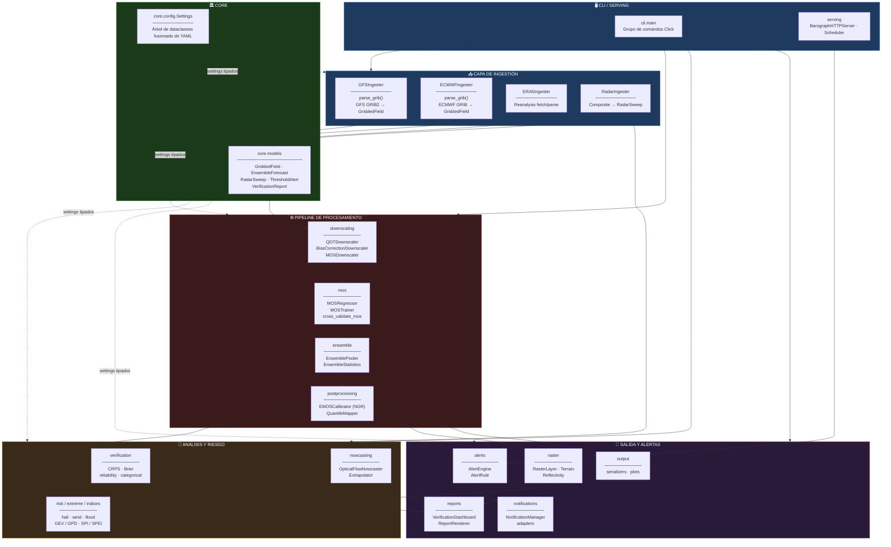
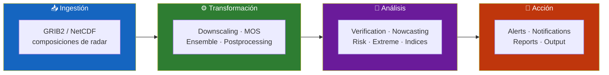
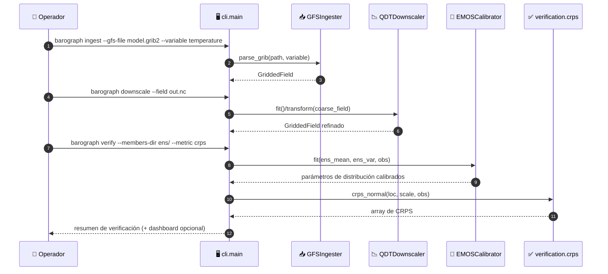
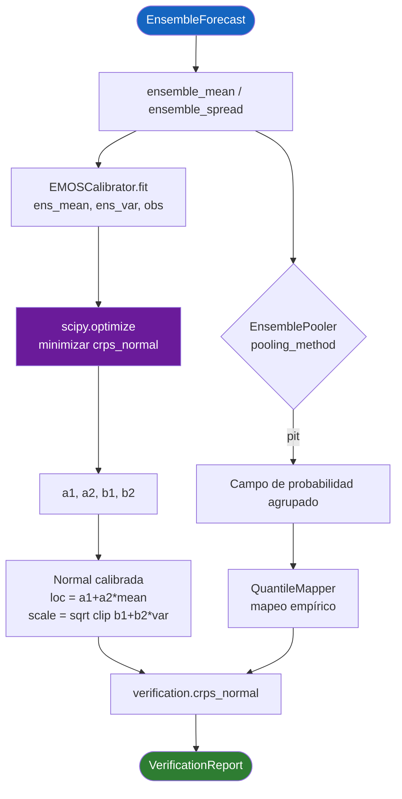
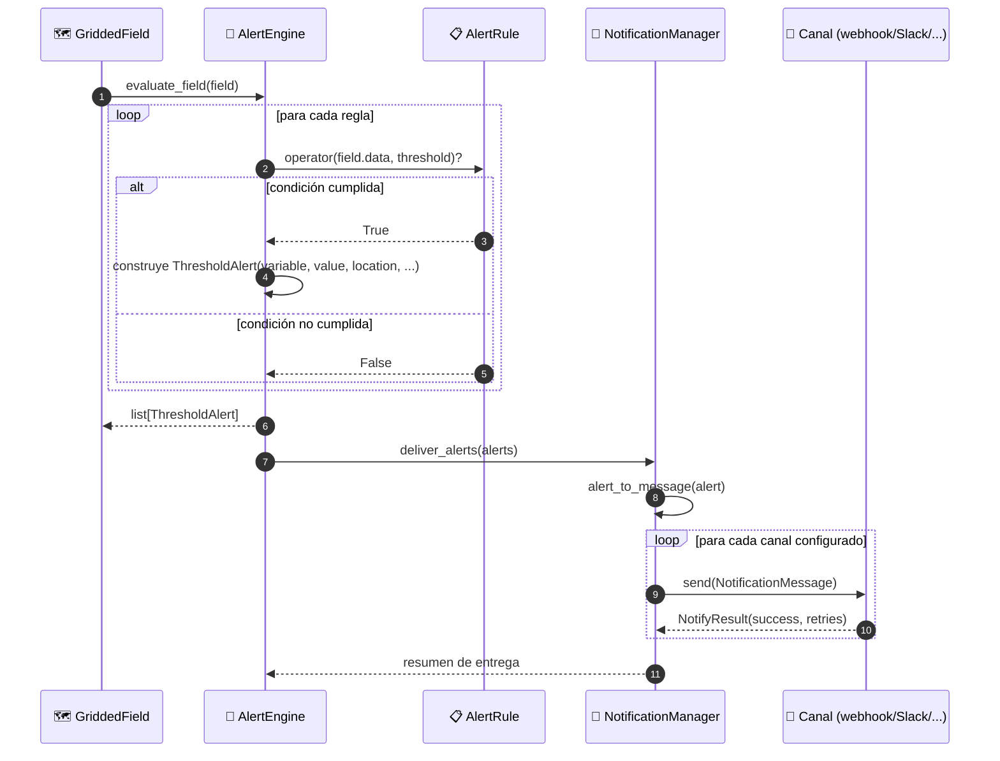
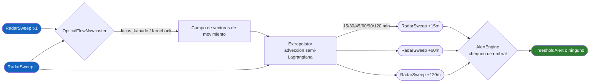
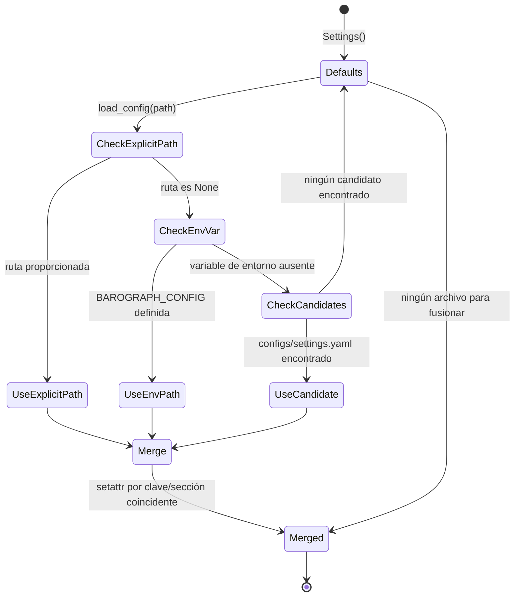
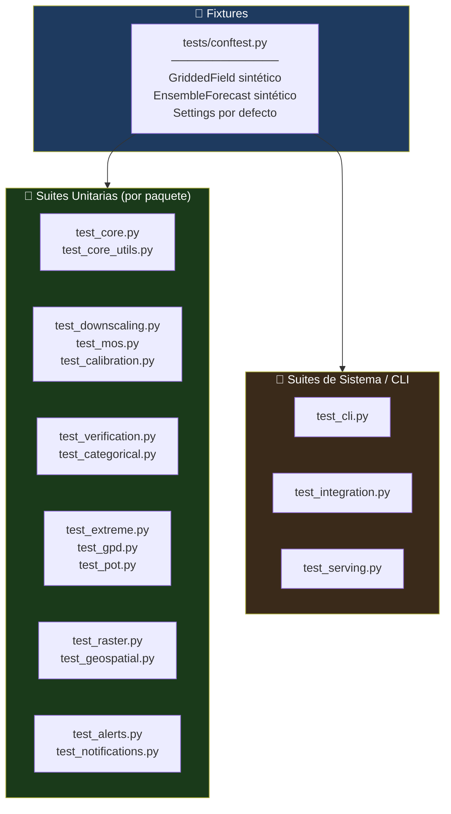

<div align="center">

**🌐 Choose Language / Selecione o Idioma / Elija el Idioma**

[](README.md)&nbsp;&nbsp;&nbsp;[](README_PT.md)&nbsp;&nbsp;&nbsp;[](README_ES.md)

</div>

---

<div align="center">

```
██████╗  █████╗ ██████╗  ██████╗  ██████╗ ██████╗  █████╗ ██████╗ ██╗  ██╗
██╔══██╗██╔══██╗██╔══██╗██╔═══██╗██╔════╝ ██╔══██╗██╔══██╗██╔══██╗██║  ██║
██████╔╝███████║██████╔╝██║   ██║██║  ███╗██████╔╝███████║██████╔╝███████║
██╔══██╗██╔══██║██╔══██╗██║   ██║██║   ██║██╔══██╗██╔══██║██╔═══╝ ██╔══██║
██████╔╝██║  ██║██║  ██║╚██████╔╝╚██████╔╝██║  ██║██║  ██║██║     ██║  ██║
╚═════╝ ╚═╝  ╚═╝╚═╝  ╚═╝ ╚═════╝  ╚═════╝ ╚═╝  ╚═╝╚═╝  ╚═╝╚═╝     ╚═╝  ╚═╝
    Kit de Modelado, Post-Procesamiento y Verificación de Pronóstico
```

---

[](https://www.python.org/)
[](https://numpy.org/)
[](https://xarray.dev/)
[](https://scipy.org/)
[](https://scikit-learn.org/)
[](https://click.palletsprojects.com/)
[](https://pytest.org/)
[]()

<br/>

> **Un kit de herramientas basado en archivos y dependencias para ingerir salidas de modelos NWP,**
> aplicar downscaling estadístico, calibrar ensembles, verificar habilidad y emitir alertas.

<br/>


</div>

---

## 📑 Tabla de Contenidos

<details>
<summary>▶️ <strong>Haga clic para expandir / contraer esta sección</strong></summary>

<table>
<tr>
<td valign="top" width="50%">

**🏗️ Sistema**
- [Visión General](#-visión-general)
- [Arquitectura del Sistema](#-arquitectura-del-sistema)
- [Stack Tecnológico](#-stack-tecnológico)
- [Patrones de Diseño](#-patrones-de-diseño-aplicados)
- [Estructura del Proyecto](#-estructura-del-proyecto)

**📦 Módulos**
- [Core — Modelos, Config, Coordenadas](#-core--modelos-de-dominio-config--coordenadas)
- [Ingestion — GFS, ECMWF, ERA5, Radar](#-ingestion--gfs-ecmwf-era5-radar)
- [Downscaling — QDT, Corrección de Sesgo, MOS](#-downscaling--qdt-corrección-de-sesgo-mos)
- [MOS — Regressor, Trainer, Evaluación](#-mos--model-output-statistics)
- [Ensemble — Pooling y Estadísticas](#-ensemble--pooling-y-estadísticas)
- [Postprocessing — EMOS y Quantile Mapping](#-postprocessing--emos-y-quantile-mapping)
- [Verification — CRPS, Brier, Categórico](#-verification--crps-brier-categórico)
- [Nowcasting — Optical Flow](#-nowcasting--optical-flow-extrapolación)
- [Alerts — Reglas y Motor](#-alerts--motor-de-reglas)
- [Raster — Capas, Álgebra, Terreno](#-raster--capas-álgebra-terreno-reflectividad)
- [Extreme, Indices, Risk y Time Series](#-extreme-indices-risk-y-time-series)
- [Serving, Notifications, Reports, CLI](#-serving-notifications-reports-y-cli)

</td>
<td valign="top" width="50%">

**💼 Negocio**
- [Reglas de Negocio](#-reglas-de-negocio)
- [Requisitos Funcionales](#-requisitos-funcionales)
- [Requisitos No Funcionales](#-requisitos-no-funcionales)

**📐 Diseño**
- [Modelo de Datos](#-modelo-de-datos)
- [Flujos del Sistema](#-flujos-del-sistema)
- [Flujo Ingest → Downscale → Verify](#flujo-ingest--downscale--verify)
- [Flujo de Calibración de Ensemble](#flujo-de-calibración-de-ensemble)
- [Flujo de Evaluación de Alerta](#flujo-de-evaluación-de-alerta)
- [Flujo de Nowcasting](#flujo-de-nowcasting)
- [Estado de Resolución de Configuración](#estado-de-resolución-de-configuración)

**🔐 Seguridad y Operaciones**
- [Seguridad](#-seguridad)
- [Instalación y Ejecución](#-instalación--ejecución)
- [Pruebas Automatizadas](#-pruebas-automatizadas)
- [Métricas y Monitoreo](#-métricas--monitoreo)
- [Limitaciones Conocidas](#-limitaciones-conocidas)

</td>
</tr>
</table>

---

</details>

## 🌟 Visión General

<details>
<summary>▶️ <strong>Haga clic para expandir / contraer esta sección</strong></summary>

**Barograph** es un kit de herramientas Python que lleva un pronóstico numérico del tiempo desde un archivo bruto de modelo GRIB2/NetCDF hasta un producto verificado y listo para alertas. Está organizado en 25 paquetes enfocados bajo `barograph/`, cada uno responsable de una etapa del pipeline: ingestión, downscaling estadístico, Model Output Statistics (MOS), procesamiento de ensembles, calibración de post-procesamiento, verificación, nowcasting de radar, alertas, análisis raster y salida.

El proyecto evita deliberadamente una base de datos o un servidor persistente como columna vertebral. En su lugar, `barograph.core.models` define un pequeño conjunto de dataclasses (`GriddedField`, `EnsembleForecast`, `PointForecast`, `RadarSweep`, `ThresholdAlert`, `VerificationReport`) que fluyen entre etapas en memoria, y `barograph.utils.storage` las persiste en NetCDF, Zarr o NPY cuando un límite de etapa necesita un archivo en disco. La configuración es un árbol de dataclasses (`barograph.core.config.Settings`) fusionado desde un archivo YAML opcional, de modo que cada subsistema (URLs de ingestión, algoritmo MOS, método de pooling de ensemble, cooldowns de alerta) tiene un valor por defecto tipado que un despliegue puede sobrescribir sin cambiar código.

Una única CLI basada en Click (`barograph.cli.main`) expone todo el pipeline como subcomandos combinables (`ingest`, `downscale`, `verify`, `nowcast`, `check-alerts`, `raster`, `qc`, `derived`, `extreme`, `spi`, `spei`, `risk`, `notify`, `export`, `config-show`), de modo que el kit puede activarse desde scripts de shell, cron o un planificador sin importar Python.

### 🎯 Objetivos del Sistema

| Objetivo | Descripción |
|-----------|-------------|
| 📥 **Ingestión de modelos** | Analizar GFS, ECMWF, ERA5 GRIB2/NetCDF y composiciones de radar en objetos `GriddedField` |
| 📉 **Downscaling estadístico** | Refinar pronósticos de malla gruesa con Quantile Delta Transform o corrección de sesgo |
| 🌡️ **Model Output Statistics** | Entrenar regresores por estación (lineal, gradient boosting) que mapean campos de modelo a pronósticos a escala de estación |
| 🎲 **Calibración de ensemble** | Agrupar miembros del ensemble y calibrar dispersión/ubicación con EMOS (NGR) y quantile mapping |
| ✅ **Verificación** | Puntuar pronósticos con CRPS, Brier score + descomposición, diagramas de confiabilidad y métricas categóricas (POD/FAR/CSI/ETS) |
| 🌩️ **Nowcasting de radar** | Extrapolar campos de reflectividad con flujo óptico Lucas-Kanade / Farneback / block-matching |
| 🚨 **Alertas por umbral** | Evaluar objetos `AlertRule` contra campos gridded y despachar por canales de notificación conectables |
| 🗺️ **Análisis raster** | Álgebra de malla con CRS, enmascaramiento, derivadas de terreno (pendiente/aspecto/hillshade) y conversión Z-R de reflectividad |
| 📊 **Informes** | Renderizar paneles de verificación y resúmenes de alertas/campos en Markdown/JSON/HTML |
| 🧪 **Control de calidad** | Señalar problemas de rango bruto, picos, persistencia, duplicados y huecos en series de observación antes de que lleguen a un modelo |

---

</details>

## 🏗️ Arquitectura del Sistema

<details>
<summary>▶️ <strong>Haga clic para expandir / contraer esta sección</strong></summary>

### Diagrama de Módulos



### Capas de Arquitectura



---

</details>

## 🛠️ Stack Tecnológico

<details>
<summary>▶️ <strong>Haga clic para expandir / contraer esta sección</strong></summary>

<table>
<thead>
<tr>
<th>Capa</th>
<th>Tecnología</th>
<th>Versión</th>
<th>Propósito</th>
</tr>
</thead>
<tbody>
<tr>
<td rowspan="2"><strong>🧠 Lenguaje</strong></td>
<td>Python</td>
<td>&gt;= 3.10</td>
<td>Lenguaje de la aplicación (<code>requires-python</code> en <code>pyproject.toml</code>)</td>
</tr>
<tr>
<td>Objetivo de mypy</td>
<td>3.12</td>
<td>Línea base de chequeo de tipos (<code>[tool.mypy] python_version</code>)</td>
</tr>
<tr>
<td rowspan="5"><strong>🔢 Núcleo Científico</strong></td>
<td>NumPy</td>
<td>&gt;= 1.24</td>
<td>Operaciones con arrays en todos los módulos</td>
</tr>
<tr>
<td>pandas</td>
<td>&gt;= 2.0</td>
<td>Series temporales tabulares y datos de estación</td>
</tr>
<tr>
<td>xarray</td>
<td>&gt;= 2023.1</td>
<td>Arrays multidimensionales etiquetados, E/S NetCDF/Zarr</td>
</tr>
<tr>
<td>SciPy</td>
<td>&gt;= 1.11</td>
<td><code>scipy.optimize</code> (ajuste EMOS), <code>scipy.stats</code> (CRPS/normal), <code>scipy.interpolate</code>, <code>scipy.ndimage</code></td>
</tr>
<tr>
<td>scikit-learn</td>
<td>&gt;= 1.3</td>
<td>Regresores lineal / ridge / random-forest / gradient-boosting para MOS y pipelines de ML</td>
</tr>
<tr>
<td rowspan="4"><strong>📦 Formatos de Datos</strong></td>
<td>netCDF4</td>
<td>&gt;= 1.6</td>
<td>Backend de lectura/escritura NetCDF para <code>xarray</code></td>
</tr>
<tr>
<td>zarr</td>
<td>&gt;= 2.15</td>
<td>Almacenamiento en bloques comprimidos para ensembles</td>
</tr>
<tr>
<td>cfgrib</td>
<td>&gt;= 0.9</td>
<td>Decodificación GRIB2 vía bindings de ecCodes</td>
</tr>
<tr>
<td>eccodes</td>
<td>&gt;= 1.6</td>
<td>Códec de mensajes GRIB de bajo nivel (ECMWF)</td>
</tr>
<tr>
<td rowspan="2"><strong>⚙️ Paralelismo</strong></td>
<td>dask[complete]</td>
<td>&gt;= 2023.7</td>
<td>Cómputo en bloques/perezoso sobre grandes arrays gridded</td>
</tr>
<tr>
<td>Configuración <code>n_workers</code></td>
<td>—</td>
<td><code>Settings.n_workers</code>, por defecto 4</td>
</tr>
<tr>
<td rowspan="2"><strong>🖥️ CLI / Config</strong></td>
<td>Click</td>
<td>&gt;= 8.1</td>
<td>Grupo de comandos en <code>barograph.cli.main</code>, 19 subcomandos</td>
</tr>
<tr>
<td>PyYAML / toml</td>
<td>&gt;= 6.0 / &gt;= 0.10</td>
<td><code>load_config()</code> fusiona configuración YAML en <code>Settings</code></td>
</tr>
<tr>
<td rowspan="2"><strong>🖼️ Imágenes</strong></td>
<td>OpenCV (opencv-python)</td>
<td>&gt;= 4.8</td>
<td>Flujo óptico Lucas-Kanade / Farneback para nowcasting</td>
</tr>
<tr>
<td>loguru</td>
<td>&gt;= 0.7</td>
<td>Logging estructurado vía <code>utils.logging.setup_logging</code></td>
</tr>
<tr>
<td rowspan="3"><strong>🧪 Calidad</strong></td>
<td>pytest / pytest-cov / pytest-xdist</td>
<td>&gt;= 7.4 / 4.1 / 3.3</td>
<td>Ejecutor de pruebas, cobertura, ejecución paralela (extra <code>dev</code>)</td>
</tr>
<tr>
<td>mypy</td>
<td>&gt;= 1.5</td>
<td>Tipado estático (<code>[tool.mypy]</code>, overrides de stubs de terceros)</td>
</tr>
<tr>
<td>ruff</td>
<td>&gt;= 0.0.280</td>
<td>Lint, conjunto de reglas <code>E,F,I,N,W,UP</code>, línea de 100 caracteres</td>
</tr>
<tr>
<td rowspan="1"><strong>📚 Docs</strong></td>
<td>Sphinx + sphinx-rtd-theme</td>
<td>&gt;= 7.2 / 2.0</td>
<td>Extra <code>docs</code>, construido vía <code>hatch run docs:build</code></td>
</tr>
<tr>
<td rowspan="1"><strong>📦 Build</strong></td>
<td>hatchling</td>
<td>—</td>
<td>Backend <code>[build-system]</code>, entry point <code>barograph = barograph.cli.main:cli</code></td>
</tr>
</tbody>
</table>

---

</details>

## 🎨 Patrones de Diseño Aplicados

<details>
<summary>▶️ <strong>Haga clic para expandir / contraer esta sección</strong></summary>

| Patrón | Dónde | Justificación |
|---------|-------|-----------|
| 🧱 **Abstract Base Class / Template Method** | `downscaling.base.BaseDownscaler`, subclasificado por `QDTDownscaler`, `BiasCorrectionDownscaler`, `MOSDownscaler` | Cada downscaler expone el mismo contrato `fit`/`transform` mientras mantiene su propio método estadístico |
| 🏭 **Factory Function** | `model.regressor._make_estimator(kind, **kwargs)` | Construye un estimador scikit-learn a partir de una clave string (`"linear"`, `"ridge"`, `"random_forest"`) sin filtrar imports de sklearn por el código |
| 🎯 **Strategy** | `EMOSCalibrator(distribution=...)`, `QuantileMapper(method=...)`, selección de método de flujo óptico en `Extrapolator` | El algoritmo de calibración/extrapolación se elige mediante una cadena de configuración y se intercambia sin tocar los puntos de llamada |
| 🧾 **Dataclass Value Objects** | `core.models` (`GriddedField`, `EnsembleForecast`, ...), `core.config` (`Settings` y sus sub-configuraciones) | Registros tipados, inmutables por convención, en lugar de dicts que viajan por el pipeline |
| 🚦 **Guard Clause / Fail Fast** | `GriddedField.__post_init__`, `EnsembleForecast.__post_init__`, `ingestion._grib.require_cfgrib()` | Formas inválidas o dependencias opcionales faltantes lanzan excepción de inmediato en lugar de fallar más adelante |
| 🔌 **Adapter** | `notifications.adapters.alert_to_message`, `notifications.adapters.deliver_alerts` | Convierte un objeto de dominio `ThresholdAlert` en la forma `NotificationMessage` que cada canal espera |
| 🧮 **Pipeline / Composite** | `model.regressor.RegressionPipeline` (`FeatureSelector` + `RegressionModel`) | Encadena selección de features y estimación detrás de una única llamada `fit`/`predict` |
| 👂 **Observer-like Callback Registry** | Lista de canales de notificación de `alerts.engine.AlertEngine`, lista de jobs de `serving.scheduler.Scheduler` | Múltiples manejadores independientes reaccionan al mismo evento evaluado sin acoplamiento fuerte |
| 🗃️ **Repository-lite** | `utils.storage` (`save_gridded_field`, `load_gridded_field`, `save_ensemble`, `to_zarr`) | Centraliza toda lectura/escritura en disco para que los formatos puedan cambiar sin tocar el código del pipeline |
| ⏳ **Memoization / Decorator** | `utils.cache.memoize(ttl_hours=...)`, `utils.cache.TTLCache` | Envuelve llamadas costosas de red/parsing con una caché acotada en el tiempo de forma transparente |

---

</details>

## 📁 Estructura del Proyecto

<details>
<summary>▶️ <strong>Haga clic para expandir / contraer esta sección</strong></summary>

```
barograph/
│
├── 📄 pyproject.toml                 # build hatchling, dependencias, config ruff/mypy/pytest
├── 📄 README.md                      # 🇺🇸 Inglés (primario)
├── 📄 README_PT.md                   # 🇧🇷 Português
├── 📄 README_ES.md                   # 🇪🇸 Español
│
├── 📂 configs/                       # 📄 settings.yaml, alert_rules.yaml (configuración de runtime)
├── 📂 data/                          # 📂 gen/ 📂 ingested/ 📂 radar/ — directorios de datos de ejemplo/trabajo
├── 📂 docs/                          # Fuentes Sphinx — 📂 _static/ 📂 _templates/ 📂 api/
├── 📂 logs/                          # Log de runtime + salida JSONL de notificaciones
├── 📂 scripts/                       # Scripts operativos auxiliares
│
├── 📂 barograph/                     # ★ Paquete principal (25 sub-paquetes, 95 archivos fuente)
│   ├── 📄 __init__.py
│   │
│   ├── 📂 core/                      # Modelos de dominio, config, coordenadas, utilidades temporales
│   │   ├── models.py                 # GriddedField, EnsembleForecast, ThresholdAlert, ...
│   │   ├── config.py                 # Árbol de dataclasses Settings + load_config()
│   │   ├── coordinates.py            # haversine_distance, reproject_field, create_grid
│   │   └── temporal.py               # temporal_interpolate, resample_temporal, time_weights
│   │
│   ├── 📂 ingestion/                 # Ingestión de datos de modelo + radar
│   │   ├── gfs.py, ecmwf.py, era5.py # GFSIngester, ECMWFIngester, ERA5Ingester
│   │   ├── radar.py                  # RadarIngester → RadarSweep
│   │   └── _grib.py                  # Guarda de dependencia opcional require_cfgrib()
│   │
│   ├── 📂 downscaling/                # QDT, corrección de sesgo, downscaling basado en MOS
│   ├── 📂 mos/                        # MOSRegressor, MOSTrainer, cross_validate_mos
│   ├── 📂 ensemble/                   # EnsemblePooler, EnsembleStatistics
│   ├── 📂 postprocessing/             # EMOSCalibrator (NGR), QuantileMapper
│   ├── 📂 verification/               # crps.py, brier.py, reliability.py, categorical.py, metrics.py
│   ├── 📂 nowcasting/                  # OpticalFlowNowcaster, Extrapolator
│   ├── 📂 forecast/                    # ForecastCycle, ForecastBlender, BlendingWeights
│   ├── 📂 alerts/                      # AlertRule, Operator, Severity, AlertEngine
│   ├── 📂 raster/                      # RasterLayer, CRS, RasterAlgebra, Terrain, Reflectivity, RasterMasker
│   ├── 📂 geospatial/                  # IDWInterpolator, SimpleKriging, PolygonMasker, ayudantes de proyección
│   ├── 📂 time_series/                 # linear_trend, seasonal_climatology, PrecipitationAnalyzer
│   ├── 📂 climatology/                 # ClimatologyNormal, monthly_climatology, deviation_from_normal
│   ├── 📂 model/                       # FeatureSelector, RegressionModel, RegressionPipeline
│   ├── 📂 risk/                        # hail_index, wind_risk_score, flood_risk_score
│   ├── 📂 extreme/                     # gev.py, gpd.py, peak.py, pot.py — análisis de valores extremos GEV/GPD
│   ├── 📂 indices/                     # spi.py (SPI), spei.py (SPEI) — índices de sequía
│   ├── 📂 derived/                     # humidity.py, thermal.py — punto de rocío, índice de calor, sensación térmica
│   ├── 📂 quality/                     # qc.py — QualityController, chequeos de rango/pico/persistencia
│   ├── 📂 api/                         # Cliente OpenMeteo, HTTPClient, HTTPError
│   ├── 📂 serving/                     # BarographHTTPServer, RouteTable, Scheduler
│   ├── 📂 notifications/               # NotificationManager, adapters.py
│   ├── 📂 reports/                     # VerificationDashboard, ReportRenderer
│   ├── 📂 output/                      # serializers.py, plots.py
│   ├── 📂 utils/                       # storage.py, logging.py, cache.py (TTLCache, memoize)
│   └── 📂 cli/                         # main.py — grupo de comandos Click, 19 subcomandos
│
└── 📂 tests/                          # 35 archivos de prueba, 315 funciones de prueba (pytest)
    ├── conftest.py                    # Fixtures compartidas (campos sintéticos, ensembles, configs)
    └── test_*.py                      # Una suite por área de módulo (ver Pruebas Automatizadas)
```

---

</details>

## 📦 Módulos del Sistema

<details>
<summary>▶️ <strong>Haga clic para expandir / contraer esta sección</strong></summary>

### 🏛️ Core — Modelos de Dominio, Config y Coordenadas

`barograph/core/` es el vocabulario compartido que importan todos los demás paquetes. `models.py` define las dataclasses que viajan por el pipeline; `config.py` define `Settings` y `load_config()`; `coordinates.py` y `temporal.py` proporcionan ayudantes espaciales y de eje temporal.

| Componente | Archivo | Responsabilidad |
|-----------|------|-----------------|
| `GriddedField` | `core/models.py` | Campo 2D/3D con `data`, `lats`, `lons`, `variable`, `source`, `valid_time`, `init_time`; valida la forma espacial en `__post_init__` |
| `EnsembleForecast` | `core/models.py` | Lista de miembros `GriddedField`; expone las propiedades `ensemble_mean`, `ensemble_spread`, `member_array` |
| `RadarSweep` | `core/models.py` | Composición única de radar; expone `dbz` y `reflectivity_linear` (`10**(dBZ/10)`) |
| `ThresholdAlert` / `VerificationReport` | `core/models.py` | Registros de alerta y de resultado de puntuación con payloads de dict `meta`/`details` |
| `Settings` | `core/config.py` | Árbol de dataclasses (`IngestionConfig`, `DownscalingConfig`, `MOSConfig`, `EnsembleConfig`, `PostprocessingConfig`, `VerificationConfig`, `NowcastingConfig`, `AlertsConfig`, `RasterConfig`, `NotificationsConfig`, `OutputConfig`) |
| `load_config(path)` | `core/config.py` | Resuelve `--config`, la variable de entorno `BAROGRAPH_CONFIG`, o `configs/settings.yaml`, luego fusiona las claves coincidentes por sección |
| `haversine_distance`, `create_grid`, `reproject_field` | `core/coordinates.py` | Distancia de gran círculo, construcción de malla regular, reproyección por vecino más cercano |
| `temporal_interpolate`, `resample_temporal`, `time_weights` | `core/temporal.py` | Interpolación y remuestreo en el eje temporal para series irregulares |

---

### 📥 Ingestion — GFS, ECMWF, ERA5, Radar

Cuatro ingesters convierten archivos brutos de modelo/radar en objetos `GriddedField`/`RadarSweep`, todos configurados desde `IngestionConfig`.

| Clase | Archivo | Formato de origen | Notas |
|-------|------|----------------|-------|
| `GFSIngester` | `ingestion/gfs.py` | GRIB2 (0.25°) | `parse_grib(path, variable)` → `GriddedField` |
| `ECMWFIngester` | `ingestion/ecmwf.py` | GRIB (IFS) | Mismo contrato `parse_grib` que GFS |
| `ERA5Ingester` | `ingestion/era5.py` | Reanálisis NetCDF / GRIB | URL base estilo Copernicus CDS en la config |
| `RadarIngester` | `ingestion/radar.py` | Composición de radar | Produce `RadarSweep` para nowcasting |
| `require_cfgrib()` | `ingestion/_grib.py` | — | Lanza `EcCodesUnavailableError` cuando `cfgrib`/`eccodes` no son importables, fallando rápido con un mensaje claro |

---

### 📉 Downscaling — QDT, Corrección de Sesgo, MOS

`downscaling/base.py` define `BaseDownscaler(ABC)`; tres estrategias concretas la implementan.

| Clase | Archivo | Método |
|-------|------|--------|
| `QDTDownscaler` | `downscaling/quantile_delta_transform.py` | Quantile Delta Transform — aplica el delta entre las distribuciones cuantílicas observada y modelada al pronóstico |
| `BiasCorrectionDownscaler` | `downscaling/bias_correction.py` | Corrección de sesgo aditiva/multiplicativa contra una ventana histórica de entrenamiento |
| `MOSDownscaler` | `downscaling/mos_downscaling.py` | Delega en un `MOSRegressor` entrenado para el refinamiento a escala de estación |

`DownscalingConfig` (en `core/config.py`) define `method`, `grid_resolution_km`, `training_years` y `dem_path`.

---

### 🌡️ MOS — Model Output Statistics

`mos/` entrena y evalúa regresores por estación que mapean campos brutos de modelo al comportamiento observado en la estación.

| Componente | Archivo | Rol |
|-----------|------|------|
| `MOSRegressor` | `mos/regressor.py` | Envuelve un estimador scikit-learn (`linear` o `gradient_boosting`, según `MOSConfig.algorithm`) para una estación |
| `MOSTrainer`, `MOSDataset` | `mos/trainer.py` | Ensambla arrays de features/objetivo y ajusta regresores en `calibration_station_ids` |
| `cross_validate_mos` | `mos/evaluation.py` | Evaluación de habilidad mediante validación cruzada k-fold |
| `skill_vs_reference`, `mse_reduction` | `mos/evaluation.py` | Comparaciones de skill-score y reducción de error contra un pronóstico de referencia |

---

### 🎲 Ensemble — Pooling y Estadísticas

| Componente | Archivo | Rol |
|-----------|------|------|
| `EnsemblePooler` | `ensemble/pooling.py` | Agrupa miembros brutos del ensemble usando `EnsembleConfig.pooling_method` (p. ej., binning basado en PIT) |
| `EnsembleStatistics` | `ensemble/statistics.py` | Deriva productos de media, dispersión, cuantil y probabilidad a partir de un `EnsembleForecast` |

---

### 🧮 Postprocessing — EMOS y Quantile Mapping

| Componente | Archivo | Rol |
|-----------|------|------|
| `EMOSCalibrator` | `postprocessing/emos.py` | Regresión Gaussiana No-Homogénea (Gneiting et al. 2005): ubicación `a1 + a2*ens_mean`, escala `sqrt(b1 + b2*ens_var)`, ajustada vía `scipy.optimize` minimizando `crps_normal` |
| `QuantileMapper` | `postprocessing/quantile_mapping.py` | Mapeo cuantílico empírico entre distribuciones de modelo y observadas, controlado por `PostprocessingConfig.n_bins` |

---

### ✅ Verification — CRPS, Brier, Categórico

| Componente | Archivo | Rol |
|-----------|------|------|
| `crps_normal`, `crps_ensemble`, `crps_truncated_normal`, `crps_score`, `crps_skill` | `verification/crps.py` | Continuous Ranked Probability Score para pronósticos paramétricos y de ensemble |
| `brier_score`, `brier_decomposition`, `brier_skill_score` | `verification/brier.py` | Puntuación probabilística de evento binario y descomposición en confiabilidad/resolución/incertidumbre |
| `reliability_diagram`, `reliability_index`, `accuracy_curve` | `verification/reliability.py` | Curvas de calibración agrupadas por probabilidad pronosticada |
| `ContingencyTable`, `probability_of_detection`, `false_alarm_ratio`, `critical_success_index`, `equitable_threat_score`, `frequency_bias`, `peirce_skill_score` | `verification/categorical.py` | POD / FAR / CSI / ETS / bias / PSS a partir de conteos de tabla de contingencia 2x2 |
| `VerificationMetrics` | `verification/metrics.py` | Agrega bias, MAE, RMSE y las métricas anteriores en un único informe |

---

### 🌩️ Nowcasting — Optical Flow y Extrapolación

| Componente | Archivo | Rol |
|-----------|------|------|
| `OpticalFlowNowcaster` | `nowcasting/optical_flow.py` | Calcula vectores de movimiento entre dos `RadarSweep` usando los métodos Lucas-Kanade o Farneback de OpenCV (`NowcastingConfig.optical_flow_method`) |
| `Extrapolator` | `nowcasting/extrapolation.py` | Advección semi-Lagrangiana del campo de reflectividad a lo largo de los vectores de flujo para cada lead time en `extrapolation_minutes` |

---

### 🚨 Alerts — Motor de Reglas

| Componente | Archivo | Rol |
|-----------|------|------|
| `AlertRule` | `alerts/rules.py` | Dataclass: `variable`, `threshold`, `operator` (enum `Operator`), `severity` (enum `Severity`) |
| `Operator`, `Severity` | `alerts/rules.py` | Comparaciones estilo `GREATER_OR_EQUAL`/`GREATER`/`LESS`/`LESS_OR_EQUAL`; severidades estilo `WATCH`/`WARNING`/`SEVERE` |
| `AlertEngine` | `alerts/engine.py` | `add_rule()`, `evaluate_field(field)` → lista de `ThresholdAlert`; despacha por los `notification_channels` configurados |

---

### 🗺️ Raster — Capas, Álgebra, Terreno, Reflectividad

| Componente | Archivo | Rol |
|-----------|------|------|
| `RasterLayer`, `CRS` | `raster/layer.py` | Wrapper de malla 2D con CRS (por defecto EPSG:4326 según `RasterConfig.default_crs`) |
| `RasterAlgebra` | `raster/algebra.py` | Aritmética celda a celda entre capas con manejo de nodata |
| `RasterMasker` | `raster/masking.py` | Enmascaramiento por polígono/umbral de capas raster |
| `Terrain` | `raster/terrain.py` | Derivación de pendiente, aspecto e hillshade a partir de una capa DEM |
| `Reflectivity`, `ZRRelation` | `raster/reflectivity.py` | Conversión dBZ ↔ tasa de lluvia vía relación Z-R configurable |

---

### 🌪️ Extreme, Indices, Risk y Time Series

| Paquete | Componentes clave | Rol |
|---------|-----------------|------|
| `extreme/` | `GEVDistribution`, `fit_gev`, `return_level`, `GPDDistribution`, `fit_gpd`, `POTResult`, `pot_return_level`, `block_maxima`, `annual_maxima`, `peak_over_threshold` | Análisis de niveles de retorno por Valor Extremo Generalizado (L-moments) y Pareto Generalizado (picos sobre umbral) |
| `indices/` | `compute_spi`, `compute_spi_series`, `classify_drought` (`spi.py`); `compute_spei`, `pet_thornthwaite` (`spei.py`) | Índice de Precipitación Estandarizado e Índice de Precipitación-Evapotranspiración Estandarizado |
| `risk/` | `hail_index`, `wind_risk_score`, `flood_risk_score`, `HailIndex`, `WindRiskIndex`, `hail_index_field` | Puntuación de riesgo de tiempo severo escalar y gridded |
| `time_series/` | `linear_trend`, `seasonal_climatology`, `standard_anomalies`, `TimeSeriesAnalyzer`, `PrecipitationEvent`, `PrecipitationAnalyzer`, `rolling_precip`, `wet_days_fraction` | Análisis de tendencia, anomalía y eventos de precipitación |
| `climatology/` | `ClimatologyNormal`, `monthly_climatology`, `annual_climatology`, `deviation_from_normal` | Normales de largo plazo y cálculo de desviación de la normal |
| `derived/` | `dewpoint`, `relative_humidity`, `absolute_humidity`, `wind_chill`, `heat_index`, `apparent_temperature` | Fórmulas estándar de magnitudes meteorológicas derivadas |
| `quality/` | `QualityController`, `QualityFlag`, `check_gross_range`, `check_spikes`, `check_persistence`, `check_duplicates`, `detect_gaps` | Chequeos de QC con severidad marcada en series de observación |
| `model/` | `FeatureSelector`, `RegressionModel`, `RegressionPipeline`, `_make_estimator` | Pipelines genéricos de regresión ML (lineal/ridge/random-forest) con selección de features |
| `geospatial/` | `IDWInterpolator`, `NearestInterpolator`, `SimpleKriging`, `PolygonMasker`, `haversine_distance`, `point_in_polygon` | Interpolación estación-a-malla y enmascaramiento espacial |
| `forecast/` | `ForecastCycle`, `ForecastBlender`, `BlendingWeights` | Control de ciclos multi-run y blending ponderado por recencia de pronósticos sucesivos |

---

### 🔌 Serving, Notifications, Reports y CLI

| Paquete | Componentes clave | Rol |
|---------|-----------------|------|
| `serving/` | `BarographHTTPServer`, `RouteTable`, `start_server`, `Scheduler`, `ScheduledJob` | Servidor HTTP JSON sin dependencias (basado en `http.server`) y un ejecutor de tareas programadas en proceso |
| `notifications/` | `NotificationManager`, `NotificationMessage`, `NotifyResult`, `alert_to_message`, `deliver_alerts` | Entrega con reintentos por canales consola/log/archivo/webhook/Slack/Discord/Mattermost/email |
| `reports/` | `VerificationDashboard`, `ReportRenderer` | Agrega resultados de verificación y alertas en paneles Markdown/JSON/HTML |
| `output/` | `serializers.py`, `plots.py` | Serialización de campos JSON/CSV/NetCDF/Zarr/NPY y renderizado PNG |
| `api/` | `OpenMeteo`, `HTTPClient`, `HTTPError`, `CurrentWeather`, `HourlyForecast`, `DailyForecast` | Cliente Open-Meteo en tiempo real con transporte HTTP inyectable y lógica de reintentos |
| `utils/` | `save_gridded_field`, `load_gridded_field`, `TTLCache`, `memoize`, `setup_logging`, `get_logger` | Almacenamiento, caché y logging compartidos por todos los paquetes |
| `cli/` | `cli` (grupo Click), `ingest`, `downscale`, `verify`, `nowcast`, `check_alerts`, `raster`, `qc_cmd`, `derived`, `extreme_cmd`, `spi_cmd`, `spei_cmd`, `risk_cmd`, `notify_cmd`, `export_cmd`, `config_show` | El único punto de entrada (`barograph = barograph.cli.main:cli`) que conecta todos los paquetes a subcomandos ejecutables |

---

</details>

## 💼 Reglas de Negocio

<details>
<summary>▶️ <strong>Haga clic para expandir / contraer esta sección</strong></summary>

### 📥 Reglas de Ingestión y Validación

| # | Regla | Aplicación |
|---|------|-------------|
| RN-01 | Un `GriddedField` debe tener al menos 2D y sus dos últimas dimensiones deben coincidir con las longitudes de `lats`/`lons` | `GriddedField.__post_init__` lanza `ValueError` en caso contrario |
| RN-02 | Un `EnsembleForecast` debe tener tantos `member_ids` como `members` | `EnsembleForecast.__post_init__` lanza `ValueError` en caso contrario, y autocompleta `member_ids` cuando se omite |
| RN-03 | El análisis GRIB requiere que `cfgrib`/`eccodes` sean importables | `ingestion._grib.require_cfgrib()` lanza `EcCodesUnavailableError` antes de cualquier intento de análisis |
| RN-04 | Los valores de cadena de `Variable` desconocidos recaen a un valor por defecto especificado por el llamador (o `TEMPERATURE`) | `Variable.from_value(value, default)` |

### 🌡️ Reglas de Calibración y Verificación

| # | Regla | Aplicación |
|---|------|-------------|
| RN-05 | EMOS solo admite distribuciones `"normal"` o `"truncated_normal"` | `EMOSCalibrator.__init__` lanza `ValueError` para cualquier otro valor |
| RN-06 | La escala de EMOS debe permanecer positiva durante la optimización | `scale2 = np.clip(b1 + b2*ens_var, 1e-6, None)` en `crps_normal` |
| RN-07 | La puntuación CRPS de ensemble usa la fórmula justa (no sesgada) | `crps_ensemble` resta el término de diferencia por pares dividido por `n*n` |
| RN-08 | Las puntuaciones categóricas (POD, FAR, CSI, ETS, bias, PSS) aceptan una `ContingencyTable` o conteos brutos de acierto/error/falsa-alarma/negativa-correcta | Cada función en `verification/categorical.py` acepta `table=None, **counts` |

### 🚨 Reglas de Alertas

| # | Regla | Aplicación |
|---|------|-------------|
| RN-09 | Una alerta solo se dispara cuando un valor de campo satisface el `Operator` de la regla contra su `threshold` | `AlertEngine.evaluate_field` |
| RN-10 | Cada alerta disparada lleva la `Variable`, `Severity`, ubicación y ambas marcas de tiempo de disparo/pronóstico | Los campos de la dataclass `ThresholdAlert` son obligatorios (sin valores por defecto excepto `severity`/`message`/`meta`) |
| RN-11 | Las alertas se despachan solo por los canales configurados en `AlertsConfig.notification_channels` | Constructor `AlertEngine(notification_channels=[...])` |
| RN-12 | Las alertas idénticas repetidas deben suprimirse dentro de `AlertsConfig.cooldown_minutes` | La ventana de cooldown se lee de la config para la lógica de despacho del motor |

### 🧪 Reglas de Control de Calidad

| # | Regla | Aplicación |
|---|------|-------------|
| RN-13 | Los valores fuera de `[min_value, max_value]` se marcan como fallos de rango bruto | `quality.qc.check_gross_range` |
| RN-14 | Una severidad de QC solo se escala, nunca se descarta silenciosamente | `QualityController` combina flags vía `_combine()` (unión estilo OR bit a bit) |

---

</details>

## ✅ Requisitos Funcionales

<details>
<summary>▶️ <strong>Haga clic para expandir / contraer esta sección</strong></summary>

| ID | Requisito | Prioridad | Estado |
|----|-------------|----------|--------|
| **RF-01** | El sistema debe analizar archivos GFS GRIB2 en objetos `GriddedField` vía `GFSIngester.parse_grib` | 🔴 Alta | ✅ Implementado |
| **RF-02** | El sistema debe analizar archivos GRIB de ECMWF vía `ECMWFIngester.parse_grib` | 🔴 Alta | ✅ Implementado |
| **RF-03** | El sistema debe ingerir datos de reanálisis ERA5 vía `ERA5Ingester` | 🟡 Media | ✅ Implementado |
| **RF-04** | El sistema debe ingerir composiciones de radar en objetos `RadarSweep` | 🔴 Alta | ✅ Implementado |
| **RF-05** | El sistema debe reducir la escala de pronósticos gruesos usando Quantile Delta Transform | 🔴 Alta | ✅ Implementado |
| **RF-06** | El sistema debe reducir la escala de pronósticos usando corrección de sesgo | 🟡 Media | ✅ Implementado |
| **RF-07** | El sistema debe entrenar regresores MOS por estación y validar cruzadamente su habilidad | 🔴 Alta | ✅ Implementado |
| **RF-08** | El sistema debe agrupar miembros de ensemble y calcular estadísticas de ensemble | 🔴 Alta | ✅ Implementado |
| **RF-09** | El sistema debe calibrar ensembles con EMOS (Regresión Gaussiana No-Homogénea) | 🔴 Alta | ✅ Implementado |
| **RF-10** | El sistema debe aplicar mapeo cuantílico empírico como calibración alternativa | 🟡 Media | ✅ Implementado |
| **RF-11** | El sistema debe calcular CRPS para pronósticos normal, normal-truncada y de ensemble | 🔴 Alta | ✅ Implementado |
| **RF-12** | El sistema debe calcular el Brier score y su descomposición en confiabilidad/resolución/incertidumbre | 🔴 Alta | ✅ Implementado |
| **RF-13** | El sistema debe producir diagramas de confiabilidad a partir de pronósticos probabilísticos | 🟡 Media | ✅ Implementado |
| **RF-14** | El sistema debe calcular puntuaciones categóricas (POD, FAR, CSI, ETS, bias, PSS) a partir de tablas de contingencia | 🔴 Alta | ✅ Implementado |
| **RF-15** | El sistema debe hacer nowcasting de reflectividad de radar vía extrapolación por flujo óptico | 🔴 Alta | ✅ Implementado |
| **RF-16** | El sistema debe evaluar reglas de alerta por umbral contra campos gridded | 🔴 Alta | ✅ Implementado |
| **RF-17** | El sistema debe despachar alertas por canales de notificación conectables con reintento | 🔴 Alta | ✅ Implementado |
| **RF-18** | El sistema debe realizar álgebra raster con CRS, enmascaramiento y derivación de terreno | 🟡 Media | ✅ Implementado |
| **RF-19** | El sistema debe convertir la reflectividad de radar (dBZ) en tasa de lluvia vía una relación Z-R | 🟡 Media | ✅ Implementado |
| **RF-20** | El sistema debe ajustar distribuciones de valor extremo GEV y GPD y calcular niveles/periodos de retorno | 🟡 Media | ✅ Implementado |
| **RF-21** | El sistema debe calcular los índices de sequía SPI y SPEI | 🟡 Media | ✅ Implementado |
| **RF-22** | El sistema debe calcular índices de riesgo de granizo, viento e inundación | 🟡 Media | ✅ Implementado |
| **RF-23** | El sistema debe marcar series de observación por problemas de rango bruto, pico, persistencia, duplicado y hueco | 🟡 Media | ✅ Implementado |
| **RF-24** | El sistema debe exponer una CLI basada en Click que cubra desde la ingestión hasta la exportación | 🔴 Alta | ✅ Implementado |
| **RF-25** | El sistema debe servir resultados mediante un servidor HTTP JSON sin dependencias y un planificador | 🟢 Baja | ✅ Implementado |

---

</details>

## ⚡ Requisitos No Funcionales

<details>
<summary>▶️ <strong>Haga clic para expandir / contraer esta sección</strong></summary>

| ID | Categoría | Requisito | Objetivo |
|----|----------|-------------|--------|
| **RNF-01** | ⚡ Rendimiento | Operaciones intensivas en arrays vectorizadas vía NumPy/SciPy en lugar de bucles Python cuando es viable | Sin bucles por píxel no vectorizados en `verification`, `postprocessing`, `raster` |
| **RNF-02** | ⚡ Rendimiento | Grandes ensembles procesados con `dask[complete]` para cómputo en bloques/perezoso | Configurable vía `Settings.n_workers` |
| **RNF-03** | 🧠 Memoria | Zarr usado para almacenamiento de ensemble en bloques comprimidos en lugar de cargar arrays completos | `utils.storage.to_zarr` |
| **RNF-04** | 🔧 Configurabilidad | Todo parámetro de subsistema (URLs de ingestión, algoritmo MOS, cooldowns, ...) sobrescribible vía YAML | `core.config.load_config` fusiona solo las claves presentes en el archivo |
| **RNF-05** | 🧪 Testabilidad | Todo paquete tiene al menos un módulo pytest dedicado | 35 archivos de prueba que cubren 25 paquetes + CLI + integración |
| **RNF-06** | 🧱 Mantenibilidad | Tipado estático aplicado en todo el proyecto | `mypy` configurado en `pyproject.toml`, `check_untyped_defs=false` para adopción gradual |
| **RNF-07** | 🧹 Calidad de Código | Conjunto de reglas de lint `E,F,I,N,W,UP` aplicado con línea de 100 caracteres | `ruff check .` |
| **RNF-08** | 🔌 Extensibilidad | Nuevas estrategias de downscaling/calibración conectables vía interfaces estilo `BaseDownscaler`/`EMOSCalibrator` | No se necesita ningún cambio en la CLI o el motor para añadir una estrategia |
| **RNF-09** | 🌐 Portabilidad | Sin dependencia fuerte de un SO o GPU específicos | Se ejecuta en cualquier plataforma con intérprete Python 3.10+ |
| **RNF-10** | 🔐 Resiliencia | Dependencias pesadas opcionales (cfgrib/eccodes) fallan con un error explícito y capturable | `EcCodesUnavailableError` en lugar de un traceback de `ImportError` |
| **RNF-11** | 📶 Confiabilidad | La entrega de notificaciones reintenta con backoff | `NotificationsConfig.max_retries`, `backoff_base` |
| **RNF-12** | ⏱️ Latencia | Los clientes de red (Open-Meteo) admiten timeout y reintento configurables | `IngestionConfig.timeout_seconds`, `max_retries`; transporte inyectable de `HTTPClient` |
| **RNF-13** | 📚 Documentación | Referencia de API construible a partir de docstrings | Sphinx + `sphinx-autodoc-typehints`, extra `docs` |
| **RNF-14** | 🗄️ Interoperabilidad | La salida de campos admite JSON, CSV, NetCDF, Zarr y NPY | `output.serializers`, `OutputConfig.format` |

---

</details>

## 🗄️ Modelo de Datos

<details>
<summary>▶️ <strong>Haga clic para expandir / contraer esta sección</strong></summary>

Barograph **no tiene base de datos relacional**: la capa de persistencia es el sistema de archivos (NetCDF/Zarr/NPY/JSON vía `utils.storage` y `output.serializers`), y el contrato en memoria es el grafo de dataclasses en `core/models.py`. El diagrama a continuación modela ese grafo como un diagrama entidad-relación.

### Diagrama Entidad-Relación

```mermaid
erDiagram
    GRIDDED_FIELD ||--o{ ENSEMBLE_FORECAST : "miembro de"
    GRIDDED_FIELD ||--o| VERIFICATION_REPORT : "puntuado por"
    GRIDDED_FIELD ||--o{ THRESHOLD_ALERT : "dispara"
    ENSEMBLE_FORECAST ||--|| VERIFICATION_REPORT : "verificado como"
    RADAR_SWEEP ||--o{ RADAR_SWEEP : "extrapolado a"
    THRESHOLD_ALERT }o--|| ALERT_RULE : "coincide con"
    THRESHOLD_ALERT ||--o| NOTIFICATION_MESSAGE : "renderizado como"
    COORDINATE ||--o{ POINT_FORECAST : "ubicado en"
    COORDINATE ||--o{ STATION_OBS : "ubicado en"
    STATION_OBS }o--|| POINT_FORECAST : "verificado contra"
    SETTINGS ||--|| INGESTION_CONFIG : "contiene"
    SETTINGS ||--|| ALERTS_CONFIG : "contiene"
    SETTINGS ||--|| POSTPROCESSING_CONFIG : "contiene"

    GRIDDED_FIELD {
        ndarray data "valores del campo 2D/3D"
        Variable variable "enum: temperature, precip, ..."
        ModelSource source "enum: gfs, ecmwf, era5, hrrr"
        datetime valid_time "hora de validez del pronóstico"
        dict meta "metadatos libres"
    }

    ENSEMBLE_FORECAST {
        list members "lista de GriddedField"
        list member_ids "ids enteros, autocompletados"
    }

    RADAR_SWEEP {
        ndarray data "reflectividad dBZ"
        datetime scan_time "hora del barrido"
    }

    ALERT_RULE {
        Variable variable "variable monitoreada"
        float threshold "umbral de disparo"
        Operator operator "gt, lt, ge, le"
        Severity severity "watch, warning, severe"
    }

    THRESHOLD_ALERT {
        Variable variable "variable que dispara"
        Coordinate location "ubicación del disparo"
        datetime trigger_time "hora de evaluación"
        float value "valor observado/pronosticado"
        string severity "warning por defecto"
    }

    VERIFICATION_REPORT {
        string metric_name "crps, brier, ..."
        float value "valor de la puntuación"
        int n_samples "conteo de muestras"
        dict details "datos por bin / descomposición"
    }

    COORDINATE {
        float latitude "grados"
        float longitude "grados"
    }

    POINT_FORECAST {
        list values "valores pronosticados"
        list times "horas de validez"
    }

    STATION_OBS {
        string station_id "identificador de estación"
        list values "valores observados"
    }

    NOTIFICATION_MESSAGE {
        string title "titular de la alerta"
        string severity "prioridad de entrega"
    }

    SETTINGS {
        string log_level "INFO por defecto"
        int n_workers "por defecto 4"
    }

    INGESTION_CONFIG {
        string gfs_base_url "endpoint de filtro NOMADS"
        int max_retries "por defecto 3"
    }

    ALERTS_CONFIG {
        int cooldown_minutes "por defecto 60"
        list notification_channels "p. ej. log"
    }

    POSTPROCESSING_CONFIG {
        int emos_n_members "por defecto 51"
        string distribution "truncated_normal"
    }
```



### Claves de Configuración (Settings)

| Sección | Clave | Por defecto | Propósito |
|---------|-----|---------|---------|
| `ingestion` | `gfs_base_url`, `ecmwf_base_url`, `era5_base_url` | Endpoints NOMADS / ECMWF / CDS | URLs de origen para cada ingester |
| `ingestion` | `data_dir`, `cache_ttl_hours`, `max_retries`, `timeout_seconds` | `./data/ingested`, `6`, `3`, `120` | Caché local y resiliencia de red |
| `downscaling` | `method`, `grid_resolution_km`, `training_years` | `quantile_delta_transform`, `1.0`, `(2010, 2020)` | Selección de estrategia de downscaling |
| `mos` | `algorithm`, `feature_window_hours`, `retrain_interval_days` | `gradient_boosting`, `24`, `7` | Cadencia de entrenamiento y features del MOS |
| `ensemble` | `pooling_method`, `n_members`, `pooling_bins` | `pit`, `51`, `100` | Comportamiento de pooling de ensemble |
| `postprocessing` | `emos_n_members`, `distribution`, `n_bins` | `51`, `truncated_normal`, `1000` | Parámetros de calibración |
| `verification` | `metrics`, `brier_thresholds`, `reliability_bins` | `[crps, brier, ...]`, lista de umbrales, `10` | Configuración de puntuación |
| `nowcasting` | `optical_flow_method`, `extrapolation_minutes` | `lucas_kanade`, `[15,30,45,60,90,120]` | Método de flujo y lead times |
| `alerts` | `rules_file`, `cooldown_minutes`, `notification_channels` | `./configs/alert_rules.yaml`, `60`, `[log]` | Comportamiento de despacho de alertas |
| `raster` | `default_crs`, `nodata`, `resample_method` | `4326`, `-9999.0`, `nearest` | Valores por defecto de malla raster |
| `notifications` | `channels`, `max_retries`, `backoff_base` | `[console]`, `3`, `1.0` | Confiabilidad de entrega |
| `output` | `format`, `render_png`, `cmap` | `netcdf`, `false`, `viridis` | Valores por defecto de exportación de campos |

### Formato de Persistencia Basado en Archivos

| Formato | Productor | Consumidor | Notas |
|--------|----------|----------|-------|
| NetCDF | `utils.storage.save_gridded_field`, `output.serializers` | `load_gridded_field` | `OutputConfig.format` por defecto |
| Zarr | `utils.storage.to_zarr`, `save_ensemble` | `xarray.open_zarr` | Almacenamiento en bloques para ensembles |
| NPY | `output.serializers` | Consumidores NumPy | Exportación ligera de array bruto |
| JSON / CSV | `output.serializers` | Informes, dashboards | Exportaciones legibles por humanos |
| JSON Lines | `NotificationsConfig.file_path` (`./logs/notifications.jsonl`) | `reports` | Registro de auditoría de entrega de notificaciones |

---

</details>

## 🔄 Flujos del Sistema

<details>
<summary>▶️ <strong>Haga clic para expandir / contraer esta sección</strong></summary>

### Flujo Ingest → Downscale → Verify



### Flujo de Calibración de Ensemble



### Flujo de Evaluación de Alerta



### Flujo de Nowcasting



### Estado de Resolución de Configuración



---

</details>

## 🔐 Seguridad

<details>
<summary>▶️ <strong>Haga clic para expandir / contraer esta sección</strong></summary>

### Controles Implementados

| Control | Implementación | Efecto |
|---------|---------------|--------|
| 🚦 **Guarda de dependencia fail-fast** | `ingestion._grib.require_cfgrib()` lanza `EcCodesUnavailableError` | Evita un análisis silenciosamente incorrecto cuando faltan los códecs GRIB |
| 🧾 **Superficie de configuración tipada** | Dataclasses de `core.config.Settings` con chequeos `hasattr` en `load_config` | Las claves YAML desconocidas se ignoran en lugar de inyectarse como atributos arbitrarios |
| 🔌 **Transporte HTTP inyectable** | `api.client.HTTPClient(transport=...)`, por defecto `_default_transport` | Los llamadores pueden sustituir un transporte sandboxed o simulado, evitando llamadas salientes no controladas en pruebas |
| ✅ **Validación de entrada en objetos de dominio** | `GriddedField.__post_init__`, `EnsembleForecast.__post_init__` | Las formas malformadas se rechazan antes de entrar al pipeline |
| 🔁 **Reintentos limitados con backoff** | `NotificationsConfig.max_retries`, `backoff_base`; `IngestionConfig.max_retries`, `timeout_seconds` | Previene tormentas de reintentos ilimitadas contra servicios externos |
| 🗄️ **Sin secretos incrustados** | Las URLs de webhook, host/puerto SMTP viven en `NotificationsConfig`, provenientes de YAML/env, no hardcodeadas | Las credenciales las provee el operador, no se comprometen |
| 🧪 **Diseño local-first** | Los directorios por defecto de ingestión/salida son relativos (`./data`, `./output`, `./logs`) | Sin dependencia de red implícita para desarrollo local o CI |

### Limitaciones de Seguridad Conocidas

> [!WARNING]
> Las siguientes son inherentes al diseño actual y deben entenderse antes de cualquier despliegue en producción o de cara al público.

| Limitación | Riesgo | Camino de mitigación |
|------------|------|-----------------|
| 🌐 **`serving.server.BarographHTTPServer` usa el `http.server` de la stdlib** | Sin TLS, autenticación ni limitación de tasa incorporados | Colocarlo detrás de un proxy inverso (nginx/Caddy) que proporcione TLS y autenticación |
| 🔑 **Credenciales de webhook/SMTP leídas de YAML/env en texto plano** | Los secretos pueden filtrarse vía logs o control de versiones si se configuran mal | Usar un gestor de secretos y mantener `configs/settings.yaml` fuera del control de versiones |
| 📦 **El análisis GRIB/NetCDF confía en los archivos de entrada** | Un archivo malformado o malicioso podría explotar una vulnerabilidad del parser en `cfgrib`/`netCDF4` | Mantener `netCDF4`/`cfgrib`/`eccodes` parcheados; aislar la ingestión de archivos no confiables |
| 🧵 **Sin autenticación en la CLI o el servidor HTTP por defecto** | Cualquiera con acceso local/de red puede disparar ingestión, alertas o exportaciones | Añadir middleware/chequeo de token de autenticación antes de exponer `serving.server` más allá de localhost |
| 📤 **Los canales de notificación (webhook/Slack/Discord/email) envían solicitudes de red salientes** | Umbrales mal configurados podrían filtrar detalles de pronóstico a endpoints de terceros | Revisar `AlertsConfig.webhook_urls` y la selección de canal antes de habilitar en producción |
| 🧮 **Sin limitación de tasa en `AlertEngine.evaluate_field`** | Una malla patológica podría disparar una ráfaga de alertas y llamadas de notificación | Confiar en `AlertsConfig.cooldown_minutes` y considerar una capa de cola/backpressure para evaluación de alta frecuencia |

---

</details>

## 🚀 Instalación & Ejecución

<details>
<summary>▶️ <strong>Haga clic para expandir / contraer esta sección</strong></summary>

### Requisitos Previos

```bash
# Python 3.10 o más reciente
python --version        # se espera 3.10+

# (Opcional) crear un entorno aislado
python -m venv .venv
source .venv/bin/activate      # Windows: .venv\Scripts\activate
```

### Build

```bash
# Instalar el paquete con extras de desarrollo (pytest, mypy, ruff, pre-commit)
pip install -e ".[dev]"

# Instalar con extras de documentación
pip install -e ".[docs]"

# Construir la documentación Sphinx
sphinx-build -b html docs docs/_build/html
# o, vía hatch:
# hatch run docs:build
```

### Ejecución

```bash
# Ingerir un archivo GRIB2 del GFS
barograph --config configs/settings.yaml ingest --gfs-file data/model.grib2 --variable temperature

# Verificar un campo gridded contra reglas de alerta por umbral
barograph --config configs/settings.yaml check-alerts --field out.nc --threshold 50 --variable precipitation

# Hacer nowcasting de reflectividad de radar 60 minutos adelante
barograph --config configs/settings.yaml nowcast --radar-dir data/radar --lead-minutes 60

# Cargar reglas de alerta desde un archivo YAML
barograph --config configs/settings.yaml load-rules --rule-file configs/alert_rules.yaml

# Resumir un raster (DEM/campo) en un punto
barograph --config configs/settings.yaml raster summary --file data/dem.nc --lat -23.5 --lon -46.6

# Convertir raster de reflectividad en tasa de lluvia
barograph --config configs/settings.yaml raster rainfall --file data/dbz.nc --output rain.nc

# Ejecutar control de calidad en una serie de observación
barograph qc --file observations.csv --min-value -50 --max-value 50 --persistence 6

# Calcular índices térmicos derivados
barograph derived thermal --temperature 35 --rh 80 --wind 2

# Ajustar niveles de retorno de valor extremo (GEV / POT)
barograph extreme --file extremes.csv --period 50 --period 100
barograph extreme --file series.csv --method pot --threshold 8 --period 20

# Calcular el Índice de Precipitación Estandarizado
barograph spi --file precip.csv --window 3 --current

# Enviar una notificación manual
barograph --config configs/settings.yaml notify --title "Heavy rain" --body "50 mm expected"

# Exportar un campo guardado a otro formato
barograph --config configs/settings.yaml export --field out.nc --format netcdf --output exported.nc

# Imprimir la configuración resuelta
barograph --config configs/settings.yaml config-show
```

### Configuración de Build

| Configuración | Valor | Declarado en |
|---------|-------|-------------|
| `name` / `version` | `barograph` / `0.1.0` | `pyproject.toml` `[project]` |
| `requires-python` | `>=3.10` | `pyproject.toml` `[project]` |
| `license` | MIT | `pyproject.toml` `[project.license]` |
| Punto de entrada | `barograph = barograph.cli.main:cli` | `pyproject.toml` `[project.scripts]` |
| Backend de build | `hatchling.build` | `pyproject.toml` `[build-system]` |
| Objetivo de Ruff | `py310`, línea de `100` | `pyproject.toml` `[tool.ruff]` |
| Objetivo de Mypy | `python_version = "3.12"` | `pyproject.toml` `[tool.mypy]` |
| Rutas de Pytest | `testpaths = ["tests"]`, `addopts = "-v --tb=short"` | `pyproject.toml` `[tool.pytest.ini_options]` |

---

</details>

## 🧪 Pruebas Automatizadas

<details>
<summary>▶️ <strong>Haga clic para expandir / contraer esta sección</strong></summary>

### Arquitectura de Pruebas



### Suites de Pruebas

| Archivo(s) de prueba | Paquete(s) probado(s) |
|-----------|------------------------|
| `test_alerts.py`, `test_notifications.py` | `alerts` (reglas, `AlertEngine`), `notifications` (manager, adapters) |
| `test_api.py` | `api` (`OpenMeteo`, `HTTPClient`) |
| `test_calibration.py` | `postprocessing` (`EMOSCalibrator`, `QuantileMapper`) |
| `test_categorical.py`, `test_verification.py` | `verification` (`crps`, `brier`, `reliability`, `categorical`, `metrics`) |
| `test_cli.py`, `test_integration.py` | `cli.main` (invocación Click), composición de pipeline de extremo a extremo |
| `test_climatology.py`, `test_time_series.py` | `climatology`, `time_series` (tendencia, estacionalidad, eventos de precipitación) |
| `test_core.py`, `test_core_utils.py` | `core.models`, `core.config`, `core.coordinates`, `core.temporal` |
| `test_derived.py`, `test_quality.py` | `derived` (humedad, térmico), `quality` (chequeos de QC) |
| `test_downscaling.py`, `test_mos.py`, `test_mos_and_metrics.py` | `downscaling` (QDT, corrección de sesgo, MOS), `mos` (regresor, trainer, evaluación) |
| `test_ensemble.py`, `test_forecast.py` | `ensemble` (pooling, estadísticas), `forecast` (ciclo, blending) |
| `test_extreme.py`, `test_gpd.py`, `test_pot.py`, `test_spei.py`, `test_spi.py` | `extreme` (GEV/GPD/POT), `indices` (SPI, SPEI) |
| `test_geospatial.py`, `test_raster.py` | `geospatial` (interpolación, enmascaramiento, proyección), `raster` (capa, álgebra, terreno, reflectividad) |
| `test_grib_guard.py`, `test_ingestion.py` | `ingestion` (GFS, ECMWF, ERA5, radar, `_grib.require_cfgrib`) |
| `test_model.py` | `model` (pipeline de regresión, selección de features) |
| `test_nowcasting.py`, `test_serving.py` | `nowcasting` (flujo óptico, extrapolación), `serving` (servidor HTTP, scheduler) |
| `test_reports_output.py`, `test_risk.py` | `reports`, `output`, `risk` (índices de granizo, viento, inundación) |
| `test_storage.py`, `test_utils_and_eval.py` | `utils.storage`, `utils.cache`, `utils.logging`, `mos.evaluation` |

### Ejecución de las Pruebas

```bash
# Ejecutar la suite completa
pytest

# Ejecutar con cobertura
pytest --cov=barograph

# Ejecutar en paralelo entre núcleos de CPU
pytest -n auto

# Ejecutar una única suite
pytest tests/test_verification.py -v

# Lint y chequeo de tipos junto con las pruebas
ruff check .
mypy barograph
```

### Checklist de Aceptación Manual

| # | Escenario | Resultado esperado |
|---|----------|-----------------|
| 1 | `barograph ingest --gfs-file <file> --variable temperature` | Se analiza un `GriddedField` con una forma de `lats`/`lons` coincidente |
| 2 | `barograph downscale --field out.nc` tras ingest | Se aplica el método de downscaling de la config, se muestra la forma |
| 3 | `barograph check-alerts --field out.nc --threshold 50 --variable precipitation` | Se producen alertas solo donde el campo excede el umbral |
| 4 | `barograph nowcast --radar-dir data/radar --lead-minutes 60` | Se producen campos de reflectividad extrapolados para cada lead time |
| 5 | `barograph qc --file observations.csv --min-value -50 --max-value 50` | Las violaciones de rango bruto se marcan en el resultado de QC |
| 6 | `barograph spi --file precip.csv --window 3 --current` | Valor de SPI clasificado vía `classify_drought` |
| 7 | `barograph extreme --file series.csv --method pot --threshold 8 --period 20` | Se imprime un `POTResult` con nivel de retorno para el periodo 20 |
| 8 | `barograph config-show` sin `--config` | Se imprimen los valores por defecto de `Settings()` |
| 9 | `barograph notify --title "Test" --body "Test body"` | Notificación despachada por el/los canal(es) configurado(s), resultado registrado |
| 10 | `pytest` desde la raíz del repositorio | 315 pruebas pasan en 35 archivos |

---

</details>

## 📊 Métricas & Monitoreo

<details>
<summary>▶️ <strong>Haga clic para expandir / contraer esta sección</strong></summary>

### Métricas del Código

| Métrica | Valor |
|--------|-------|
| Subdirectorios de paquete bajo `barograph/` | 25 |
| Archivos fuente Python bajo `barograph/` | 95 |
| Subcomandos CLI (`cli.main`) | 19 comandos de nivel superior/grupo |
| Archivos de prueba | 35 |
| Funciones de prueba (`def test_*`) | 315 |
| Dataclasses de dominio core | 9 (`core/models.py`) |
| Subsecciones de configuración | 11 (`core/config.py`, bajo `Settings`) |
| Dependencias directas de runtime | 15 (`[project.dependencies]`) |
| Grupos de dependencias opcionales | 2 (`dev`, `docs`) |

### Señales de Runtime

| Señal | Fuente | Dónde observar |
|--------|--------|------------------|
| Flujo de log estructurado | `utils.logging.setup_logging` (loguru) | stdout / sink configurado |
| Resultado de despacho de alerta | `NotifyResult` devuelto por `NotificationManager` | Manejo por el llamador, `logs/notifications.jsonl` |
| Puntuaciones de verificación | `VerificationReport.value`, `.details` | Devuelto por el comando `verify` / `reports.VerificationDashboard` |
| Hit/miss de caché | `utils.cache.TTLCache` | En proceso; envolver con logging si se necesita auditoría |
| Errores de cliente HTTP | `api.client.HTTPError` | Excepción lanzada, capturable por los llamadores |
| Disponibilidad de dependencia GRIB | `ingestion._grib.require_cfgrib` | Lanza `EcCodesUnavailableError` en el momento de la ingestión |

### Comandos Útiles de Diagnóstico

```bash
# Mostrar la configuración resuelta (verifica que la fusión YAML sea correcta)
barograph --config configs/settings.yaml config-show

# Logging verbose/debug para cualquier comando
barograph -v --config configs/settings.yaml ingest --gfs-file data/model.grib2 --variable temperature

# Contar funciones y archivos de prueba (usado para derivar las métricas anteriores)
grep -rE "^\s*def test_" tests | wc -l
find tests -name "test_*.py" | wc -l

# Lint + chequeo de tipos como health check
ruff check .
mypy barograph
```

### Códigos de Salida / Estado Estandarizados

| Código | Origen | Significado |
|------|--------|---------|
| `0` | Por defecto de Click | Comando completado con éxito |
| `1` | `click.Abort()` (p. ej., `ingest` sin archivo de entrada) | Falta entrada requerida, comando abortado |
| distinto de cero | Excepción Python no capturada (p. ej., `ValueError` de `GriddedField.__post_init__`) | Error de programación o de datos expuesto al shell |
| `EcCodesUnavailableError` | `ingestion._grib.require_cfgrib` | Dependencia GRIB opcional no instalada |
| `HTTPError` | `api.client.HTTPClient` | Fallo no-2xx o de transporte al llamar a Open-Meteo |

---

</details>

## ⚠️ Limitaciones Conocidas

<details>
<summary>▶️ <strong>Haga clic para expandir / contraer esta sección</strong></summary>

> [!IMPORTANT]
> Barograph es un kit de modelado y análisis, no un servicio de pronóstico endurecido para producción. Varios límites a continuación son intencionales dado su alcance; otros son seguimientos pendientes.

| Categoría | Problema | Estado |
|----------|-------|--------|
| 🗄️ **Persistencia** | Sin base de datos; cada límite de etapa es un archivo (NetCDF/Zarr/NPY/JSON) | ➕ Intencional — mantiene el kit ligero en dependencias y automatizable |
| 🌐 **Servidor HTTP** | `serving.server.BarographHTTPServer` no tiene TLS ni autenticación incorporados | ⚠️ Abierto — colocar detrás de un proxy inverso antes de cualquier exposición de red |
| 📡 **Dependencia GRIB** | `cfgrib`/`eccodes` son dependencias opcionales pesadas y sensibles a la plataforma | ⚠️ Abierto — `require_cfgrib()` falla rápido, pero la instalación misma puede ser frágil en algunas plataformas |
| 🧮 **Optimización EMOS** | El ajuste basado en `scipy.optimize` es por punto de malla/estación y no está acelerado por GPU | ➕ Intencional — el kit apunta a escalas de investigación/operativas, no a mallas globales en tiempo real |
| 🧪 **Cobertura de código numéricamente sensible** | El ajuste GEV/GPD usa L-moments hechos a mano y aproximaciones de gamma de Lanczos (`extreme/gev.py`) en lugar de depender solo de `scipy.stats` | ⚠️ Abierto — vale la pena validar cruzadamente contra `scipy.stats.genextreme`/`genpareto` en casos extremos |
| 📶 **Canales de notificación** | Los adaptadores de Slack/Discord/Mattermost/email requieren URLs de webhook/configuraciones SMTP correctamente configuradas | ⚠️ Abierto — una mala configuración falla en el momento de la entrega, no al inicio |
| 🧵 **Concurrencia** | `dask[complete]` es una dependencia, pero no todos los módulos usan cómputo perezoso/en bloques | ⚠️ Abierto — las grandes ingestiones en una sola máquina aún pueden estar limitadas por memoria |
| 🗺️ **Soporte de CRS raster** | `raster.layer.CRS` usa por defecto EPSG:4326; el soporte más amplio de CRS/reproyección es limitado | ⚠️ Abierto — extender para mallas proyectadas no geográficas |
| 📚 **Build de documentación** | La documentación Sphinx existe bajo `docs/` pero requiere el extra `docs` para construirse; los docs de API no se publican en ningún lugar por defecto | ⚠️ Abierto — conectar un paso de hospedaje de docs en el CI/CD |
| 🔐 **Manejo de secretos** | Las URLs de webhook y las credenciales SMTP son valores de config en texto plano | ⚠️ Abierto — integrar un gestor de secretos para despliegues en producción |

> [!TIP]
> La mejora de mayor valor es añadir TLS/autenticación delante de `serving.server.BarographHTTPServer` (o documentar que solo debe ejecutarse detrás de un proxy inverso confiable), ya que es el único componente del kit diseñado para ser accesible por red.

</details>

---

<div align="center">

---

### 🌦️ Barograph

*De los bytes brutos de GRIB a un pronóstico verificado y listo para alertas.*

[](https://www.python.org/)
[](https://xarray.dev/)
[](https://click.palletsprojects.com/)
[](https://pytest.org/)
[]()

<br/>

```
"Todos los pronósticos están equivocados; algunos pronósticos están verificados.
 Barograph existe para decirte cuál es cuál."
```

</div>
