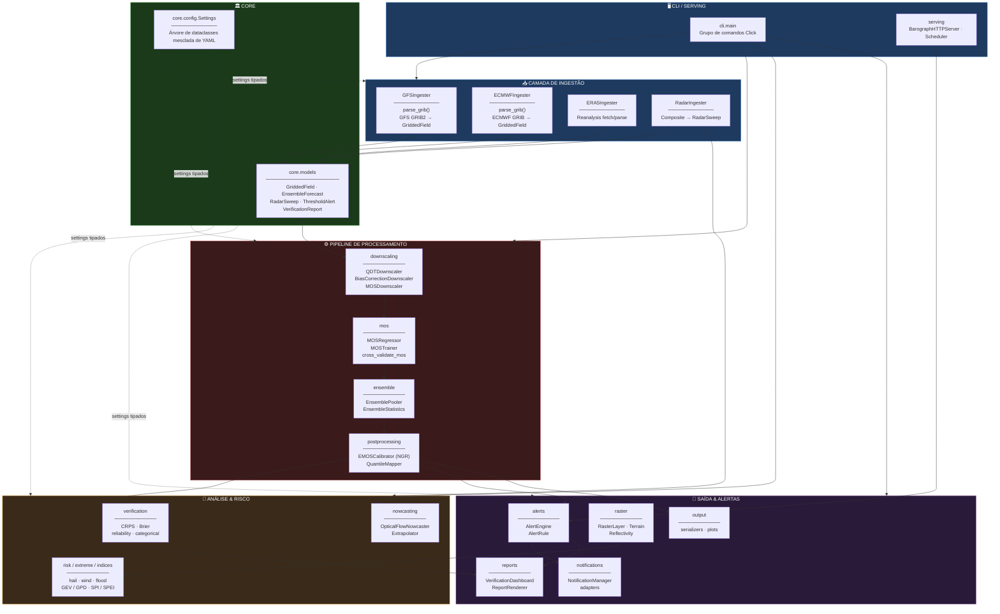
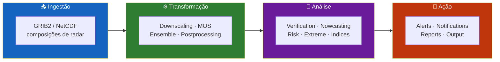
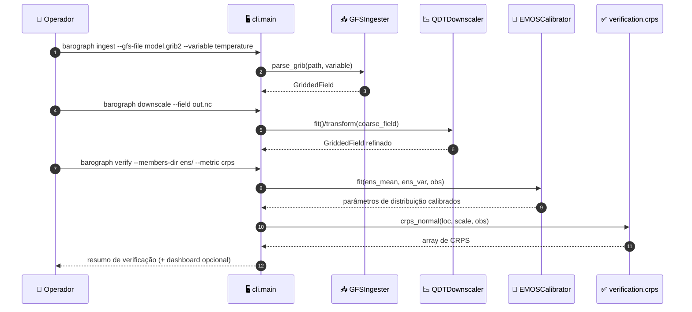
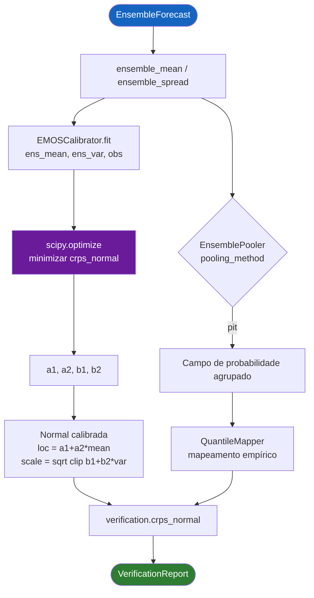
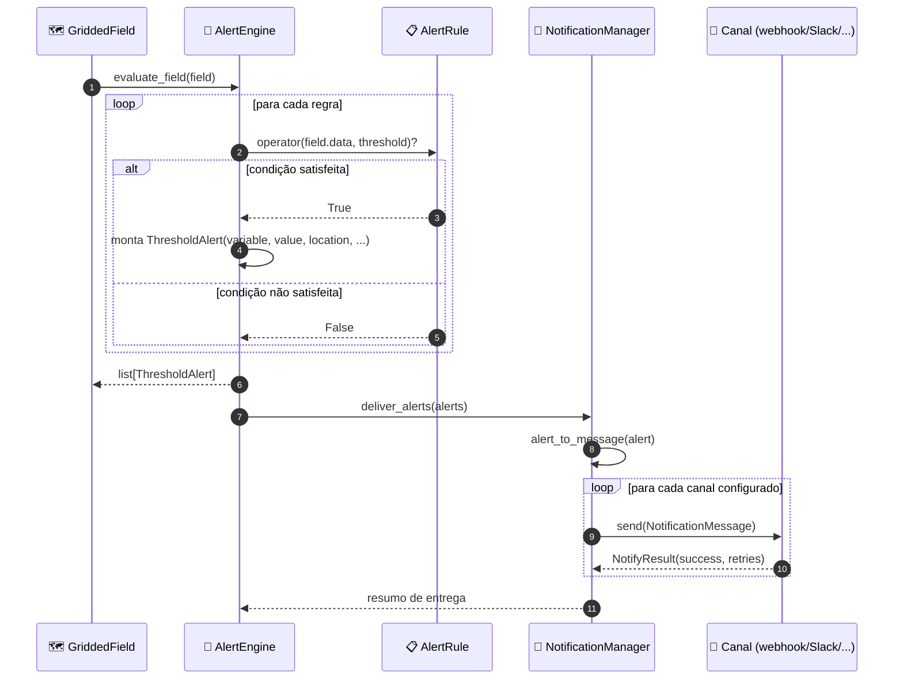
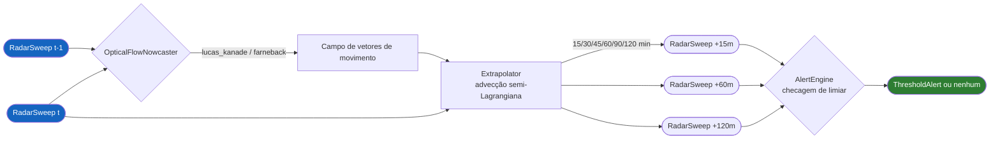
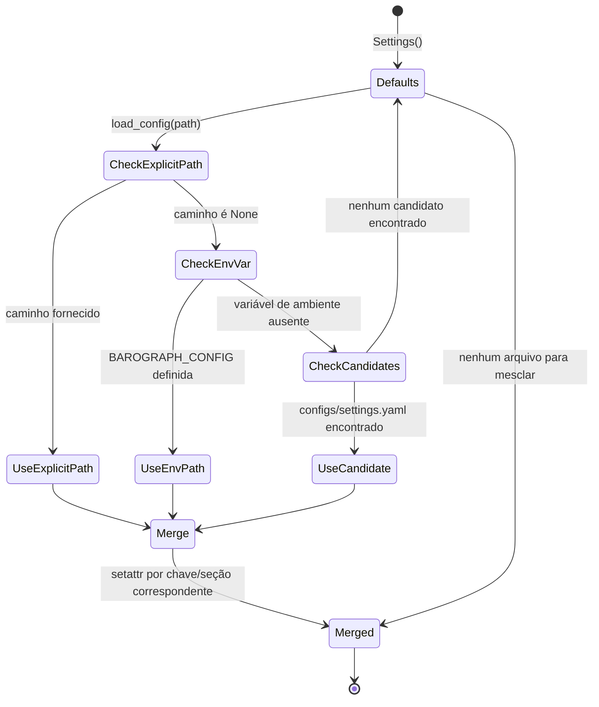
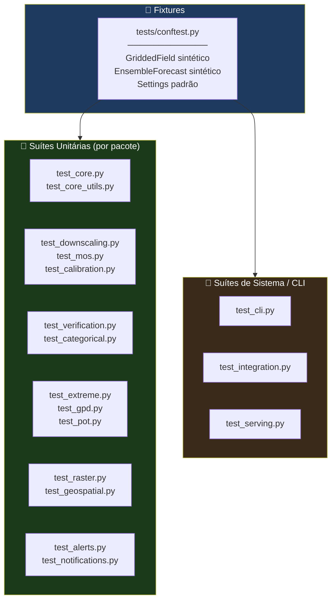

<div align="center">

**🌐 Choose Language / Selecione o Idioma / Elija el Idioma**

[](README.md)&nbsp;&nbsp;&nbsp;[](README_PT.md)&nbsp;&nbsp;&nbsp;[](README_ES.md)

</div>

---

<div align="center">

```
██████╗  █████╗ ██████╗  ██████╗  ██████╗ ██████╗  █████╗ ██████╗ ██╗  ██╗
██╔══██╗██╔══██╗██╔══██╗██╔═══██╗██╔════╝ ██╔══██╗██╔══██╗██╔══██╗██║  ██║
██████╔╝███████║██████╔╝██║   ██║██║  ███╗██████╔╝███████║██████╔╝███████║
██╔══██╗██╔══██║██╔══██╗██║   ██║██║   ██║██╔══██╗██╔══██║██╔═══╝ ██╔══██║
██████╔╝██║  ██║██║  ██║╚██████╔╝╚██████╔╝██║  ██║██║  ██║██║     ██║  ██║
╚═════╝ ╚═╝  ╚═╝╚═╝  ╚═╝ ╚═════╝  ╚═════╝ ╚═╝  ╚═╝╚═╝  ╚═╝╚═╝     ╚═╝  ╚═╝
   Kit de Modelagem, Pós-Processamento e Verificação de Previsão do Tempo
```

---

[](https://www.python.org/)
[](https://numpy.org/)
[](https://xarray.dev/)
[](https://scipy.org/)
[](https://scikit-learn.org/)
[](https://click.palletsprojects.com/)
[](https://pytest.org/)
[]()

<br/>

> **Um kit de ferramentas orientado a arquivos e dependências para ingerir saída de modelos NWP,**
> aplicar downscaling estatístico, calibrar ensembles, verificar habilidade e emitir alertas.

<br/>


</div>

---

## 📑 Índice

<details>
<summary>▶️ <strong>Clique para expandir / recolher esta seção</strong></summary>

<table>
<tr>
<td valign="top" width="50%">

**🏗️ Sistema**
- [Visão Geral](#-visão-geral)
- [Arquitetura do Sistema](#-arquitetura-do-sistema)
- [Stack Tecnológica](#-stack-tecnológica)
- [Padrões de Projeto](#-padrões-de-projeto-aplicados)
- [Estrutura do Projeto](#-estrutura-do-projeto)

**📦 Módulos**
- [Core — Modelos, Config, Coordenadas](#-core--modelos-de-domínio-config--coordenadas)
- [Ingestion — GFS, ECMWF, ERA5, Radar](#-ingestion--gfs-ecmwf-era5-radar)
- [Downscaling — QDT, Correção de Viés, MOS](#-downscaling--qdt-correção-de-viés-mos)
- [MOS — Regressor, Trainer, Avaliação](#-mos--model-output-statistics)
- [Ensemble — Pooling & Estatísticas](#-ensemble--pooling--estatísticas)
- [Postprocessing — EMOS & Quantile Mapping](#-postprocessing--emos--quantile-mapping)
- [Verification — CRPS, Brier, Categórico](#-verification--crps-brier-categórico)
- [Nowcasting — Optical Flow](#-nowcasting--optical-flow-extrapolação)
- [Alerts — Regras & Engine](#-alerts--motor-de-regras)
- [Raster — Camadas, Álgebra, Terreno](#-raster--camadas-álgebra-terreno-refletividade)
- [Extreme, Indices, Risk & Time Series](#-extreme-indices-risk--time-series)
- [Serving, Notifications, Reports, CLI](#-serving-notifications-reports--cli)

</td>
<td valign="top" width="50%">

**💼 Negócio**
- [Regras de Negócio](#-regras-de-negócio)
- [Requisitos Funcionais](#-requisitos-funcionais)
- [Requisitos Não Funcionais](#-requisitos-não-funcionais)

**📐 Design**
- [Modelo de Dados](#-modelo-de-dados)
- [Fluxos do Sistema](#-fluxos-do-sistema)
- [Fluxo Ingest → Downscale → Verify](#fluxo-ingest--downscale--verify)
- [Fluxo de Calibração de Ensemble](#fluxo-de-calibração-de-ensemble)
- [Fluxo de Avaliação de Alerta](#fluxo-de-avaliação-de-alerta)
- [Fluxo de Nowcasting](#fluxo-de-nowcasting)
- [Estado de Resolução de Configuração](#estado-de-resolução-de-configuração)

**🔐 Segurança & Operações**
- [Segurança](#-segurança)
- [Instalação & Execução](#-instalação--execução)
- [Testes Automatizados](#-testes-automatizados)
- [Métricas & Monitoramento](#-métricas--monitoramento)
- [Limitações Conhecidas](#-limitações-conhecidas)

</td>
</tr>
</table>

---

</details>

## 🌟 Visão Geral

<details>
<summary>▶️ <strong>Clique para expandir / recolher esta seção</strong></summary>

**Barograph** é um kit de ferramentas Python que conduz uma previsão numérica do tempo desde um arquivo bruto de modelo GRIB2/NetCDF até um produto verificado e pronto para alertas. Está organizado em 25 pacotes focados sob `barograph/`, cada um responsável por uma etapa do pipeline: ingestão, downscaling estatístico, Model Output Statistics (MOS), processamento de ensemble, calibração de pós-processamento, verificação, nowcasting de radar, alertas, análise raster e saída.

O projeto evita deliberadamente um banco de dados ou um servidor persistente como espinha dorsal. Em vez disso, `barograph.core.models` define um pequeno conjunto de dataclasses (`GriddedField`, `EnsembleForecast`, `PointForecast`, `RadarSweep`, `ThresholdAlert`, `VerificationReport`) que fluem entre as etapas em memória, e `barograph.utils.storage` as persiste em NetCDF, Zarr ou NPY quando uma fronteira de etapa precisa de um arquivo em disco. A configuração é uma árvore de dataclasses (`barograph.core.config.Settings`) mesclada a partir de um arquivo YAML opcional, de modo que cada subsistema — URLs de ingestão, algoritmo MOS, método de pooling de ensemble, cooldowns de alerta — tem um padrão tipado que uma implantação pode sobrescrever sem alterar código.

Uma única CLI baseada em Click (`barograph.cli.main`) expõe todo o pipeline como subcomandos combináveis (`ingest`, `downscale`, `verify`, `nowcast`, `check-alerts`, `raster`, `qc`, `derived`, `extreme`, `spi`, `spei`, `risk`, `notify`, `export`, `config-show`), de modo que o kit pode ser acionado a partir de scripts de shell, cron ou um agendador sem importar Python.

### 🎯 Objetivos do Sistema

| Objetivo | Descrição |
|-----------|-------------|
| 📥 **Ingestão de modelos** | Analisar GFS, ECMWF, ERA5 GRIB2/NetCDF e composições de radar em objetos `GriddedField` |
| 📉 **Downscaling estatístico** | Refinar previsões de grade grosseira com Quantile Delta Transform ou correção de viés |
| 🌡️ **Model Output Statistics** | Treinar regressores por estação (linear, gradient boosting) que mapeiam campos de modelo para previsões em escala de estação |
| 🎲 **Calibração de ensemble** | Agrupar membros do ensemble e calibrar spread/localização com EMOS (NGR) e quantile mapping |
| ✅ **Verificação** | Pontuar previsões com CRPS, Brier score + decomposição, diagramas de confiabilidade e métricas categóricas (POD/FAR/CSI/ETS) |
| 🌩️ **Nowcasting de radar** | Extrapolar campos de refletividade com fluxo óptico Lucas-Kanade / Farneback / block-matching |
| 🚨 **Alertas por limiar** | Avaliar objetos `AlertRule` contra campos gridded e despachar por canais de notificação plugáveis |
| 🗺️ **Análise raster** | Álgebra de grade com CRS, mascaramento, derivadas de terreno (declividade/aspecto/hillshade) e conversão Z-R de refletividade |
| 📊 **Relatórios** | Renderizar painéis de verificação e resumos de alertas/campos em Markdown/JSON/HTML |
| 🧪 **Controle de qualidade** | Sinalizar problemas de faixa bruta, picos, persistência, duplicatas e lacunas em séries de observação antes de chegarem a um modelo |

---

</details>

## 🏗️ Arquitetura do Sistema

<details>
<summary>▶️ <strong>Clique para expandir / recolher esta seção</strong></summary>

### Diagrama de Módulos



### Camadas de Arquitetura



---

</details>

## 🛠️ Stack Tecnológica

<details>
<summary>▶️ <strong>Clique para expandir / recolher esta seção</strong></summary>

<table>
<thead>
<tr>
<th>Camada</th>
<th>Tecnologia</th>
<th>Versão</th>
<th>Propósito</th>
</tr>
</thead>
<tbody>
<tr>
<td rowspan="2"><strong>🧠 Linguagem</strong></td>
<td>Python</td>
<td>&gt;= 3.10</td>
<td>Linguagem da aplicação (<code>requires-python</code> em <code>pyproject.toml</code>)</td>
</tr>
<tr>
<td>Alvo do mypy</td>
<td>3.12</td>
<td>Baseline de checagem de tipos (<code>[tool.mypy] python_version</code>)</td>
</tr>
<tr>
<td rowspan="5"><strong>🔢 Núcleo Científico</strong></td>
<td>NumPy</td>
<td>&gt;= 1.24</td>
<td>Operações com arrays em todos os módulos</td>
</tr>
<tr>
<td>pandas</td>
<td>&gt;= 2.0</td>
<td>Séries temporais tabulares e dados de estação</td>
</tr>
<tr>
<td>xarray</td>
<td>&gt;= 2023.1</td>
<td>Arrays multidimensionais rotulados, I/O NetCDF/Zarr</td>
</tr>
<tr>
<td>SciPy</td>
<td>&gt;= 1.11</td>
<td><code>scipy.optimize</code> (ajuste EMOS), <code>scipy.stats</code> (CRPS/normal), <code>scipy.interpolate</code>, <code>scipy.ndimage</code></td>
</tr>
<tr>
<td>scikit-learn</td>
<td>&gt;= 1.3</td>
<td>Regressores linear / ridge / random-forest / gradient-boosting para MOS e pipelines de ML</td>
</tr>
<tr>
<td rowspan="4"><strong>📦 Formatos de Dados</strong></td>
<td>netCDF4</td>
<td>&gt;= 1.6</td>
<td>Backend de leitura/escrita NetCDF para <code>xarray</code></td>
</tr>
<tr>
<td>zarr</td>
<td>&gt;= 2.15</td>
<td>Armazenamento em blocos comprimidos para ensembles</td>
</tr>
<tr>
<td>cfgrib</td>
<td>&gt;= 0.9</td>
<td>Decodificação GRIB2 via bindings do ecCodes</td>
</tr>
<tr>
<td>eccodes</td>
<td>&gt;= 1.6</td>
<td>Codec de mensagens GRIB de baixo nível (ECMWF)</td>
</tr>
<tr>
<td rowspan="2"><strong>⚙️ Paralelismo</strong></td>
<td>dask[complete]</td>
<td>&gt;= 2023.7</td>
<td>Computação em blocos/preguiçosa sobre grandes arrays gridded</td>
</tr>
<tr>
<td>Configuração <code>n_workers</code></td>
<td>—</td>
<td><code>Settings.n_workers</code>, padrão 4</td>
</tr>
<tr>
<td rowspan="2"><strong>🖥️ CLI / Config</strong></td>
<td>Click</td>
<td>&gt;= 8.1</td>
<td>Grupo de comandos em <code>barograph.cli.main</code>, 19 subcomandos</td>
</tr>
<tr>
<td>PyYAML / toml</td>
<td>&gt;= 6.0 / &gt;= 0.10</td>
<td><code>load_config()</code> mescla configurações YAML em <code>Settings</code></td>
</tr>
<tr>
<td rowspan="2"><strong>🖼️ Imagem</strong></td>
<td>OpenCV (opencv-python)</td>
<td>&gt;= 4.8</td>
<td>Fluxo óptico Lucas-Kanade / Farneback para nowcasting</td>
</tr>
<tr>
<td>loguru</td>
<td>&gt;= 0.7</td>
<td>Logging estruturado via <code>utils.logging.setup_logging</code></td>
</tr>
<tr>
<td rowspan="3"><strong>🧪 Qualidade</strong></td>
<td>pytest / pytest-cov / pytest-xdist</td>
<td>&gt;= 7.4 / 4.1 / 3.3</td>
<td>Executor de testes, cobertura, execução paralela (extra <code>dev</code>)</td>
</tr>
<tr>
<td>mypy</td>
<td>&gt;= 1.5</td>
<td>Tipagem estática (<code>[tool.mypy]</code>, overrides de stubs de terceiros)</td>
</tr>
<tr>
<td>ruff</td>
<td>&gt;= 0.0.280</td>
<td>Lint, conjunto de regras <code>E,F,I,N,W,UP</code>, linha de 100 caracteres</td>
</tr>
<tr>
<td rowspan="1"><strong>📚 Docs</strong></td>
<td>Sphinx + sphinx-rtd-theme</td>
<td>&gt;= 7.2 / 2.0</td>
<td>Extra <code>docs</code>, construído via <code>hatch run docs:build</code></td>
</tr>
<tr>
<td rowspan="1"><strong>📦 Build</strong></td>
<td>hatchling</td>
<td>—</td>
<td>Backend <code>[build-system]</code>, entry point <code>barograph = barograph.cli.main:cli</code></td>
</tr>
</tbody>
</table>

---

</details>

## 🎨 Padrões de Projeto Aplicados

<details>
<summary>▶️ <strong>Clique para expandir / recolher esta seção</strong></summary>

| Padrão | Onde | Justificativa |
|---------|-------|-----------|
| 🧱 **Abstract Base Class / Template Method** | `downscaling.base.BaseDownscaler`, subclassificado por `QDTDownscaler`, `BiasCorrectionDownscaler`, `MOSDownscaler` | Todo downscaler expõe o mesmo contrato `fit`/`transform` mantendo seu próprio método estatístico |
| 🏭 **Factory Function** | `model.regressor._make_estimator(kind, **kwargs)` | Constrói um estimador scikit-learn a partir de uma chave string (`"linear"`, `"ridge"`, `"random_forest"`) sem vazar imports do sklearn pelo código |
| 🎯 **Strategy** | `EMOSCalibrator(distribution=...)`, `QuantileMapper(method=...)`, seleção de método de fluxo óptico no `Extrapolator` | O algoritmo de calibração/extrapolação é escolhido por uma string de config e trocado sem tocar nos pontos de chamada |
| 🧾 **Dataclass Value Objects** | `core.models` (`GriddedField`, `EnsembleForecast`, ...), `core.config` (`Settings` e suas sub-configs) | Registros tipados, imutáveis por convenção, em vez de dicts trafegando pelo pipeline |
| 🚦 **Guard Clause / Fail Fast** | `GriddedField.__post_init__`, `EnsembleForecast.__post_init__`, `ingestion._grib.require_cfgrib()` | Formatos inválidos ou dependências opcionais ausentes levantam exceção imediatamente em vez de falhar mais adiante |
| 🔌 **Adapter** | `notifications.adapters.alert_to_message`, `notifications.adapters.deliver_alerts` | Converte um objeto de domínio `ThresholdAlert` no formato `NotificationMessage` que cada canal espera |
| 🧮 **Pipeline / Composite** | `model.regressor.RegressionPipeline` (`FeatureSelector` + `RegressionModel`) | Encadeia seleção de features e estimação atrás de uma única chamada `fit`/`predict` |
| 👂 **Observer-like Callback Registry** | Lista de canais de notificação do `alerts.engine.AlertEngine`, lista de jobs do `serving.scheduler.Scheduler` | Múltiplos handlers independentes reagem ao mesmo evento avaliado sem acoplamento forte |
| 🗃️ **Repository-lite** | `utils.storage` (`save_gridded_field`, `load_gridded_field`, `save_ensemble`, `to_zarr`) | Centraliza toda leitura/escrita em disco para que formatos possam mudar sem tocar no código do pipeline |
| ⏳ **Memoization / Decorator** | `utils.cache.memoize(ttl_hours=...)`, `utils.cache.TTLCache` | Envolve chamadas custosas de rede/parsing com um cache limitado por tempo de forma transparente |

---

</details>

## 📁 Estrutura do Projeto

<details>
<summary>▶️ <strong>Clique para expandir / recolher esta seção</strong></summary>

```
barograph/
│
├── 📄 pyproject.toml                 # build hatchling, dependências, config ruff/mypy/pytest
├── 📄 README.md                      # 🇺🇸 Inglês (primário)
├── 📄 README_PT.md                   # 🇧🇷 Português
├── 📄 README_ES.md                   # 🇪🇸 Español
│
├── 📂 configs/                       # 📄 settings.yaml, alert_rules.yaml (configuração de runtime)
├── 📂 data/                          # 📂 gen/ 📂 ingested/ 📂 radar/ — diretórios de dados de exemplo/trabalho
├── 📂 docs/                          # Fontes Sphinx — 📂 _static/ 📂 _templates/ 📂 api/
├── 📂 logs/                          # Log de runtime + saída JSONL de notificações
├── 📂 scripts/                       # Scripts operacionais auxiliares
│
├── 📂 barograph/                     # ★ Pacote principal (25 sub-pacotes, 95 arquivos-fonte)
│   ├── 📄 __init__.py
│   │
│   ├── 📂 core/                      # Modelos de domínio, config, coordenadas, utilitários temporais
│   │   ├── models.py                 # GriddedField, EnsembleForecast, ThresholdAlert, ...
│   │   ├── config.py                 # Árvore de dataclasses Settings + load_config()
│   │   ├── coordinates.py            # haversine_distance, reproject_field, create_grid
│   │   └── temporal.py               # temporal_interpolate, resample_temporal, time_weights
│   │
│   ├── 📂 ingestion/                 # Ingestão de dados de modelo + radar
│   │   ├── gfs.py, ecmwf.py, era5.py # GFSIngester, ECMWFIngester, ERA5Ingester
│   │   ├── radar.py                  # RadarIngester → RadarSweep
│   │   └── _grib.py                  # Guarda de dependência opcional require_cfgrib()
│   │
│   ├── 📂 downscaling/                # QDT, correção de viés, downscaling baseado em MOS
│   ├── 📂 mos/                        # MOSRegressor, MOSTrainer, cross_validate_mos
│   ├── 📂 ensemble/                   # EnsemblePooler, EnsembleStatistics
│   ├── 📂 postprocessing/             # EMOSCalibrator (NGR), QuantileMapper
│   ├── 📂 verification/               # crps.py, brier.py, reliability.py, categorical.py, metrics.py
│   ├── 📂 nowcasting/                  # OpticalFlowNowcaster, Extrapolator
│   ├── 📂 forecast/                    # ForecastCycle, ForecastBlender, BlendingWeights
│   ├── 📂 alerts/                      # AlertRule, Operator, Severity, AlertEngine
│   ├── 📂 raster/                      # RasterLayer, CRS, RasterAlgebra, Terrain, Reflectivity, RasterMasker
│   ├── 📂 geospatial/                  # IDWInterpolator, SimpleKriging, PolygonMasker, helpers de projeção
│   ├── 📂 time_series/                 # linear_trend, seasonal_climatology, PrecipitationAnalyzer
│   ├── 📂 climatology/                 # ClimatologyNormal, monthly_climatology, deviation_from_normal
│   ├── 📂 model/                       # FeatureSelector, RegressionModel, RegressionPipeline
│   ├── 📂 risk/                        # hail_index, wind_risk_score, flood_risk_score
│   ├── 📂 extreme/                     # gev.py, gpd.py, peak.py, pot.py — análise de valores extremos GEV/GPD
│   ├── 📂 indices/                     # spi.py (SPI), spei.py (SPEI) — índices de seca
│   ├── 📂 derived/                     # humidity.py, thermal.py — ponto de orvalho, índice de calor, sensação térmica
│   ├── 📂 quality/                     # qc.py — QualityController, checagens de faixa/pico/persistência
│   ├── 📂 api/                         # Cliente OpenMeteo, HTTPClient, HTTPError
│   ├── 📂 serving/                     # BarographHTTPServer, RouteTable, Scheduler
│   ├── 📂 notifications/               # NotificationManager, adapters.py
│   ├── 📂 reports/                     # VerificationDashboard, ReportRenderer
│   ├── 📂 output/                      # serializers.py, plots.py
│   ├── 📂 utils/                       # storage.py, logging.py, cache.py (TTLCache, memoize)
│   └── 📂 cli/                         # main.py — grupo de comandos Click, 19 subcomandos
│
└── 📂 tests/                          # 35 arquivos de teste, 315 funções de teste (pytest)
    ├── conftest.py                    # Fixtures compartilhadas (campos sintéticos, ensembles, configs)
    └── test_*.py                      # Uma suíte por área de módulo (ver Testes Automatizados)
```

---

</details>

## 📦 Módulos do Sistema

<details>
<summary>▶️ <strong>Clique para expandir / recolher esta seção</strong></summary>

### 🏛️ Core — Modelos de Domínio, Config & Coordenadas

`barograph/core/` é o vocabulário compartilhado que todos os outros pacotes importam. `models.py` define as dataclasses que trafegam pelo pipeline; `config.py` define `Settings` e `load_config()`; `coordinates.py` e `temporal.py` fornecem auxiliares espaciais e de eixo temporal.

| Componente | Arquivo | Responsabilidade |
|-----------|------|-----------------|
| `GriddedField` | `core/models.py` | Campo 2D/3D com `data`, `lats`, `lons`, `variable`, `source`, `valid_time`, `init_time`; valida forma espacial em `__post_init__` |
| `EnsembleForecast` | `core/models.py` | Lista de membros `GriddedField`; expõe as propriedades `ensemble_mean`, `ensemble_spread`, `member_array` |
| `RadarSweep` | `core/models.py` | Composição única de radar; expõe `dbz` e `reflectivity_linear` (`10**(dBZ/10)`) |
| `ThresholdAlert` / `VerificationReport` | `core/models.py` | Registros de alerta e de resultado de pontuação com payloads de dict `meta`/`details` |
| `Settings` | `core/config.py` | Árvore de dataclasses (`IngestionConfig`, `DownscalingConfig`, `MOSConfig`, `EnsembleConfig`, `PostprocessingConfig`, `VerificationConfig`, `NowcastingConfig`, `AlertsConfig`, `RasterConfig`, `NotificationsConfig`, `OutputConfig`) |
| `load_config(path)` | `core/config.py` | Resolve `--config`, variável de ambiente `BAROGRAPH_CONFIG`, ou `configs/settings.yaml`, depois mescla as chaves correspondentes por seção |
| `haversine_distance`, `create_grid`, `reproject_field` | `core/coordinates.py` | Distância de grande círculo, construção de grade regular, reprojeção pelo vizinho mais próximo |
| `temporal_interpolate`, `resample_temporal`, `time_weights` | `core/temporal.py` | Interpolação e reamostragem no eixo temporal para séries irregulares |

---

### 📥 Ingestion — GFS, ECMWF, ERA5, Radar

Quatro ingesters convertem arquivos brutos de modelo/radar em objetos `GriddedField`/`RadarSweep`, todos configurados a partir de `IngestionConfig`.

| Classe | Arquivo | Formato de origem | Notas |
|-------|------|----------------|-------|
| `GFSIngester` | `ingestion/gfs.py` | GRIB2 (0.25°) | `parse_grib(path, variable)` → `GriddedField` |
| `ECMWFIngester` | `ingestion/ecmwf.py` | GRIB (IFS) | Mesmo contrato `parse_grib` do GFS |
| `ERA5Ingester` | `ingestion/era5.py` | Reanálise NetCDF / GRIB | URL base estilo Copernicus CDS na config |
| `RadarIngester` | `ingestion/radar.py` | Composição de radar | Produz `RadarSweep` para nowcasting |
| `require_cfgrib()` | `ingestion/_grib.py` | — | Levanta `EcCodesUnavailableError` quando `cfgrib`/`eccodes` não são importáveis, falhando rápido com mensagem clara |

---

### 📉 Downscaling — QDT, Correção de Viés, MOS

`downscaling/base.py` define `BaseDownscaler(ABC)`; três estratégias concretas a implementam.

| Classe | Arquivo | Método |
|-------|------|--------|
| `QDTDownscaler` | `downscaling/quantile_delta_transform.py` | Quantile Delta Transform — aplica o delta entre as distribuições quantílicas observada e modelada à previsão |
| `BiasCorrectionDownscaler` | `downscaling/bias_correction.py` | Correção de viés aditiva/multiplicativa contra uma janela histórica de treinamento |
| `MOSDownscaler` | `downscaling/mos_downscaling.py` | Delega a um `MOSRegressor` treinado para refino em escala de estação |

`DownscalingConfig` (em `core/config.py`) define `method`, `grid_resolution_km`, `training_years` e `dem_path`.

---

### 🌡️ MOS — Model Output Statistics

`mos/` treina e avalia regressores por estação que mapeiam campos brutos de modelo para o comportamento observado na estação.

| Componente | Arquivo | Papel |
|-----------|------|------|
| `MOSRegressor` | `mos/regressor.py` | Encapsula um estimador scikit-learn (`linear` ou `gradient_boosting`, conforme `MOSConfig.algorithm`) para uma estação |
| `MOSTrainer`, `MOSDataset` | `mos/trainer.py` | Monta arrays de features/alvo e ajusta regressores em `calibration_station_ids` |
| `cross_validate_mos` | `mos/evaluation.py` | Avaliação de habilidade com validação cruzada em k-folds |
| `skill_vs_reference`, `mse_reduction` | `mos/evaluation.py` | Comparações de skill-score e redução de erro contra uma previsão de referência |

---

### 🎲 Ensemble — Pooling & Estatísticas

| Componente | Arquivo | Papel |
|-----------|------|------|
| `EnsemblePooler` | `ensemble/pooling.py` | Agrupa membros brutos do ensemble usando `EnsembleConfig.pooling_method` (ex.: binning baseado em PIT) |
| `EnsembleStatistics` | `ensemble/statistics.py` | Deriva produtos de média, spread, quantil e probabilidade a partir de um `EnsembleForecast` |

---

### 🧮 Postprocessing — EMOS & Quantile Mapping

| Componente | Arquivo | Papel |
|-----------|------|------|
| `EMOSCalibrator` | `postprocessing/emos.py` | Regressão Gaussiana Não-Homogênea (Gneiting et al. 2005): localização `a1 + a2*ens_mean`, escala `sqrt(b1 + b2*ens_var)`, ajustada via `scipy.optimize` minimizando `crps_normal` |
| `QuantileMapper` | `postprocessing/quantile_mapping.py` | Mapeamento quantílico empírico entre distribuições de modelo e observadas, controlado por `PostprocessingConfig.n_bins` |

---

### ✅ Verification — CRPS, Brier, Categórico

| Componente | Arquivo | Papel |
|-----------|------|------|
| `crps_normal`, `crps_ensemble`, `crps_truncated_normal`, `crps_score`, `crps_skill` | `verification/crps.py` | Continuous Ranked Probability Score para previsões paramétricas e de ensemble |
| `brier_score`, `brier_decomposition`, `brier_skill_score` | `verification/brier.py` | Pontuação probabilística de evento binário e decomposição em confiabilidade/resolução/incerteza |
| `reliability_diagram`, `reliability_index`, `accuracy_curve` | `verification/reliability.py` | Curvas de calibração agrupadas por probabilidade prevista |
| `ContingencyTable`, `probability_of_detection`, `false_alarm_ratio`, `critical_success_index`, `equitable_threat_score`, `frequency_bias`, `peirce_skill_score` | `verification/categorical.py` | POD / FAR / CSI / ETS / bias / PSS a partir de contagens de tabela de contingência 2x2 |
| `VerificationMetrics` | `verification/metrics.py` | Agrega bias, MAE, RMSE e as métricas acima em um único relatório |

---

### 🌩️ Nowcasting — Optical Flow & Extrapolação

| Componente | Arquivo | Papel |
|-----------|------|------|
| `OpticalFlowNowcaster` | `nowcasting/optical_flow.py` | Calcula vetores de movimento entre dois `RadarSweep` usando os métodos Lucas-Kanade ou Farneback do OpenCV (`NowcastingConfig.optical_flow_method`) |
| `Extrapolator` | `nowcasting/extrapolation.py` | Advecção semi-Lagrangiana do campo de refletividade ao longo dos vetores de fluxo para cada lead time em `extrapolation_minutes` |

---

### 🚨 Alerts — Motor de Regras

| Componente | Arquivo | Papel |
|-----------|------|------|
| `AlertRule` | `alerts/rules.py` | Dataclass: `variable`, `threshold`, `operator` (enum `Operator`), `severity` (enum `Severity`) |
| `Operator`, `Severity` | `alerts/rules.py` | Comparações estilo `GREATER_OR_EQUAL`/`GREATER`/`LESS`/`LESS_OR_EQUAL`; severidades estilo `WATCH`/`WARNING`/`SEVERE` |
| `AlertEngine` | `alerts/engine.py` | `add_rule()`, `evaluate_field(field)` → lista de `ThresholdAlert`; despacha pelos `notification_channels` configurados |

---

### 🗺️ Raster — Camadas, Álgebra, Terreno, Refletividade

| Componente | Arquivo | Papel |
|-----------|------|------|
| `RasterLayer`, `CRS` | `raster/layer.py` | Wrapper de grade 2D com CRS (padrão EPSG:4326 conforme `RasterConfig.default_crs`) |
| `RasterAlgebra` | `raster/algebra.py` | Aritmética célula a célula entre camadas com tratamento de nodata |
| `RasterMasker` | `raster/masking.py` | Mascaramento por polígono/limiar de camadas raster |
| `Terrain` | `raster/terrain.py` | Derivação de declividade, aspecto e hillshade a partir de uma camada DEM |
| `Reflectivity`, `ZRRelation` | `raster/reflectivity.py` | Conversão dBZ ↔ taxa de chuva via relação Z-R configurável |

---

### 🌪️ Extreme, Indices, Risk & Time Series

| Pacote | Componentes principais | Papel |
|---------|-----------------|------|
| `extreme/` | `GEVDistribution`, `fit_gev`, `return_level`, `GPDDistribution`, `fit_gpd`, `POTResult`, `pot_return_level`, `block_maxima`, `annual_maxima`, `peak_over_threshold` | Análise de níveis de retorno por Valor Extremo Generalizado (L-moments) e Pareto Generalizado (picos acima de limiar) |
| `indices/` | `compute_spi`, `compute_spi_series`, `classify_drought` (`spi.py`); `compute_spei`, `pet_thornthwaite` (`spei.py`) | Índice de Precipitação Padronizado e Índice de Precipitação-Evapotranspiração Padronizado |
| `risk/` | `hail_index`, `wind_risk_score`, `flood_risk_score`, `HailIndex`, `WindRiskIndex`, `hail_index_field` | Pontuação de risco de tempo severo escalar e gridded |
| `time_series/` | `linear_trend`, `seasonal_climatology`, `standard_anomalies`, `TimeSeriesAnalyzer`, `PrecipitationEvent`, `PrecipitationAnalyzer`, `rolling_precip`, `wet_days_fraction` | Análise de tendência, anomalia e eventos de precipitação |
| `climatology/` | `ClimatologyNormal`, `monthly_climatology`, `annual_climatology`, `deviation_from_normal` | Normais de longo prazo e cálculo de desvio da normal |
| `derived/` | `dewpoint`, `relative_humidity`, `absolute_humidity`, `wind_chill`, `heat_index`, `apparent_temperature` | Fórmulas padrão de grandezas meteorológicas derivadas |
| `quality/` | `QualityController`, `QualityFlag`, `check_gross_range`, `check_spikes`, `check_persistence`, `check_duplicates`, `detect_gaps` | Checagens de QC com severidade sinalizada em séries de observação |
| `model/` | `FeatureSelector`, `RegressionModel`, `RegressionPipeline`, `_make_estimator` | Pipelines genéricos de regressão ML (linear/ridge/random-forest) com seleção de features |
| `geospatial/` | `IDWInterpolator`, `NearestInterpolator`, `SimpleKriging`, `PolygonMasker`, `haversine_distance`, `point_in_polygon` | Interpolação estação-para-grade e mascaramento espacial |
| `forecast/` | `ForecastCycle`, `ForecastBlender`, `BlendingWeights` | Controle de ciclos multi-run e blending ponderado por recência de previsões sucessivas |

---

### 🔌 Serving, Notifications, Reports & CLI

| Pacote | Componentes principais | Papel |
|---------|-----------------|------|
| `serving/` | `BarographHTTPServer`, `RouteTable`, `start_server`, `Scheduler`, `ScheduledJob` | Servidor HTTP JSON sem dependências (baseado em `http.server`) e um executor de tarefas agendadas em processo |
| `notifications/` | `NotificationManager`, `NotificationMessage`, `NotifyResult`, `alert_to_message`, `deliver_alerts` | Entrega com retry por canais console/log/arquivo/webhook/Slack/Discord/Mattermost/email |
| `reports/` | `VerificationDashboard`, `ReportRenderer` | Agrega resultados de verificação e alertas em painéis Markdown/JSON/HTML |
| `output/` | `serializers.py`, `plots.py` | Serialização de campos JSON/CSV/NetCDF/Zarr/NPY e renderização PNG |
| `api/` | `OpenMeteo`, `HTTPClient`, `HTTPError`, `CurrentWeather`, `HourlyForecast`, `DailyForecast` | Cliente Open-Meteo em tempo real com transporte HTTP injetável e lógica de retry |
| `utils/` | `save_gridded_field`, `load_gridded_field`, `TTLCache`, `memoize`, `setup_logging`, `get_logger` | Armazenamento, cache e logging compartilhados por todos os pacotes |
| `cli/` | `cli` (grupo Click), `ingest`, `downscale`, `verify`, `nowcast`, `check_alerts`, `raster`, `qc_cmd`, `derived`, `extreme_cmd`, `spi_cmd`, `spei_cmd`, `risk_cmd`, `notify_cmd`, `export_cmd`, `config_show` | O ponto de entrada único (`barograph = barograph.cli.main:cli`) conectando todos os pacotes a subcomandos executáveis |

---

</details>

## 💼 Regras de Negócio

<details>
<summary>▶️ <strong>Clique para expandir / recolher esta seção</strong></summary>

### 📥 Regras de Ingestão & Validação

| # | Regra | Aplicação |
|---|------|-------------|
| RN-01 | Um `GriddedField` deve ter no mínimo 2D e suas duas últimas dimensões devem corresponder aos comprimentos de `lats`/`lons` | `GriddedField.__post_init__` levanta `ValueError` caso contrário |
| RN-02 | Um `EnsembleForecast` deve ter tantos `member_ids` quanto `members` | `EnsembleForecast.__post_init__` levanta `ValueError` caso contrário, e preenche `member_ids` automaticamente quando omitido |
| RN-03 | A análise GRIB requer que `cfgrib`/`eccodes` sejam importáveis | `ingestion._grib.require_cfgrib()` levanta `EcCodesUnavailableError` antes de qualquer tentativa de parsing |
| RN-04 | Valores string de `Variable` desconhecidos recaem para um padrão especificado pelo chamador (ou `TEMPERATURE`) | `Variable.from_value(value, default)` |

### 🌡️ Regras de Calibração & Verificação

| # | Regra | Aplicação |
|---|------|-------------|
| RN-05 | EMOS suporta apenas distribuições `"normal"` ou `"truncated_normal"` | `EMOSCalibrator.__init__` levanta `ValueError` para qualquer outro valor |
| RN-06 | A escala do EMOS deve permanecer positiva durante a otimização | `scale2 = np.clip(b1 + b2*ens_var, 1e-6, None)` em `crps_normal` |
| RN-07 | A pontuação CRPS de ensemble usa a fórmula justa (não enviesada) | `crps_ensemble` subtrai o termo de diferença par a par dividido por `n*n` |
| RN-08 | Pontuações categóricas (POD, FAR, CSI, ETS, bias, PSS) aceitam uma `ContingencyTable` ou contagens brutas de acerto/erro/falso-alarme/negativa-correta | Cada função em `verification/categorical.py` aceita `table=None, **counts` |

### 🚨 Regras de Alertas

| # | Regra | Aplicação |
|---|------|-------------|
| RN-09 | Um alerta só dispara quando um valor de campo satisfaz o `Operator` da regra contra seu `threshold` | `AlertEngine.evaluate_field` |
| RN-10 | Todo alerta disparado carrega a `Variable`, `Severity`, localização e ambos os timestamps de disparo/previsão | Os campos da dataclass `ThresholdAlert` são obrigatórios (sem padrões exceto `severity`/`message`/`meta`) |
| RN-11 | Alertas são despachados apenas pelos canais configurados em `AlertsConfig.notification_channels` | Construtor `AlertEngine(notification_channels=[...])` |
| RN-12 | Alertas idênticos repetidos devem ser suprimidos dentro de `AlertsConfig.cooldown_minutes` | A janela de cooldown é lida da config pela lógica de despacho do engine |

### 🧪 Regras de Controle de Qualidade

| # | Regra | Aplicação |
|---|------|-------------|
| RN-13 | Valores fora de `[min_value, max_value]` são sinalizados como falha de faixa bruta | `quality.qc.check_gross_range` |
| RN-14 | Uma severidade de QC é apenas escalada, nunca descartada silenciosamente | `QualityController` combina flags via `_combine()` (união estilo OR bit a bit) |

---

</details>

## ✅ Requisitos Funcionais

<details>
<summary>▶️ <strong>Clique para expandir / recolher esta seção</strong></summary>

| ID | Requisito | Prioridade | Status |
|----|-------------|----------|--------|
| **RF-01** | O sistema deve analisar arquivos GFS GRIB2 em objetos `GriddedField` via `GFSIngester.parse_grib` | 🔴 Alta | ✅ Implementado |
| **RF-02** | O sistema deve analisar arquivos GRIB do ECMWF via `ECMWFIngester.parse_grib` | 🔴 Alta | ✅ Implementado |
| **RF-03** | O sistema deve ingerir dados de reanálise ERA5 via `ERA5Ingester` | 🟡 Média | ✅ Implementado |
| **RF-04** | O sistema deve ingerir composições de radar em objetos `RadarSweep` | 🔴 Alta | ✅ Implementado |
| **RF-05** | O sistema deve reduzir a escala de previsões grosseiras usando Quantile Delta Transform | 🔴 Alta | ✅ Implementado |
| **RF-06** | O sistema deve reduzir a escala de previsões usando correção de viés | 🟡 Média | ✅ Implementado |
| **RF-07** | O sistema deve treinar regressores MOS por estação e validar sua habilidade por validação cruzada | 🔴 Alta | ✅ Implementado |
| **RF-08** | O sistema deve agrupar membros de ensemble e calcular estatísticas de ensemble | 🔴 Alta | ✅ Implementado |
| **RF-09** | O sistema deve calibrar ensembles com EMOS (Regressão Gaussiana Não-Homogênea) | 🔴 Alta | ✅ Implementado |
| **RF-10** | O sistema deve aplicar mapeamento quantílico empírico como calibração alternativa | 🟡 Média | ✅ Implementado |
| **RF-11** | O sistema deve calcular CRPS para previsões normal, normal-truncada e de ensemble | 🔴 Alta | ✅ Implementado |
| **RF-12** | O sistema deve calcular o Brier score e sua decomposição em confiabilidade/resolução/incerteza | 🔴 Alta | ✅ Implementado |
| **RF-13** | O sistema deve produzir diagramas de confiabilidade a partir de previsões probabilísticas | 🟡 Média | ✅ Implementado |
| **RF-14** | O sistema deve calcular pontuações categóricas (POD, FAR, CSI, ETS, bias, PSS) a partir de tabelas de contingência | 🔴 Alta | ✅ Implementado |
| **RF-15** | O sistema deve fazer nowcasting de refletividade de radar via extrapolação por fluxo óptico | 🔴 Alta | ✅ Implementado |
| **RF-16** | O sistema deve avaliar regras de alerta por limiar contra campos gridded | 🔴 Alta | ✅ Implementado |
| **RF-17** | O sistema deve despachar alertas por canais de notificação plugáveis com retry | 🔴 Alta | ✅ Implementado |
| **RF-18** | O sistema deve realizar álgebra raster com CRS, mascaramento e derivação de terreno | 🟡 Média | ✅ Implementado |
| **RF-19** | O sistema deve converter refletividade de radar (dBZ) em taxa de chuva via relação Z-R | 🟡 Média | ✅ Implementado |
| **RF-20** | O sistema deve ajustar distribuições de valor extremo GEV e GPD e calcular níveis/períodos de retorno | 🟡 Média | ✅ Implementado |
| **RF-21** | O sistema deve calcular os índices de seca SPI e SPEI | 🟡 Média | ✅ Implementado |
| **RF-22** | O sistema deve calcular índices de risco de granizo, vento e enchente | 🟡 Média | ✅ Implementado |
| **RF-23** | O sistema deve sinalizar séries de observação para problemas de faixa bruta, pico, persistência, duplicata e lacuna | 🟡 Média | ✅ Implementado |
| **RF-24** | O sistema deve expor uma CLI baseada em Click cobrindo da ingestão à exportação | 🔴 Alta | ✅ Implementado |
| **RF-25** | O sistema deve servir resultados por um servidor HTTP JSON sem dependências e um agendador | 🟢 Baixa | ✅ Implementado |

---

</details>

## ⚡ Requisitos Não Funcionais

<details>
<summary>▶️ <strong>Clique para expandir / recolher esta seção</strong></summary>

| ID | Categoria | Requisito | Alvo |
|----|----------|-------------|--------|
| **RNF-01** | ⚡ Desempenho | Operações intensivas em array vetorizadas via NumPy/SciPy em vez de loops Python onde viável | Sem loops por pixel não vetorizados em `verification`, `postprocessing`, `raster` |
| **RNF-02** | ⚡ Desempenho | Grandes ensembles processados com `dask[complete]` para computação em blocos/preguiçosa | Configurável via `Settings.n_workers` |
| **RNF-03** | 🧠 Memória | Zarr usado para armazenamento de ensemble em blocos comprimidos em vez de carregar arrays inteiros | `utils.storage.to_zarr` |
| **RNF-04** | 🔧 Configurabilidade | Todo parâmetro de subsistema (URLs de ingestão, algoritmo MOS, cooldowns, ...) sobrescrevível via YAML | `core.config.load_config` mescla apenas as chaves presentes no arquivo |
| **RNF-05** | 🧪 Testabilidade | Todo pacote tem pelo menos um módulo pytest dedicado | 35 arquivos de teste cobrindo 25 pacotes + CLI + integração |
| **RNF-06** | 🧱 Manutenibilidade | Tipagem estática aplicada em todo o projeto | `mypy` configurado em `pyproject.toml`, `check_untyped_defs=false` para adoção gradual |
| **RNF-07** | 🧹 Qualidade de Código | Conjunto de regras de lint `E,F,I,N,W,UP` aplicado com linha de 100 caracteres | `ruff check .` |
| **RNF-08** | 🔌 Extensibilidade | Novas estratégias de downscaling/calibração plugáveis via interfaces estilo `BaseDownscaler`/`EMOSCalibrator` | Nenhuma mudança na CLI ou no engine é necessária para adicionar uma estratégia |
| **RNF-09** | 🌐 Portabilidade | Sem dependência forte de um SO ou GPU específicos | Roda em qualquer plataforma com interpretador Python 3.10+ |
| **RNF-10** | 🔐 Resiliência | Dependências pesadas opcionais (cfgrib/eccodes) falham com um erro explícito e capturável | `EcCodesUnavailableError` em vez de um traceback de `ImportError` |
| **RNF-11** | 📶 Confiabilidade | A entrega de notificação tenta novamente com backoff | `NotificationsConfig.max_retries`, `backoff_base` |
| **RNF-12** | ⏱️ Latência | Clientes de rede (Open-Meteo) suportam timeout e retry configuráveis | `IngestionConfig.timeout_seconds`, `max_retries`; transporte injetável do `HTTPClient` |
| **RNF-13** | 📚 Documentação | Referência de API construível a partir de docstrings | Sphinx + `sphinx-autodoc-typehints`, extra `docs` |
| **RNF-14** | 🗄️ Interoperabilidade | Saída de campos suporta JSON, CSV, NetCDF, Zarr e NPY | `output.serializers`, `OutputConfig.format` |

---

</details>

## 🗄️ Modelo de Dados

<details>
<summary>▶️ <strong>Clique para expandir / recolher esta seção</strong></summary>

Barograph **não possui banco de dados relacional**: a camada de persistência é o sistema de arquivos (NetCDF/Zarr/NPY/JSON via `utils.storage` e `output.serializers`), e o contrato em memória é o grafo de dataclasses em `core/models.py`. O diagrama abaixo modela esse grafo como um diagrama entidade-relacionamento.

### Diagrama Entidade-Relacionamento

```mermaid
erDiagram
    GRIDDED_FIELD ||--o{ ENSEMBLE_FORECAST : "membro de"
    GRIDDED_FIELD ||--o| VERIFICATION_REPORT : "pontuado por"
    GRIDDED_FIELD ||--o{ THRESHOLD_ALERT : "dispara"
    ENSEMBLE_FORECAST ||--|| VERIFICATION_REPORT : "verificado como"
    RADAR_SWEEP ||--o{ RADAR_SWEEP : "extrapolado para"
    THRESHOLD_ALERT }o--|| ALERT_RULE : "corresponde a"
    THRESHOLD_ALERT ||--o| NOTIFICATION_MESSAGE : "renderizado como"
    COORDINATE ||--o{ POINT_FORECAST : "localizado em"
    COORDINATE ||--o{ STATION_OBS : "localizado em"
    STATION_OBS }o--|| POINT_FORECAST : "verificado contra"
    SETTINGS ||--|| INGESTION_CONFIG : "contém"
    SETTINGS ||--|| ALERTS_CONFIG : "contém"
    SETTINGS ||--|| POSTPROCESSING_CONFIG : "contém"

    GRIDDED_FIELD {
        ndarray data "valores do campo 2D/3D"
        Variable variable "enum: temperature, precip, ..."
        ModelSource source "enum: gfs, ecmwf, era5, hrrr"
        datetime valid_time "horário de validade da previsão"
        dict meta "metadados livres"
    }

    ENSEMBLE_FORECAST {
        list members "lista de GriddedField"
        list member_ids "ids inteiros, autopreenchidos"
    }

    RADAR_SWEEP {
        ndarray data "refletividade dBZ"
        datetime scan_time "horário da varredura"
    }

    ALERT_RULE {
        Variable variable "variável monitorada"
        float threshold "limiar de disparo"
        Operator operator "gt, lt, ge, le"
        Severity severity "watch, warning, severe"
    }

    THRESHOLD_ALERT {
        Variable variable "variável que disparou"
        Coordinate location "local do disparo"
        datetime trigger_time "horário de avaliação"
        float value "valor observado/previsto"
        string severity "warning por padrão"
    }

    VERIFICATION_REPORT {
        string metric_name "crps, brier, ..."
        float value "valor da pontuação"
        int n_samples "contagem de amostras"
        dict details "dados por bin / decomposição"
    }

    COORDINATE {
        float latitude "graus"
        float longitude "graus"
    }

    POINT_FORECAST {
        list values "valores previstos"
        list times "horários de validade"
    }

    STATION_OBS {
        string station_id "identificador da estação"
        list values "valores observados"
    }

    NOTIFICATION_MESSAGE {
        string title "título do alerta"
        string severity "prioridade de entrega"
    }

    SETTINGS {
        string log_level "INFO por padrão"
        int n_workers "padrão 4"
    }

    INGESTION_CONFIG {
        string gfs_base_url "endpoint de filtro NOMADS"
        int max_retries "padrão 3"
    }

    ALERTS_CONFIG {
        int cooldown_minutes "padrão 60"
        list notification_channels "ex.: log"
    }

    POSTPROCESSING_CONFIG {
        int emos_n_members "padrão 51"
        string distribution "truncated_normal"
    }
```



### Chaves de Configuração (Settings)

| Seção | Chave | Padrão | Propósito |
|---------|-----|---------|---------|
| `ingestion` | `gfs_base_url`, `ecmwf_base_url`, `era5_base_url` | Endpoints NOMADS / ECMWF / CDS | URLs de origem para cada ingester |
| `ingestion` | `data_dir`, `cache_ttl_hours`, `max_retries`, `timeout_seconds` | `./data/ingested`, `6`, `3`, `120` | Cache local e resiliência de rede |
| `downscaling` | `method`, `grid_resolution_km`, `training_years` | `quantile_delta_transform`, `1.0`, `(2010, 2020)` | Seleção de estratégia de downscaling |
| `mos` | `algorithm`, `feature_window_hours`, `retrain_interval_days` | `gradient_boosting`, `24`, `7` | Cadência de treinamento e features do MOS |
| `ensemble` | `pooling_method`, `n_members`, `pooling_bins` | `pit`, `51`, `100` | Comportamento de pooling de ensemble |
| `postprocessing` | `emos_n_members`, `distribution`, `n_bins` | `51`, `truncated_normal`, `1000` | Parâmetros de calibração |
| `verification` | `metrics`, `brier_thresholds`, `reliability_bins` | `[crps, brier, ...]`, lista de limiares, `10` | Configuração de pontuação |
| `nowcasting` | `optical_flow_method`, `extrapolation_minutes` | `lucas_kanade`, `[15,30,45,60,90,120]` | Método de fluxo e lead times |
| `alerts` | `rules_file`, `cooldown_minutes`, `notification_channels` | `./configs/alert_rules.yaml`, `60`, `[log]` | Comportamento de despacho de alertas |
| `raster` | `default_crs`, `nodata`, `resample_method` | `4326`, `-9999.0`, `nearest` | Padrões de grade raster |
| `notifications` | `channels`, `max_retries`, `backoff_base` | `[console]`, `3`, `1.0` | Confiabilidade de entrega |
| `output` | `format`, `render_png`, `cmap` | `netcdf`, `false`, `viridis` | Padrões de exportação de campos |

### Formato de Persistência Baseado em Arquivo

| Formato | Produtor | Consumidor | Notas |
|--------|----------|----------|-------|
| NetCDF | `utils.storage.save_gridded_field`, `output.serializers` | `load_gridded_field` | `OutputConfig.format` padrão |
| Zarr | `utils.storage.to_zarr`, `save_ensemble` | `xarray.open_zarr` | Armazenamento em blocos para ensembles |
| NPY | `output.serializers` | Consumidores NumPy | Exportação leve de array bruto |
| JSON / CSV | `output.serializers` | Relatórios, dashboards | Exportações legíveis por humanos |
| JSON Lines | `NotificationsConfig.file_path` (`./logs/notifications.jsonl`) | `reports` | Log de auditoria de entrega de notificações |

---

</details>

## 🔄 Fluxos do Sistema

<details>
<summary>▶️ <strong>Clique para expandir / recolher esta seção</strong></summary>

### Fluxo Ingest → Downscale → Verify



### Fluxo de Calibração de Ensemble



### Fluxo de Avaliação de Alerta



### Fluxo de Nowcasting



### Estado de Resolução de Configuração



---

</details>

## 🔐 Segurança

<details>
<summary>▶️ <strong>Clique para expandir / recolher esta seção</strong></summary>

### Controles Implementados

| Controle | Implementação | Efeito |
|---------|---------------|--------|
| 🚦 **Guarda de dependência fail-fast** | `ingestion._grib.require_cfgrib()` levanta `EcCodesUnavailableError` | Evita parsing silenciosamente incorreto quando codecs GRIB estão ausentes |
| 🧾 **Superfície de configuração tipada** | Dataclasses `core.config.Settings` com checagens `hasattr` em `load_config` | Chaves YAML desconhecidas são ignoradas em vez de injetadas como atributos arbitrários |
| 🔌 **Transporte HTTP injetável** | `api.client.HTTPClient(transport=...)`, padrão `_default_transport` | Chamadores podem substituir um transporte sandboxed ou mockado, evitando chamadas de saída descontroladas em testes |
| ✅ **Validação de entrada em objetos de domínio** | `GriddedField.__post_init__`, `EnsembleForecast.__post_init__` | Formatos malformados são rejeitados antes de entrar no pipeline |
| 🔁 **Retries limitados com backoff** | `NotificationsConfig.max_retries`, `backoff_base`; `IngestionConfig.max_retries`, `timeout_seconds` | Previne tempestades de retry ilimitadas contra serviços externos |
| 🗄️ **Sem segredos embutidos** | URLs de webhook, host/porta SMTP vivem em `NotificationsConfig`, vindos de YAML/env, não hardcoded | Credenciais são fornecidas pelo operador, não commitadas |
| 🧪 **Design local-first** | Diretórios padrão de ingestão/saída são relativos (`./data`, `./output`, `./logs`) | Sem dependência de rede implícita para desenvolvimento local ou CI |

### Limitações de Segurança Conhecidas

> [!WARNING]
> As limitações a seguir são inerentes ao design atual e devem ser compreendidas antes de qualquer implantação em produção ou voltada ao público.

| Limitação | Risco | Caminho de mitigação |
|------------|------|-----------------|
| 🌐 **`serving.server.BarographHTTPServer` usa o `http.server` da stdlib** | Sem TLS, autenticação ou rate limiting embutidos | Colocar atrás de um proxy reverso (nginx/Caddy) fornecendo TLS e autenticação |
| 🔑 **Credenciais de webhook/SMTP lidas de YAML/env em texto plano** | Segredos podem vazar via logs ou controle de versão se mal configurados | Usar um gerenciador de segredos e manter `configs/settings.yaml` fora do controle de versão |
| 📦 **Parsing GRIB/NetCDF confia nos arquivos de entrada** | Um arquivo malformado ou malicioso poderia explorar uma vulnerabilidade do parser em `cfgrib`/`netCDF4` | Manter `netCDF4`/`cfgrib`/`eccodes` atualizados; sandboxar a ingestão de arquivos não confiáveis |
| 🧵 **Sem autenticação na CLI ou no servidor HTTP por padrão** | Qualquer um com acesso local/de rede pode disparar ingestão, alertas ou exportações | Adicionar middleware/checagem de token de autenticação antes de expor `serving.server` além do localhost |
| 📤 **Canais de notificação (webhook/Slack/Discord/email) enviam requisições de rede de saída** | Limiares mal configurados poderiam vazar detalhes de previsão para endpoints de terceiros | Revisar `AlertsConfig.webhook_urls` e a seleção de canal antes de habilitar em produção |
| 🧮 **Sem rate limiting em `AlertEngine.evaluate_field`** | Uma grade patológica poderia disparar uma rajada de alertas e chamadas de notificação | Confiar em `AlertsConfig.cooldown_minutes` e considerar uma camada de fila/backpressure para avaliação de alta frequência |

---

</details>

## 🚀 Instalação & Execução

<details>
<summary>▶️ <strong>Clique para expandir / recolher esta seção</strong></summary>

### Pré-requisitos

```bash
# Python 3.10 ou mais recente
python --version        # espera-se 3.10+

# (Opcional) criar um ambiente isolado
python -m venv .venv
source .venv/bin/activate      # Windows: .venv\Scripts\activate
```

### Build

```bash
# Instalar o pacote com extras de desenvolvimento (pytest, mypy, ruff, pre-commit)
pip install -e ".[dev]"

# Instalar com extras de documentação
pip install -e ".[docs]"

# Construir a documentação Sphinx
sphinx-build -b html docs docs/_build/html
# ou, via hatch:
# hatch run docs:build
```

### Execução

```bash
# Ingerir um arquivo GRIB2 do GFS
barograph --config configs/settings.yaml ingest --gfs-file data/model.grib2 --variable temperature

# Verificar um campo gridded contra regras de alerta por limiar
barograph --config configs/settings.yaml check-alerts --field out.nc --threshold 50 --variable precipitation

# Fazer nowcasting de refletividade de radar 60 minutos à frente
barograph --config configs/settings.yaml nowcast --radar-dir data/radar --lead-minutes 60

# Carregar regras de alerta de um arquivo YAML
barograph --config configs/settings.yaml load-rules --rule-file configs/alert_rules.yaml

# Resumir um raster (DEM/campo) em um ponto
barograph --config configs/settings.yaml raster summary --file data/dem.nc --lat -23.5 --lon -46.6

# Converter raster de refletividade em taxa de chuva
barograph --config configs/settings.yaml raster rainfall --file data/dbz.nc --output rain.nc

# Rodar controle de qualidade em uma série de observação
barograph qc --file observations.csv --min-value -50 --max-value 50 --persistence 6

# Calcular índices térmicos derivados
barograph derived thermal --temperature 35 --rh 80 --wind 2

# Ajustar níveis de retorno de valor extremo (GEV / POT)
barograph extreme --file extremes.csv --period 50 --period 100
barograph extreme --file series.csv --method pot --threshold 8 --period 20

# Calcular o Índice de Precipitação Padronizado
barograph spi --file precip.csv --window 3 --current

# Enviar uma notificação manual
barograph --config configs/settings.yaml notify --title "Heavy rain" --body "50 mm expected"

# Exportar um campo salvo para outro formato
barograph --config configs/settings.yaml export --field out.nc --format netcdf --output exported.nc

# Imprimir a configuração resolvida
barograph --config configs/settings.yaml config-show
```

### Configuração de Build

| Configuração | Valor | Declarado em |
|---------|-------|-------------|
| `name` / `version` | `barograph` / `0.1.0` | `pyproject.toml` `[project]` |
| `requires-python` | `>=3.10` | `pyproject.toml` `[project]` |
| `license` | MIT | `pyproject.toml` `[project.license]` |
| Ponto de entrada | `barograph = barograph.cli.main:cli` | `pyproject.toml` `[project.scripts]` |
| Backend de build | `hatchling.build` | `pyproject.toml` `[build-system]` |
| Alvo do Ruff | `py310`, linha de `100` | `pyproject.toml` `[tool.ruff]` |
| Alvo do Mypy | `python_version = "3.12"` | `pyproject.toml` `[tool.mypy]` |
| Caminhos do Pytest | `testpaths = ["tests"]`, `addopts = "-v --tb=short"` | `pyproject.toml` `[tool.pytest.ini_options]` |

---

</details>

## 🧪 Testes Automatizados

<details>
<summary>▶️ <strong>Clique para expandir / recolher esta seção</strong></summary>

### Arquitetura de Testes



### Suítes de Teste

| Arquivo(s) de teste | Pacote(s) testado(s) |
|-----------|------------------------|
| `test_alerts.py`, `test_notifications.py` | `alerts` (regras, `AlertEngine`), `notifications` (manager, adapters) |
| `test_api.py` | `api` (`OpenMeteo`, `HTTPClient`) |
| `test_calibration.py` | `postprocessing` (`EMOSCalibrator`, `QuantileMapper`) |
| `test_categorical.py`, `test_verification.py` | `verification` (`crps`, `brier`, `reliability`, `categorical`, `metrics`) |
| `test_cli.py`, `test_integration.py` | `cli.main` (invocação Click), composição de pipeline ponta a ponta |
| `test_climatology.py`, `test_time_series.py` | `climatology`, `time_series` (tendência, sazonalidade, eventos de precipitação) |
| `test_core.py`, `test_core_utils.py` | `core.models`, `core.config`, `core.coordinates`, `core.temporal` |
| `test_derived.py`, `test_quality.py` | `derived` (umidade, térmico), `quality` (checagens de QC) |
| `test_downscaling.py`, `test_mos.py`, `test_mos_and_metrics.py` | `downscaling` (QDT, correção de viés, MOS), `mos` (regressor, trainer, avaliação) |
| `test_ensemble.py`, `test_forecast.py` | `ensemble` (pooling, estatísticas), `forecast` (ciclo, blending) |
| `test_extreme.py`, `test_gpd.py`, `test_pot.py`, `test_spei.py`, `test_spi.py` | `extreme` (GEV/GPD/POT), `indices` (SPI, SPEI) |
| `test_geospatial.py`, `test_raster.py` | `geospatial` (interpolação, mascaramento, projeção), `raster` (camada, álgebra, terreno, refletividade) |
| `test_grib_guard.py`, `test_ingestion.py` | `ingestion` (GFS, ECMWF, ERA5, radar, `_grib.require_cfgrib`) |
| `test_model.py` | `model` (pipeline de regressão, seleção de features) |
| `test_nowcasting.py`, `test_serving.py` | `nowcasting` (fluxo óptico, extrapolação), `serving` (servidor HTTP, scheduler) |
| `test_reports_output.py`, `test_risk.py` | `reports`, `output`, `risk` (índices de granizo, vento, enchente) |
| `test_storage.py`, `test_utils_and_eval.py` | `utils.storage`, `utils.cache`, `utils.logging`, `mos.evaluation` |

### Executando os Testes

```bash
# Rodar a suíte completa
pytest

# Rodar com cobertura
pytest --cov=barograph

# Rodar em paralelo entre núcleos de CPU
pytest -n auto

# Rodar uma única suíte
pytest tests/test_verification.py -v

# Lint e checagem de tipos junto com os testes
ruff check .
mypy barograph
```

### Checklist de Aceitação Manual

| # | Cenário | Resultado esperado |
|---|----------|-----------------|
| 1 | `barograph ingest --gfs-file <file> --variable temperature` | Um `GriddedField` é analisado com forma de `lats`/`lons` correspondente |
| 2 | `barograph downscale --field out.nc` após ingest | O método de downscaling da config é aplicado, forma exibida |
| 3 | `barograph check-alerts --field out.nc --threshold 50 --variable precipitation` | Alertas são produzidos apenas onde o campo excede o limiar |
| 4 | `barograph nowcast --radar-dir data/radar --lead-minutes 60` | Campos de refletividade extrapolados são produzidos para cada lead time |
| 5 | `barograph qc --file observations.csv --min-value -50 --max-value 50` | Violações de faixa bruta são sinalizadas no resultado de QC |
| 6 | `barograph spi --file precip.csv --window 3 --current` | Valor de SPI classificado via `classify_drought` |
| 7 | `barograph extreme --file series.csv --method pot --threshold 8 --period 20` | Um `POTResult` com nível de retorno para o período 20 é impresso |
| 8 | `barograph config-show` sem `--config` | Os padrões de `Settings()` são impressos |
| 9 | `barograph notify --title "Test" --body "Test body"` | Notificação despachada pelo(s) canal(is) configurado(s), resultado registrado |
| 10 | `pytest` a partir da raiz do repositório | 315 testes passam em 35 arquivos |

---

</details>

## 📊 Métricas & Monitoramento

<details>
<summary>▶️ <strong>Clique para expandir / recolher esta seção</strong></summary>

### Métricas de Código

| Métrica | Valor |
|--------|-------|
| Subdiretórios de pacote sob `barograph/` | 25 |
| Arquivos-fonte Python sob `barograph/` | 95 |
| Subcomandos CLI (`cli.main`) | 19 comandos de nível superior/grupo |
| Arquivos de teste | 35 |
| Funções de teste (`def test_*`) | 315 |
| Dataclasses de domínio core | 9 (`core/models.py`) |
| Subseções de configuração | 11 (`core/config.py`, sob `Settings`) |
| Dependências diretas de runtime | 15 (`[project.dependencies]`) |
| Grupos de dependência opcionais | 2 (`dev`, `docs`) |

### Sinais de Runtime

| Sinal | Fonte | Onde observar |
|--------|--------|------------------|
| Fluxo de log estruturado | `utils.logging.setup_logging` (loguru) | stdout / sink configurado |
| Resultado de despacho de alerta | `NotifyResult` retornado por `NotificationManager` | Tratamento pelo chamador, `logs/notifications.jsonl` |
| Pontuações de verificação | `VerificationReport.value`, `.details` | Retornado pelo comando `verify` / `reports.VerificationDashboard` |
| Hit/miss de cache | `utils.cache.TTLCache` | Em processo; envolver com logging se auditoria for necessária |
| Erros de cliente HTTP | `api.client.HTTPError` | Exceção levantada, capturável pelos chamadores |
| Disponibilidade de dependência GRIB | `ingestion._grib.require_cfgrib` | Levanta `EcCodesUnavailableError` no momento da ingestão |

### Comandos Úteis de Diagnóstico

```bash
# Mostrar a configuração resolvida (verifica se a mesclagem YAML está correta)
barograph --config configs/settings.yaml config-show

# Logging verbose/debug para qualquer comando
barograph -v --config configs/settings.yaml ingest --gfs-file data/model.grib2 --variable temperature

# Contar funções e arquivos de teste (usado para derivar as métricas acima)
grep -rE "^\s*def test_" tests | wc -l
find tests -name "test_*.py" | wc -l

# Lint + checagem de tipos como health check
ruff check .
mypy barograph
```

### Códigos de Saída / Status Padronizados

| Código | Origem | Significado |
|------|--------|---------|
| `0` | Padrão do Click | Comando concluído com sucesso |
| `1` | `click.Abort()` (ex.: `ingest` sem arquivo de entrada) | Entrada obrigatória ausente, comando abortado |
| não-zero | Exceção Python não capturada (ex.: `ValueError` de `GriddedField.__post_init__`) | Erro de programação ou dado exposto ao shell |
| `EcCodesUnavailableError` | `ingestion._grib.require_cfgrib` | Dependência GRIB opcional não instalada |
| `HTTPError` | `api.client.HTTPClient` | Falha não-2xx ou de transporte ao chamar o Open-Meteo |

---

</details>

## ⚠️ Limitações Conhecidas

<details>
<summary>▶️ <strong>Clique para expandir / recolher esta seção</strong></summary>

> [!IMPORTANT]
> Barograph é um kit de modelagem e análise, não um serviço de previsão hardened para produção. Vários limites abaixo são intencionais dado seu escopo; outros são follow-ups em aberto.

| Categoria | Problema | Status |
|----------|-------|--------|
| 🗄️ **Persistência** | Sem banco de dados; toda fronteira de etapa é um arquivo (NetCDF/Zarr/NPY/JSON) | ➕ Intencional — mantém o kit leve em dependências e scriptável |
| 🌐 **Servidor HTTP** | `serving.server.BarographHTTPServer` não tem TLS ou autenticação embutidos | ⚠️ Aberto — colocar atrás de um proxy reverso antes de qualquer exposição de rede |
| 📡 **Dependência GRIB** | `cfgrib`/`eccodes` são dependências opcionais pesadas e sensíveis à plataforma | ⚠️ Aberto — `require_cfgrib()` falha rápido, mas a própria instalação pode ser frágil em algumas plataformas |
| 🧮 **Otimização EMOS** | O ajuste baseado em `scipy.optimize` é por ponto de grade/estação e não é acelerado por GPU | ➕ Intencional — o kit visa escalas de pesquisa/operacionais, não grades globais em tempo real |
| 🧪 **Cobertura de código numericamente sensível** | O ajuste GEV/GPD usa L-moments feitos à mão e aproximações de gama de Lanczos (`extreme/gev.py`) em vez de depender apenas de `scipy.stats` | ⚠️ Aberto — vale a pena validar cruzadamente contra `scipy.stats.genextreme`/`genpareto` em casos extremos |
| 📶 **Canais de notificação** | Adaptadores Slack/Discord/Mattermost/email requerem URLs de webhook/configurações SMTP corretamente configuradas | ⚠️ Aberto — configuração incorreta falha no momento da entrega, não na inicialização |
| 🧵 **Concorrência** | `dask[complete]` é uma dependência, mas nem todo módulo usa computação preguiçosa/em blocos | ⚠️ Aberto — grandes ingestões em máquina única ainda podem ser limitadas por memória |
| 🗺️ **Suporte a CRS raster** | `raster.layer.CRS` tem como padrão EPSG:4326; suporte mais amplo a CRS/reprojeção é limitado | ⚠️ Aberto — estender para grades projetadas não geográficas |
| 📚 **Build de documentação** | Docs Sphinx existem sob `docs/` mas requerem o extra `docs` para build; docs de API não são publicadas em nenhum lugar por padrão | ⚠️ Aberto — conectar uma etapa de hospedagem de docs no CI/CD |
| 🔐 **Tratamento de segredos** | URLs de webhook e credenciais SMTP são valores de config em texto plano | ⚠️ Aberto — integrar um gerenciador de segredos para implantações em produção |

> [!TIP]
> A melhoria de maior valor é adicionar TLS/autenticação na frente de `serving.server.BarographHTTPServer` (ou documentar que ele deve rodar apenas atrás de um proxy reverso confiável), já que é o único componente do kit projetado para ser alcançável pela rede.

</details>

---

<div align="center">

---

### 🌦️ Barograph

*Dos bytes brutos do GRIB até uma previsão verificada e pronta para alertas.*

[](https://www.python.org/)
[](https://xarray.dev/)
[](https://click.palletsprojects.com/)
[](https://pytest.org/)
[]()

<br/>

```
"Todas as previsões estão erradas; algumas previsões são verificadas.
 O Barograph existe para dizer qual é qual."
```

</div>
